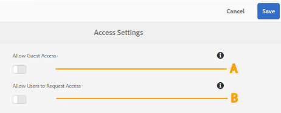
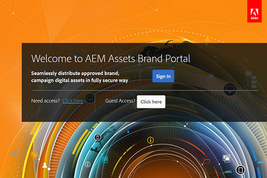

# Brand Portal でのユーザーアクセスの管理 {#administer-user-access-on-brand-portal}

Adobe Experience Manager Assets Brand Portal 6.4.2以降では、管理者がゲストアクセスを設定し、ユーザーが組織のBrand Portalでアクセスをリクエストできるようにします。 これらの設定は、管理パネルで&#x200B;**[!UICONTROL アクセス設定]**&#x200B;として提供されています。 これらの設定は両方とも、デフォルトでは無効になっています。

**A** - Brand Portalようこそ画面の&#x200B;**[!UICONTROL `Guest Access?`]** リンクを使用して、Brand Portalでゲストがアクセスできるようにするための設定。 （デフォルトでは無効になっています）

**B** - Brand Portalようこそ画面の&#x200B;**[!UICONTROL `Need access?`]** リンクを使用して、ユーザーがBrand Portalへのアクセスをリクエストできるようにするための設定。 （デフォルトでは無効になっています）

## ゲストによるアクセスを許可 {#allow-guest-access}

ゲストアクセスを許可することで、Brand Portalにログインしなくてもパブリックアセットにアクセスできます。
ゲストによるアクセスを許可するには、管理者が次の手順を実行する必要があります。

1. AEM ロゴを選択して、上部のツールバーから管理ツールにアクセスします。
1. 管理ツールパネルで「**[!UICONTROL アクセス]**」を選択して、**[!UICONTROL アクセス設定]** ページを開きます。
1. 「**[!UICONTROL ゲストによるアクセスを許可]**」設定を有効にします。
1. 変更内容を&#x200B;**[!UICONTROL 保存]**&#x200B;します。
1. ログアウトして、変更を有効にします。

## ユーザーのアクセス要求を許可 {#allow-users-to-request-access}

管理者は、組織ユーザーに対し、ようこそ画面から Brand Portal へのアクセスを要求することを許可できます。 ただし、管理者は、ようこそ画面にリクエストアクセスリンクが表示されるように、**[!UICONTROL ユーザーにアクセスをリクエスト]**&#x200B;する設定を有効にする必要があります。

組織ユーザーがBrand Portalへのアクセスをリクエストできるようにするには、管理者は次の操作を行う必要があります。

1. AEM ロゴを選択して、上部のツールバーから管理ツールにアクセスします。
1. 管理ツールパネルで「**[!UICONTROL アクセス]**」を選択して、**[!UICONTROL アクセス設定]** ページを開きます。
1. 「**[!UICONTROL ユーザーのアクセス要求を許可]**」設定を有効にします。
1. 変更内容を&#x200B;**[!UICONTROL 保存]**&#x200B;します。
1. ログアウトして、変更を有効にします。
