# ユーザー、グループ、ユーザーの役割の管理 {#manage-users-groups-and-user-roles}

管理者は、Adobe Admin Consoleを使用して、Experience Manager Assets Brand Portal ユーザーと製品プロファイルを作成し、Brand Portal ユーザーインターフェイスを使用して役割を管理できます。 これは閲覧者と編集者にはない権限です。

[[!UICONTROL Admin Console]](https://adminconsole.adobe.com/enterprise/overview) には、組織に関連するあらゆる製品が表示されます。 これには、例えば Adobe Analytics や Adobe Target、Experience Manager Assets Brand Portal など、様々な Adobe Experience Cloud ソリューションが含まれます。 AEM Brand Portalの商品を選び、商品プロファイルを作成します。

<!--
Comment Type: draft

<note type="note">

Product profiles (formerly known as product configurations*). 

* The nomenclature has changed from product configurations to Product Profiles in the new Adobe Admin Console.

</note>
-->
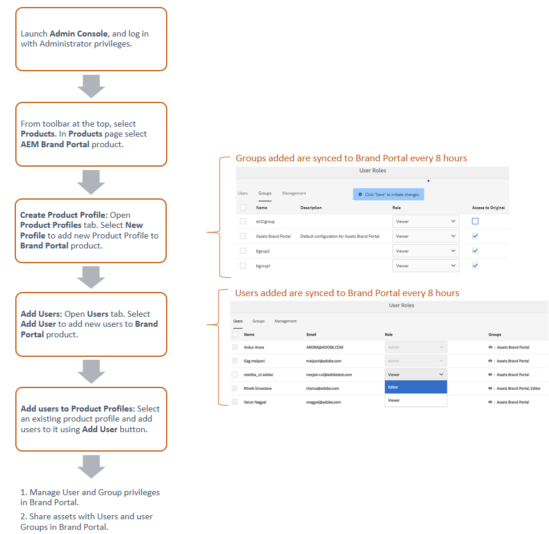

これらの製品プロファイルは、8時間ごとにBrand Portalのユーザーインターフェイスと同期され、Brand Portalではグループとして表示されます。 ユーザーを追加して製品プロファイルを作成し、それらの製品プロファイルにユーザーを追加すると、Brand Portalでユーザーとグループに役割を割り当てることができます。

>[!NOTE]
>
>Brand Portal でグループを作成するには、Adobe [!UICONTROL Admin Console] から、**[!UICONTROL ユーザー／ユーザーグループ]**&#x200B;ではなく、**[!UICONTROL 製品／製品プロファイル]**&#x200B;を使用します。 Adobe [!UICONTROL Admin Console] の製品プロファイルは、Brand Portal でグループを作成するために使用されます。

## ユーザーの追加 {#add-a-user}

製品管理者の場合は、Adobe [[!UICONTROL Admin Console]](https://adminconsole.adobe.com/enterprise/overview)を使用してユーザーを作成し、製品プロファイル （*以前は製品コンフィギュレーション*）に割り当てます。このプロファイルは、Brand Portalでグループとして表示されます。 これにより、グループを使用して役割の管理やアセットの共有などの操作を一括して実行できます。

>[!NOTE]
>
>Brand Portalにアクセスできない新規ユーザーは、Brand Portalのログイン画面からアクセスをリクエストできます。 詳しくは、[Brand Portalへのアクセスをリクエスト &#x200B;](../using/brand-portal.md#request-access-to-brand-portal)を参照してください。 管理者は、通知領域にアクセス権申請の通知が届いたら、関連する通知をクリックして「**[!UICONTROL アクセス権を付与]**」をクリックします。 または、アクセス権申請のメールが届いたら、そこに記載されているリンクをクリックします。 その後、[Adobe [!UICONTROL Admin Console]](https://adminconsole.adobe.com/enterprise/overview) からユーザーを追加するには、以下の手順 4～7 を行います。

>[!NOTE]
>
>[Adobe [!UICONTROL Admin Console]](https://adminconsole.adobe.com/enterprise/overview)に直接またはBrand Portalからログインできます。 直接ログインする場合は、以下の手順4～7に従ってユーザーを追加します。

1. 上部の AEM ツールバーでアドビのロゴをクリックして、管理ツールにアクセスします。

   

1. 管理ツールパネルの「**[!UICONTROL ユーザー]**」をクリックします。

   

1. [!UICONTROL ユーザーの役割]ページで、「**[!UICONTROL 管理]**」タブをクリックし、「**[!UICONTROL Admin Console を起動]**」をクリックします。

   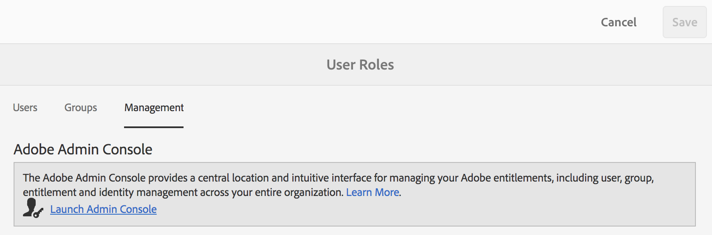

1. Admin Consoleで、次のいずれかの操作を行って新しいユーザーを作成します。

   * 上部のツールバーの「**[!UICONTROL 概要]**」をクリックします。 [!UICONTROL 概要]ページで、「Brand Portal」製品カードの「**[!UICONTROL ユーザーを割り当て]**」をクリックします。

   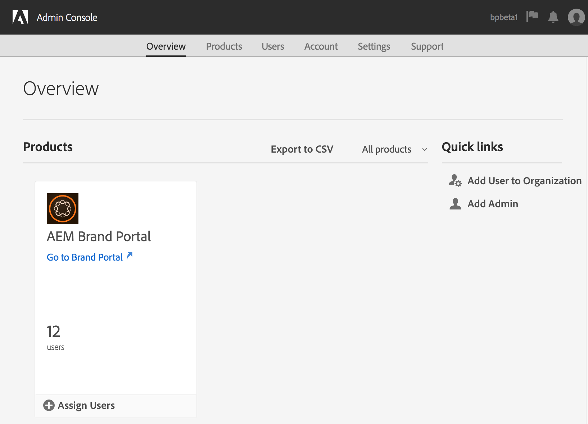

   * 上部のツールバーの「**[!UICONTROL ユーザー]**」をクリックします。 [!UICONTROL &#x200B; ユーザー] ページでは、左側のパネルの[!UICONTROL &#x200B; ユーザー]がデフォルトで選択されています。 「**[!UICONTROL ユーザーを追加]**」をクリックします。

   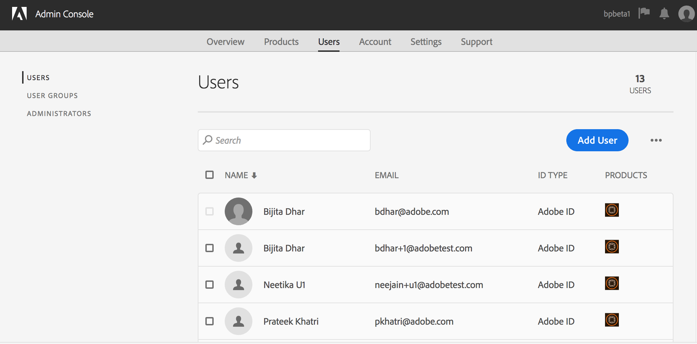

1. ユーザーを追加ダイアログボックスで、追加するユーザーの電子メール IDを入力するか、入力時に表示される候補のリストからユーザーを選択します。

   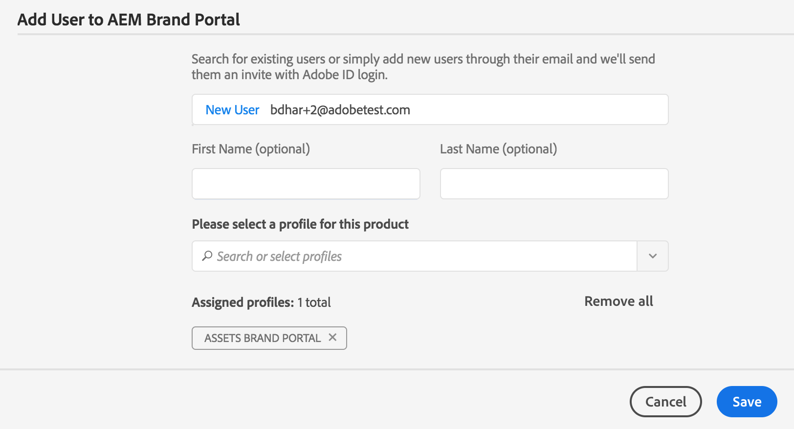

1. 1 つ以上の製品プロファイル（旧称：製品設定）にユーザーを割り当てます。製品プロファイルに割り当てられたユーザーは、Brand Portal にアクセスできます。 「**[!UICONTROL この製品のプロファイルを選択してください]**」フィールドから、適切な製品プロファイルを選択します。
1. 「**[!UICONTROL 保存]**」をクリックします。 新しく追加されたユーザーにウェルカムメールが送信されます。 招待されたユーザーは、ウェルカムメールに記載されているリンクをクリックして、Brand Portal にアクセスできます。 ユーザーは、Admin Consoleで設定された電子メール ID （[!UICONTROL Adobe ID]、[!UICONTROL Enterprise ID]、または[!UICONTROL Federated ID]）を使用してログインできます。 詳しくは、[初回のログイン操作](../using/brand-portal-onboarding.md)を参照してください。

   >[!NOTE]
   >
   >ユーザーがBrand Portalにログオンできない場合は、Adobe [!UICONTROL Admin Console]にアクセスする必要があります。 ユーザーが存在し、少なくとも1つの製品プロファイルに追加されているかどうかを確認します。

   ユーザーに管理者権限を付与する方法について詳しくは、[&#x200B; ユーザーに管理者権限を提供する](../using/brand-portal-adding-users.md#provideadministratorprivilegestousers)を参照してください。

## 製品プロファイルの追加 {#add-a-product-profile}

[!UICONTROL Admin Console] の製品プロファイル（旧称：製品設定）は、Brand Portal でグループを作成するために使用されます。これにより、Brand Portal 内で役割の管理やアセットの共有などを一括して実行できます。 **Brand Portal**&#x200B;は利用できる既定の製品プロファイルです。より多くの製品プロファイルを作成し、新しい製品プロファイルにユーザーを追加できます。

>[!NOTE]
>
>[[!UICONTROL Admin Console]](https://adminconsole.adobe.com/enterprise/overview)に直接またはBrand Portalからログインできます。 [!UICONTROL Admin Console]に直接ログインする場合は、以下の手順4 ～ 7に従って製品プロファイルを追加します。

1. 上部の AEM ツールバーでアドビのロゴをクリックして、管理ツールにアクセスします。

   

1. 管理ツールパネルの「**[!UICONTROL ユーザー]**」をクリックします。

   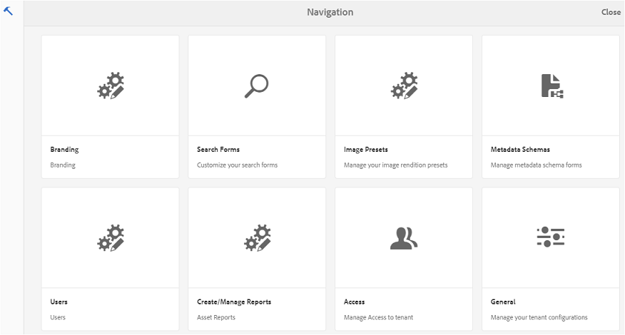

1. [!UICONTROL ユーザーの役割]ページで、「**[!UICONTROL 管理]**」タブをクリックし、「**[!UICONTROL Admin Console を起動]**」をクリックします。

   

1. 上部のツールバーの「**[!UICONTROL 製品]**」をクリックします。
1. [!UICONTROL 製品] ページでは、[!UICONTROL 製品プロファイル &#x200B;]がデフォルトで選択されています。 「**[!UICONTROL 新しいプロファイル]**」をクリックします。

   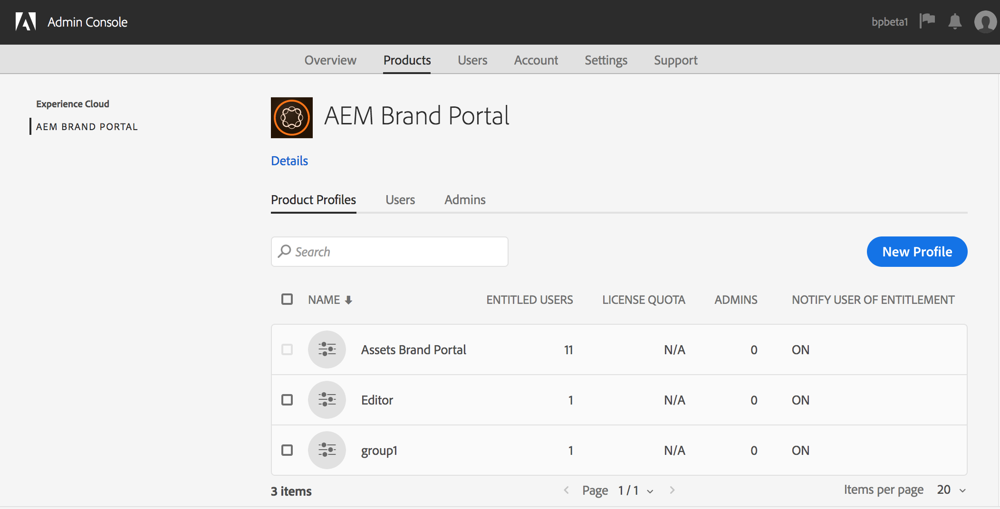

1. [!UICONTROL 新しいプロファイルの作成] ページで、プロファイル名、表示名、プロファイルの説明を入力します。 ユーザーがプロファイルに追加またはプロファイルから削除されたときに、ユーザーにメールで通知を受け取るように選択します。

   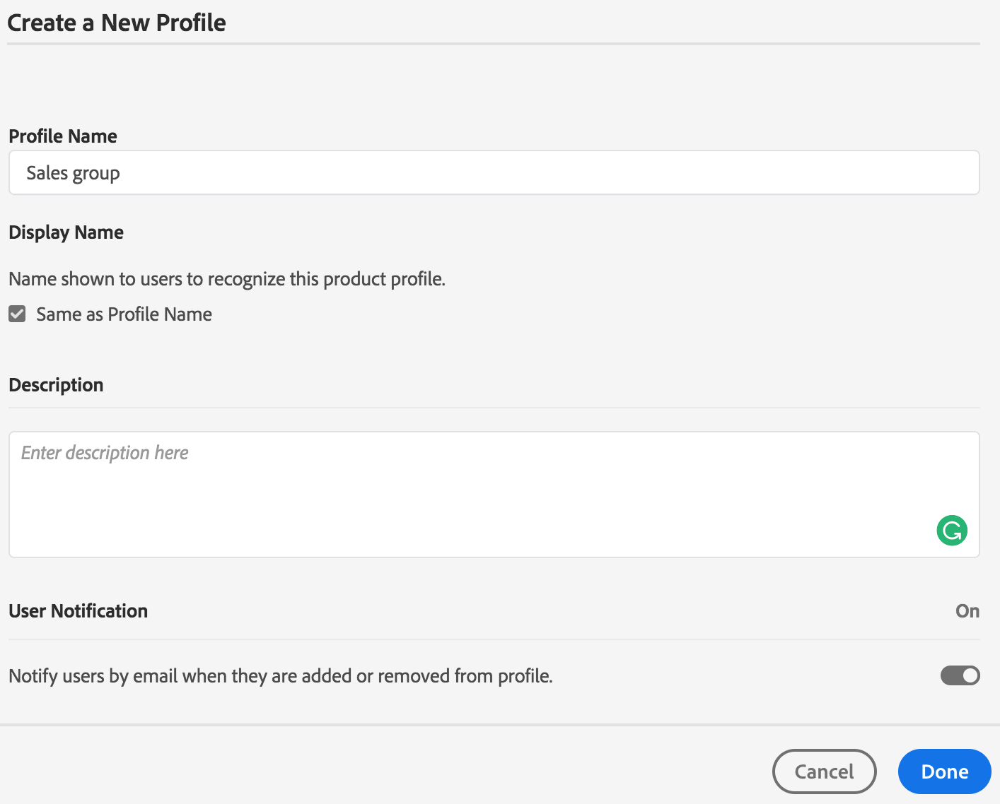

1. 「**[!UICONTROL 完了]**」をクリックします。 製品設定グループ。 例えば、**[!UICONTROL Sales group]**&#x200B;がBrand Portalに追加されます。

   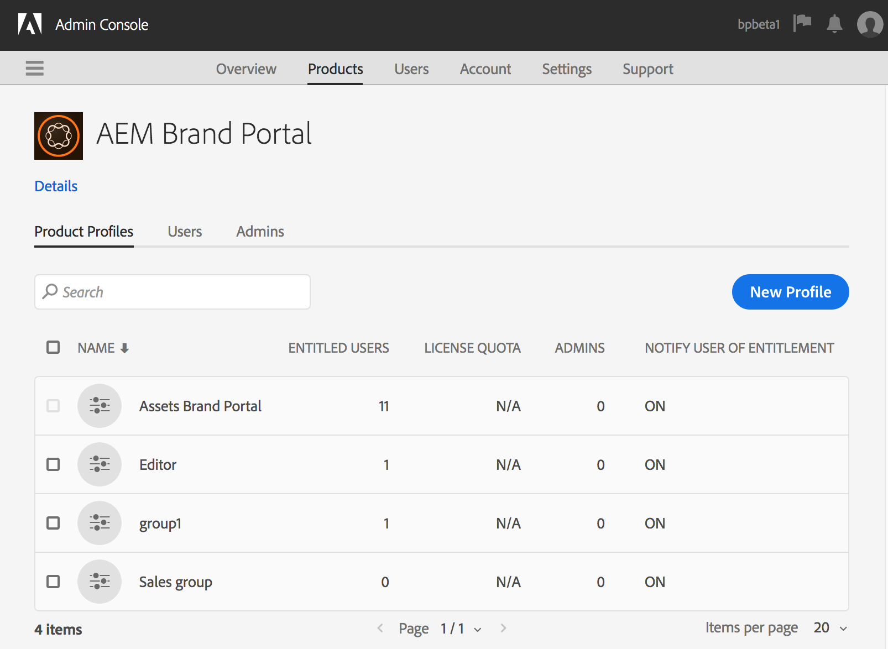

## 製品プロファイルへのユーザーの追加 {#add-users-to-a-product-profile}

Brand Portal グループにユーザーを追加するには、[!UICONTROL Admin Console]の対応する製品プロファイル （旧称：製品設定）にユーザーを追加します。 ユーザーは個別に追加することも、一括で追加することもできます。

>[!NOTE]
>
>[[!UICONTROL Admin Console]](https://adminconsole.adobe.com/enterprise/overview)に直接またはBrand Portalからログインできます。 Admin Consoleに直接ログインする場合は、以下の手順の手順4～7に従って、製品プロファイルにユーザーを追加します。

1. 上部のツールバーで Experience Manager ロゴをクリックして、管理ツールにアクセスします。

   

1. 管理ツールパネルの「**[!UICONTROL ユーザー]**」をクリックします。

   

1. [!UICONTROL ユーザーの役割]ページで、「**[!UICONTROL 管理]**」タブをクリックし、「**[!UICONTROL Admin Console を起動]**」をクリックします。

   ![[!DNL Admin Console]](assets/launch_admin_console.png) の起動

1. 上部のツールバーの「**[!UICONTROL 製品]**」をクリックします。
1. [!UICONTROL 製品] ページでは、[!UICONTROL 製品プロファイル &#x200B;]がデフォルトで選択されています。 ユーザーを追加する製品プロファイル（例：[!UICONTROL Sales group]）を開きます。

   

1. 製品プロファイルにユーザーを個別に追加するには、以下の手順を実行します。

   * 「**[!UICONTROL ユーザーを追加]**」をクリックします。

   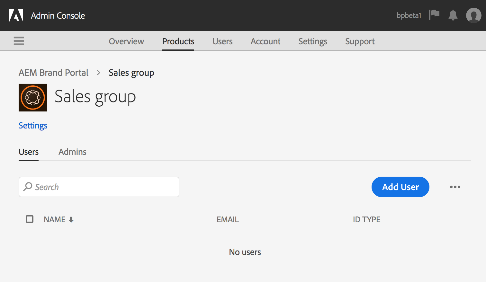

   * [!UICONTROL Sales group にユーザーを追加]ページで、追加するユーザーのメール ID を入力するか、入力中に表示される候補リストからユーザーを選択します。

   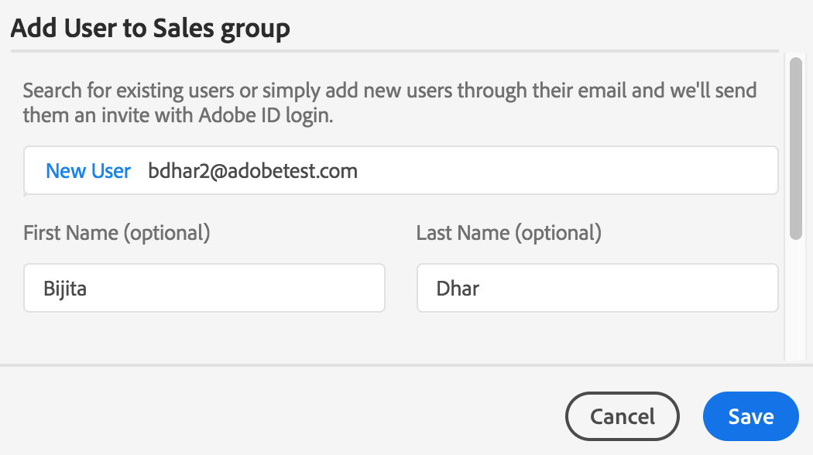

   * 「**[!UICONTROL 保存]**」をクリックします。

1. 製品プロファイルにユーザーを一括で追加するには、以下の手順を実行します。

   * **[!UICONTROL 省略記号（。..）を選択 > ユーザーをCSV]**&#x200B;で追加します。

   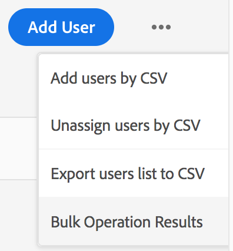

   * **[!UICONTROL CSV を利用してユーザーを一括追加]**&#x200B;ページで、CSV テンプレートをダウンロードするか、CSV ファイルをドラッグ＆ドロップします。

   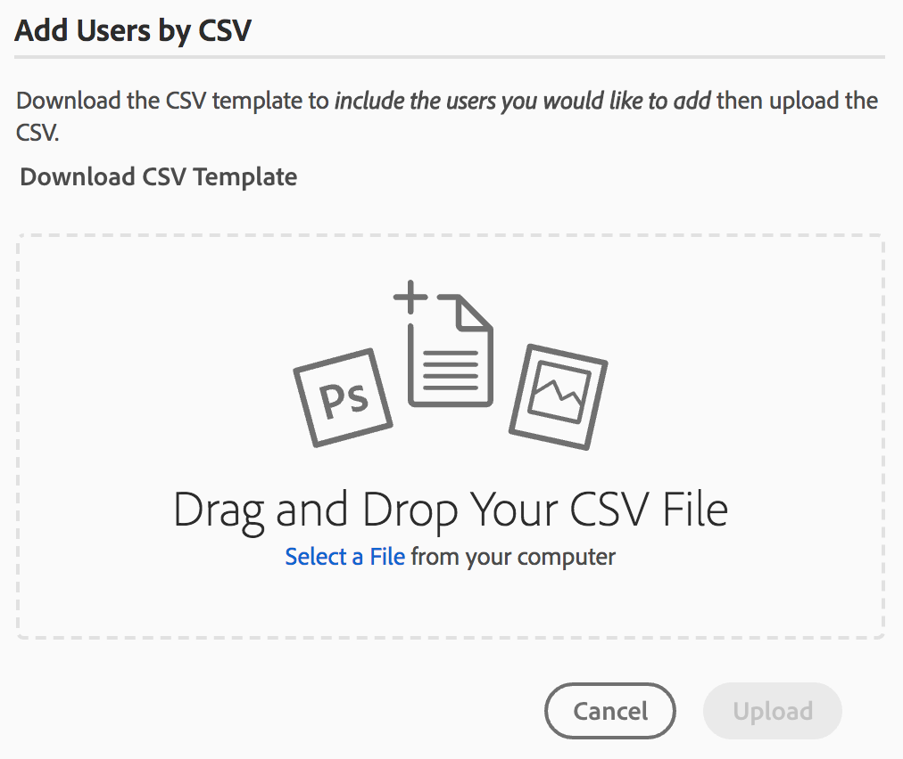

   * 「**[!UICONTROL アップロード]**」をクリックします。

   デフォルトの製品プロファイルであるBrand Portalにユーザーを追加すると、システムはメール IDにウェルカムメールを送信します。 招待されたユーザーは、ウェルカムメールのリンクをクリックし、[!UICONTROL Adobe ID]でログインすることで、Brand Portalにアクセスできます。 [初回ログイン体験](../using/brand-portal-onboarding.md)を参照してください。

   カスタムまたは新しい製品プロファイルに追加されたユーザーには、メール通知が届きません。

## ユーザーに管理者権限を提供する {#provide-administrator-privileges-to-users}

Brand Portal ユーザーには、システム管理者権限または製品管理者権限を付与できます。 ただし、[!UICONTROL Admin Console]で使用可能な他の管理ロールを割り当てないでください。 たとえば、製品プロファイル管理者、ユーザーグループ管理者、サポート管理者などです。 [管理ロール &#x200B;](https://helpx.adobe.com/jp/enterprise/using/admin-roles.html)を参照してください。

>[!NOTE]
>
>[[!UICONTROL Admin Console]](https://adminconsole.adobe.com/enterprise/overview)に直接またはBrand Portalからログインできます。 [!UICONTROL Admin Console]に直接ログインする場合は、以下の手順4 ～ 8に従って、製品プロファイルにユーザーを追加します。

1. 上部の AEM ツールバーでアドビのロゴをクリックして、管理ツールにアクセスします。

   

1. 管理ツールパネルの「**[!UICONTROL ユーザー]**」をクリックします。

   

1. [!UICONTROL ユーザーの役割]ページで、「**[!UICONTROL 管理]**」タブをクリックし、「**[!UICONTROL Admin Console を起動]**」をクリックします。

   

1. 上部のツールバーの「**[!UICONTROL ユーザー]**」をクリックします。
1. [!UICONTROL &#x200B; ユーザー] ページの左側のパネルで、[!UICONTROL &#x200B; ユーザー]がデフォルトで選択されています。 管理者権限を付与するユーザーの名前をクリックします。

   

1. ユーザープロファイルページで、下部の「**[!UICONTROL 管理者権限]**」セクションを見つけ、**[!UICONTROL 省略記号（。..）を選択します。 >管理者権限を編集]**。
   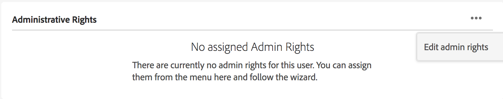

1. [!UICONTROL 管理者を編集]ページで、「システム管理者」または「製品管理者」を選択します。

   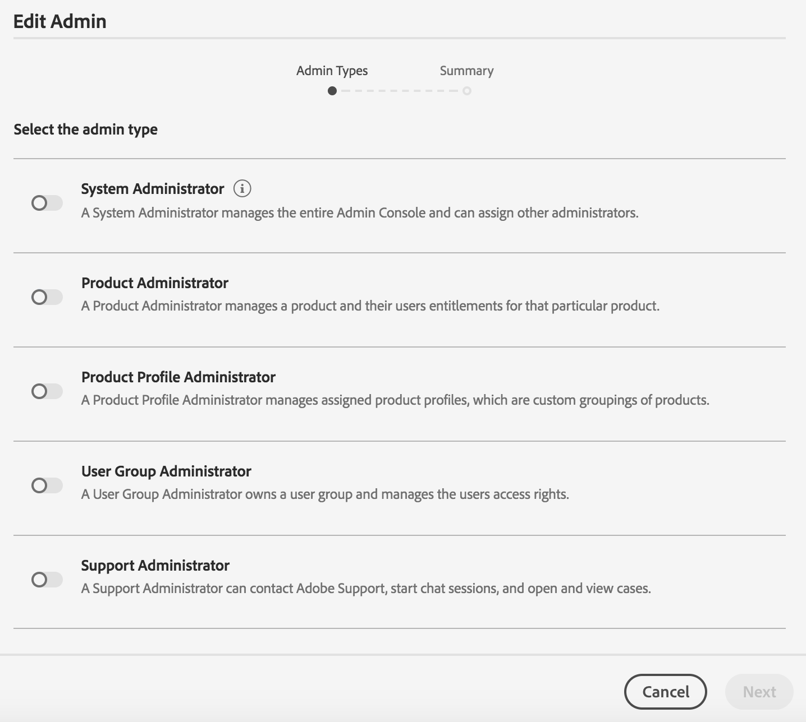

   >[!NOTE]
   >
   >Brand Portal では、システム管理者と製品管理者の役割のみをサポートしています。
   >
   >システム管理者の役割は使用しないことをお勧めします。なぜなら、システム管理者の役割は、組織のすべての製品に対する組織レベルの管理者権限を付与することになるからです。 例えば、マーケティング用の3つのクラウド製品を含む組織のシステム管理者は、3つの製品すべての権限セットを持っています。 Experience Manager Assets から Brand Portal にアセットを公開できるように Experience Manager Assets を設定できるのは、システム管理者だけです。 詳しくは、[Experience Manager Assets と Brand Portal の連携の設定](../using/configure-aem-assets-with-brand-portal.md)を参照してください。
   >
   >それに対して、製品管理者の役割は、特定の製品に対する管理者権限のみを付与します。 Brand Portal 内で、より詳細なアクセス制御を適用する場合は、製品管理者の役割を使用して、製品を「Brand Portal」として選択します。

   >[!NOTE]
   >
   >Brand Portalは、product profile administrator （旧称：configuration administrator）権限をサポートしていません。 ユーザーに製品プロファイル管理者の権限を割り当てることは避けてください。

1. 管理者タイプの選択を確認し、「**[!UICONTROL 保存]**」をクリックします。

   >[!NOTE]
   >
   >ユーザーの管理者権限を失効にするには、**[!UICONTROL 管理者を編集]**&#x200B;ページで適切な変更を行い、「**[!UICONTROL 保存]**」をクリックします。

## ユーザーの役割の管理 {#manage-user-roles}

管理者は、Brand Portalのユーザーのロールを変更できます。

管理者ロールに加えて、Brand Portalでは次のロールをサポートしています。

* [!UICONTROL 閲覧者]：この役割を持つユーザーは、管理者から共有されたファイルやフォルダーを表示できます。 また、アセットの検索とダウンロードも可能です。 ただし、他のユーザーとコンテンツ（ファイル、フォルダー、[!UICONTROL コレクション]）を共有することはできません。
* [!UICONTROL &#x200B; エディター]：この役割を持つユーザーには、ビューアーのすべての権限があります。 さらに、他のユーザーとコンテンツ（フォルダー、[!UICONTROL コレクション]、リンク）を共有できます。

1. 上部の AEM ツールバーでアドビのロゴをクリックして、管理ツールにアクセスします。

   

1. 管理ツールパネルの「**[!UICONTROL ユーザー]**」をクリックします。

   

1. [!UICONTROL ユーザー役割]ページでは、「[!UICONTROL ユーザー]」タブがデフォルトで選択されています。 役割を変更するユーザーの&#x200B;**[!UICONTROL 役割]**&#x200B;ドロップダウンから、「**[!UICONTROL エディター]**」または「**[!UICONTROL 閲覧者]**」を選択します。

   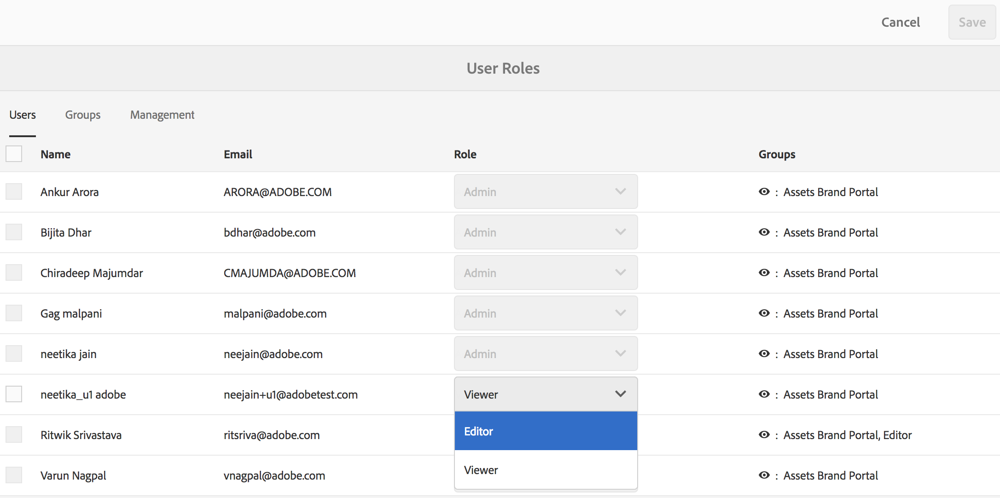

   複数のユーザーの役割を同時に変更するには、ユーザーを選択し、**[!UICONTROL 役割]**&#x200B;ドロップダウンから適切な役割を選択します。

   >[!NOTE]
   >
   >管理者ユーザーの[!UICONTROL 役割] リストは無効です。 これらのユーザーを選択して役割を変更することはできません。

   >[!NOTE]
   >
   >ユーザーがエディターグループのメンバーである場合、ユーザーロールも無効になります。 ユーザーから編集権限を取り消すには、エディターグループからユーザーを削除するか、グループ全体の役割をViewerに変更します。

1. 「**[!UICONTROL 保存]**」をクリックします。 対応するユーザーの役割が変更されます。 複数のユーザーを選択している場合は、すべてのユーザーの役割が同時に変更されます。

   >[!NOTE]
   >
   >ユーザー権限の変更は、ユーザーが Brand Portal に再ログインするまで、**[!UICONTROL ユーザー役割]**&#x200B;ページに反映されません。

## グループの役割および権限の管理 {#manage-group-roles-and-privileges}

管理者は、Brand Portal で特定の権限をユーザー[グループ](../using/brand-portal-adding-users.md#main-pars-title-278567577)に関連付けることができます。 **[!UICONTROL ユーザーの役割]**&#x200B;ページの「**[!UICONTROL グループ]**」タブでは、管理者は次の操作を行うことができます。

* ユーザーグループへの役割の割り当て
* Brand Portalから画像ファイルの元のレンディション（.jpeg、.tiff、.png、.bmp、.gif、.pjpeg、x-portable-anymap、x-portable-bitmap、x-portable-graymap、x-portable-pixmap、x-rgb、x-xbitmap、x-icon、image/photoshop、image/x-photoshop、.psd、image/vnd.adobe.photoshop）をダウンロードするようにユーザーグループを制限します。

>[!NOTE]
>
>リンクとして共有されたアセットの場合、画像ファイルの元のレンディションにアクセスする権限は、アセットを共有しているユーザーの権限に基づいて適用されます。

特定のグループメンバーがオリジナルのレンディションにアクセスするための役割および権限を変更するには、次の手順に従います。

1. **[!UICONTROL ユーザーの役割]**&#x200B;ページで、「**[!UICONTROL グループ]**」タブに移動します。
1. 役割を変更するグループを選択します。
1. **[!UICONTROL 役割]**&#x200B;ドロップダウンリストから、適切な役割を選択します。

   グループのメンバーがポータルまたは共有リンクからダウンロードした画像ファイルの元のレンディションにアクセスできるようにするには、そのグループに「**[!UICONTROL 元の]**&#x200B;へのアクセス」オプションを選択したままにします。 この方法には、次のようなファイル形式が含まれます。

   * .jpeg
   * .tiff
   * .png
   * .bmp
   * .gif
   * .pjpeg
   * .psd
   * x-portable-anymap
   * x-portable-bitmap
   * x-portable-graymap
   * x-portable-pixmap
   * x-rgb
   * x-xbitmap
   * x-xpixmap
   * x-icon
   * image/photoshop
   * image/x-photoshop
   * image/vnd.adobe.photoshop

   デフォルトでは、すべてのユーザーに対して「**[!UICONTROL 元の]**&#x200B;へのアクセス」オプションが選択されています。 ユーザーグループがオリジナルのレンディションにアクセスできないようにするには、そのグループに対応するオプションの選択を解除します。

   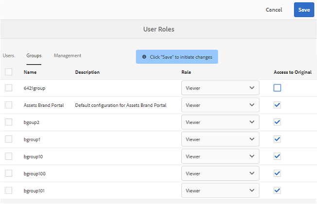

   >[!NOTE]
   >
   >ユーザーが複数のグループに追加され、いずれかのグループに制限がある場合は、そのユーザーに制限が適用されます。
   >
   >また、画像ファイルの元のレンディションにアクセスするための制限は、制限されたグループのメンバーであっても、管理者には適用されません。

1. 「**[!UICONTROL 保存]**」をクリックします。 対応するグループの役割が変更されます。

   >[!NOTE]
   >
   >ユーザー間の関連付け、つまりユーザーのグループメンバーシップは、8時間ごとにBrand Portalに同期されます。 ユーザーまたはグループの役割の変更は、次回の同期ジョブの実行後に反映されます。
