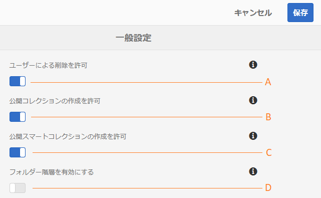

# 一般的なテナント設定の管理 {#administer-general-tenant-configurations}

Experience Manager Assets Brand Portal では、各組織が特定のテナントについて以下の機能を設定することができます。

* 管理者によるアセットの削除
* 管理者以外のユーザーによる公開コレクションの作成
* 管理者以外のユーザーによる公開スマートコレクションの作成
* 共有フォルダーの親階層は、管理者以外のユーザーにも表示されます

これらの設定は、管理ツールパネルの **[!UICONTROL 一般設定]** 設定として指定されています。

**A** – 管理者がBrand Portalからアセットを削除できるように設定します。 （デフォルトでは有効になっています）

**B** – 管理者以外のユーザーが公開コレクションを作成できるようにする設定。 （デフォルトでは有効になっています）

**C** – 管理者以外のユーザーが公開スマートコレクションを作成できるようにする設定。 （デフォルトでは有効になっています）

**D** – 管理者でないユーザー（エディター、閲覧者、ゲストユーザー）に対して共有フォルダーのフォルダー階層（ルートから）を表示する設定。 （デフォルトでは無効になっています）

## 一般設定を有効または無効にする {#enable-disable-general-configurations}

これらの各設定を有効または無効にするには：

1. 管理者権限でログインします。
1. Experience Managerのロゴを選択して、上部のツールバーにある管理ツールにアクセスします。
1. 管理ツールパネルから、**[!UICONTROL 一般]**&#x200B;を選択して&#x200B;**[!UICONTROL 一般設定]**&#x200B;ページを開きます。
1. それぞれの切り替えスイッチを使用して、一般設定を有効または無効にします。
1. 変更内容を&#x200B;**[!UICONTROL 保存]**&#x200B;します。
1. ログアウトして、変更を有効にします。

## 管理者ユーザーが Brand Portal からアセットを削除することを許可 {#allow-admin-users-to-delete-assets-from-brand-portal}

「**[!UICONTROL ユーザーによる削除を許可]**」設定では、管理者権限を持つユーザーがアセットやフォルダーを Brand Portal から削除することを許可（または禁止）できます。

## 管理者以外による公開コレクションの作成を許可 {#allow-public-collections-creation-by-non-admins}

「[[!UICONTROL 公開コレクションの作成を許可]](../using/brand-portal-share-collection.md#main-pars-text-1915052376)」設定では、管理者以外のユーザーが Brand Portal 上に公開コレクションを作成することを許可するかどうかを制御できます。この設定はデフォルトで有効です。この設定を無効にすると、組織はポータルに多数の公開コレクションを保持できなくなります。その結果、システムの空き容量を節約できます。

## 管理者以外による公開スマートコレクションの作成を許可 {#allow-public-smart-collections-creation-by-non-admins}

「[[!UICONTROL 公開スマートコレクションの作成を許可]](../using/brand-portal-searching.md#main-pars-header-500620467)」設定では、管理者以外のユーザーが検索をスマートコレクションとして保存して、そのテナントの公開スマートコレクションにすることを許可するかどうかを制御できます。この設定はデフォルトで有効です。この設定を無効にすると、管理者以外のユーザーが作成した多数の公開スマートコレクションが組織のBrand Portalに格納されるのを防ぐことができます。

<!-- 
## Allow download acceleration {#allow-download-acceleration}

[[!UICONTROL Allow download acceleration]](../using/accelerated-download.md) configuration lets the organizations to allow accelerated downloads of assets from Brand Portal and shared links, by integrating with IBM Aspera Connect that is an install-on-demand application. The application uses proprietary technology to remove TCP overheads.
-->

## フォルダー階層の有効化 {#enable-folder-hierarchy}

「[[!UICONTROL フォルダー階層を有効化]](../using/brand-portal-sharing-folders.md#non-admin-user-access-to-shared-folders)」設定では、管理者以外のユーザー（エディター、閲覧者、ゲストユーザー）がログイン後に目にする共有フォルダーの表示を管理者が制御できます。
