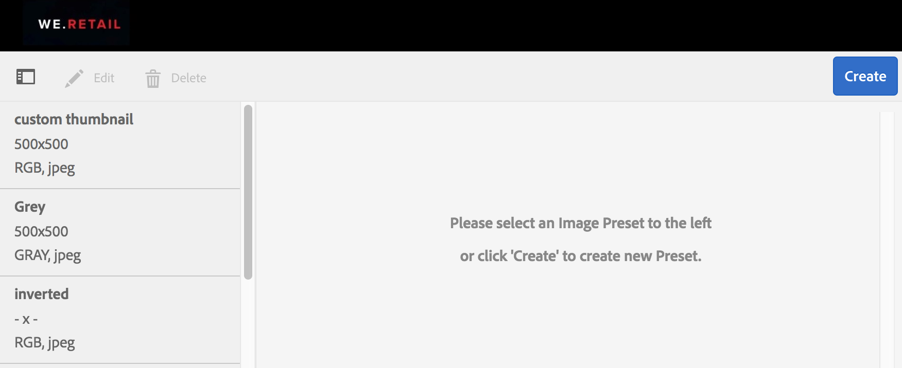
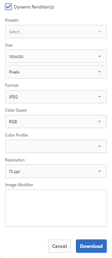

# 画像プリセットまたは動的レンディションの適用 {#apply-image-presets-or-dynamic-renditions}

画像プリセットは、マクロと同様、サイズとフォーマットに関するコマンドのコレクションを事前に定義し、名前を付けて保存したものです。画像プリセットを使用すると、Experience Manager Assets Brand Portalは様々なサイズ、形式、プロパティの画像を動的に配信できます。

画像プリセットは、プレビューおよびダウンロード可能な画像の動的レンディションを生成するために使用されます。 画像とそのレンディションをプレビューする際に、プリセットを選択すると、管理者が設定した仕様に合わせて画像を再フォーマットできます。

（*Experience Manager Assets オーサーインスタンスが&#x200B;**Dynamic Media ハイブリッドモードで動作している場合***）。 Brand Portalでアセットの動的レンディションを表示するには、Brand Portalに公開するExperience Manager Assets オーサーインスタンスにピラミッド型TIFFのレンディションが存在することを確認してください。 アセットを公開すると、その PTIFF レンディションも Brand Portal に公開されます。

>[!NOTE]
>
>画像とそのレンディションをダウンロードする場合、既存のプリセットから選択するオプションはありません。 代わりに、カスタム画像プリセットのプロパティを指定できます。 詳しくは、[&#x200B; 画像のダウンロード時に画像プリセットを適用する &#x200B;](../using/brand-portal-image-presets.md#main-pars-text-1403412644) を参照してください。

画像プリセットの作成時に必要となるパラメーターについて詳しくは、[画像プリセットの管理](../using/brand-portal-image-presets.md)を参照してください。

## 画像プリセットの作成 {#create-an-image-preset}

Experience Manager Assets 管理者は、アセットの詳細ページに動的レンディションとして表示される画像プリセットを作成できます。画像プリセットは、最初から作成することも、既存の画像プリセットを新しい名前で保存することもできます。 画像プリセットを作成する際は、画像配信のサイズと書式設定コマンドを選択します。 画像が表示用に配信されるときには、選択したコマンドに応じて画像の外観が最適化されます。

>[!NOTE]
>
>画像の動的レンディションは、ピラミッド TIFF を使用して作成されます。ピラミッドTIFFがどのアセットにも使用できない場合、そのアセットの動的レンディションはBrand Portalで取得できません。
>
>Experience Manager Assets オーサーインスタンスが **Dynamic Media ハイブリッドモード** で動作している場合、画像アセットのピラミッドTIFFレンディションが作成され、Experience Manager Assets リポジトリに保存されます。
>
>ただし、Experience Manager Assets オーサーインスタンスが **Dynamic Media Scene7 モード** で動作している場合、画像アセットのピラミッドTIFFレンディションはScene7 サーバー上に存在します。
>
>このようなアセットがBrand Portalに公開されると、画像プリセットが適用されて動的レンディションが表示されます。

1. 上部のツールバーで Experience Manager ロゴをクリックして、管理ツールにアクセスします。

1. 管理ツールパネルの「**[!UICONTROL 画像プリセット]**」をクリックします。

   

1. 画像プリセットページの「**[!UICONTROL 作成]**」をクリックします。

   

1. **[!UICONTROL 画像プリセットを編集]**&#x200B;ページで、「**[!UICONTROL 基本]**」または「**[!UICONTROL 詳細]**」のどちらか該当するタブに、名前などの値を入力します。プリセットは左側のウィンドウに表示され、他のアセットにすぐに使用できます。

   

   >[!NOTE]
   >
   >**[!UICONTROL 画像プリセットを編集]**&#x200B;ページを使用して、既存の画像プリセットのプロパティを編集することもできます。画像プリセットを編集するには、該当する画像プリセットを画像プリセットページから選択し、「**[!UICONTROL 編集]**」をクリックします。

1. 「**[!UICONTROL 保存]**」をクリックします。画像プリセットが作成され、画像プリセットページに表示されます。
1. 画像プリセットを削除するには、画像プリセットページから削除する画像プリセットを選択し、「**[!UICONTROL 削除]**」をクリックします。確認ページで「**[!UICONTROL 削除]**」をクリックして、削除することを確認します。指定した画像プリセットが、画像プリセットページから削除されます。

## 画像をプレビューする際の画像プリセットの適用 {#apply-image-presets-when-previewing-images}

画像とそのレンディションをプレビューするときは、既存のプリセットから選択することで、管理者が設定した仕様で画像を再フォーマットできます。

1. Brand Portal インターフェイスで、画像をクリックして開きます。
1. 左側のオーバーレイアイコンをクリックし、「**[!UICONTROL レンディション]**」を選択します。

   

1. **[!UICONTROL レンディション]**&#x200B;リストから、適切な動的レンディション（例：「**[!UICONTROL サムネール]**」）を選択します。プレビューイメージは、選択したレンディションに基づいてレンダリングされます。

   

## 画像のダウンロード時に画像プリセットを適用する {#apply-image-presets-when-downloading-images}

Brand Portal から画像とそのレンディションをダウンロードするときは、既存の画像プリセットから選択することはできません。ただし、再フォーマットする画像に基づいて、画像プリセットのプロパティをカスタマイズできます。

1. Brand Portal コンソールで、以下のいずれかの手順を実行します。

   * ダウンロードする画像の上にポインターを置きます。 使用できるクイックアクションサムネールから、**[!UICONTROL ダウンロード]**&#x200B;アイコンをクリックします。

   

   * ダウンロードする画像を選択します。 上部のツールバーで「**[!UICONTROL ダウンロード]**」アイコンをクリックします。

   

1. **[!UICONTROL ダウンロード]**&#x200B;ダイアログボックスで、アセットとそのレンディションを一緒にダウンロードするかどうかに応じて、必要なオプションを選択します。

   

1. アセットの動的レンディションをダウンロードするには、「**[!UICONTROL 動的レンディション]** オプションを選択します。
1. 画像プリセットのプロパティをカスタマイズして、ダウンロード中に画像とそのレンディションを動的に再フォーマットします。 サイズ、形式、カラースペース、解像度および画像修飾子を指定します。

   

1. 「**[!UICONTROL ダウンロード]**」をクリックします。カスタムの動的レンディションが、ダウンロード対象として選択した画像とレンディションと一緒に ZIP ファイルにダウンロードされます。ただし、ダウンロードするアセットが 1 つだけの場合は、迅速なダウンロードを行うために zip ファイルは作成されません。
