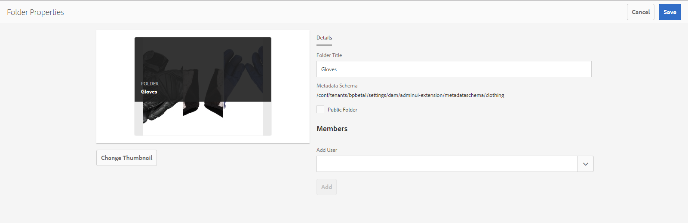

# メタデータスキーマフォームの使用 {#use-the-metadata-schema-form}

メタデータスキーマは、プロパティ ページのレイアウトと、特定のスキーマを使用するアセットに対して表示されるメタデータプロパティを記述します。 アセットに適用するスキーマによって、そのプロパティ ページに表示されるメタデータフィールドが決まります。

各アセットの&#x200B;**[!UICONTROL プロパティ]**&#x200B;ページには、そのアセットの MIME タイプに応じたデフォルトのメタデータプロパティが表示されます。管理者は、メタデータスキーマエディターを使用して、既存のスキーマを変更したり、カスタムのメタデータスキーマを追加したりできます。Experience Manager Assets Brand Portal には、様々な MIME タイプのアセットに応じたデフォルトのフォームが用意されています。ただし、このようなアセットのカスタムフォームを追加することもできます。

## メタデータスキーマフォームの追加 {#add-a-metadata-schema-form}

新しいメタデータスキーマフォームを作成するには、以下の手順を実行します。

1. 上部のツールバーで Experience Manager ロゴをクリックして、管理ツールにアクセスします。

   

1. 管理ツールパネルの「**[!UICONTROL メタデータスキーマ]**」をクリックします。

   

1. **[!UICONTROL メタデータスキーマフォーム]**&#x200B;ページの「**[!UICONTROL 作成]**」をクリックします。

   

1. **[!UICONTROL スキーマフォームを作成]**&#x200B;ダイアログボックスで、スキーマフォームのタイトルを指定し、「**[!UICONTROL 作成]**」をクリックして、フォーム作成プロセスを完了します。

   

## メタデータスキーマフォームの編集 {#edit-a-metadata-schema-form}

追加したメタデータスキーマフォームや既存のメタデータスキーマフォームは編集できます。 メタデータスキーマフォームには、タブやタブ内のフォーム項目など、その親から派生したコンテンツが含まれています。 これらのフォーム項目をメタデータノード内のフィールドにマッピングまたは設定できます。

新しいタブまたはフォーム項目をメタデータスキーマフォームに追加できます。 親から派生したタブとフォーム項目はロック状態になっています。 子レベルではこれらを変更できません。

メタデータスキーマフォームを編集するには、次の手順を実行します。

1. 上部のツールバーで Experience Manager ロゴをクリックして、管理ツールにアクセスします。

   

1. 管理ツールパネルの「**[!UICONTROL メタデータスキーマ]**」をクリックします。
1. **[!UICONTROL メタデータスキーマフォーム]**&#x200B;ページで、スキーマフォームを選択して、そのプロパティ（例：**[!UICONTROL collection]**）を編集します。

   

   >[!NOTE]
   >
   >編集されていないテンプレートの前にはロック記号が表示されます。テンプレートをカスタマイズすると、そのテンプレートの前にあるロック記号が消えます。

1. 上部のツールバーの「**[!UICONTROL 編集]**」をクリックします。

   **[!UICONTROL メタデータスキーマエディター]** ページが開き、左側に「**[!UICONTROL 基本]** タブが開きます。 右側には、「フォームを作成 **[!UICONTROL タブが開き]** す。

1. **[!UICONTROL メタデータスキーマエディター]** ページで、アセットの **[!UICONTROL プロパティ]** ページをカスタマイズします。 「**[!UICONTROL フォームを作成]**」タブのコンポーネントタイプのリストから 1 つ以上のコンポーネントをドラッグするだけです。 「**[!UICONTROL 基本]**」タブにドラッグします。

   

1. コンポーネントを設定するには、コンポーネントを選択して、「**[!UICONTROL 設定]**」タブでそのプロパティを変更します。

### 「フォームを作成」タブのコンポーネント  {#components-in-the-build-form-tab}

「**[!UICONTROL フォームを作成]**」タブには、スキーマフォーム内で使用できるフォーム項目が表示されます。「**[!UICONTROL 設定]**」タブに、「**[!UICONTROL フォームを作成]**」タブで選択した各項目の属性が表示されます。「**[!UICONTROL フォームを作成]**」タブで使用できるフォーム項目を次の表に示します。

| コンポーネント名 | 説明 |
|---------------------|--------------------------------------------------------------------------------------------------------------------------------------------------------------------------------------------------------------------------------------------------------------------------------------------|
| **[!UICONTROL セクションヘッダー]** | 共通コンポーネントのリストに対してセクションヘッダーを追加します。 |
| **[!UICONTROL 1 行のテキスト]** | 1 行のテキストプロパティを追加します。これは文字列として保存されます。 |
| **[!UICONTROL 複数値テキスト]** | 複数値テキストプロパティを追加します。これは文字列の配列として保存されます。 |
| **[!UICONTROL 数値]** | 数値コンポーネントを追加します。 |
| **[!UICONTROL 日付]** | 日付コンポーネントを追加します。 |
| **[!UICONTROL ドロップダウン]** | ドロップダウンリストを追加します。 |
| **[!UICONTROL 標準タグ]** | タグを追加します。管理者は、場合によっては、パス値を変更する必要があります。 例えば、Experience Manager Assetsからメタデータスキーマフォームを公開する場合の `/etc/tags/mac/<tenant_id>/<custom_tag_namespace>` では、パスにテナント情報（例：`/etc/tags/<custom_tag_namespace>`）が含まれていません。 |
| **[!UICONTROL スマートタグ]** | Experience Manager Assets スマートタグアドオンを購入して設定済みの場合に自動検出されるタグです。 |
| **[!UICONTROL 非表示のフィールド]** | 非表示のフィールドを追加します。このフィールドは、アセットの保存時に POST パラメーターとして送信されます。 |
| **[!UICONTROL アセットの参照元]** | このコンポーネントを追加して、アセットが参照するアセットのリストを表示します。 |
| **[!UICONTROL アセットの参照]** | このアセットを参照しているアセットのリストを表示するには、このコンポーネントを追加します。 |
| **[!UICONTROL アセット評価]** | Experience Manager Assets から追加されるアセットの、Brand Portal に公開される前の平均評価です。 |
| **[!UICONTROL コンテキストメタデータ]** | アセットのプロパティページにある他のメタデータタブの表示を制御するために追加します。 |

>[!NOTE]
>
>「**[!UICONTROL 製品の参照]**」を使用しないでください。これは機能しません。

#### メタデータコンポーネントの編集 {#edit-the-metadata-component}

フォームのメタデータコンポーネントのプロパティを編集するには、コンポーネントをクリックし、「**[!UICONTROL 設定]**」タブでプロパティを編集します。

* **[!UICONTROL フィールドラベル]**：アセットのプロパティページに表示されるメタデータプロパティの名前。

* **[!UICONTROL プロパティにマッピング]**：このプロパティの値は、CRX リポジトリに保存されているアセットノードへの相対パスまたは名前を提供します。 「**/**」は、パスがアセットのノードの配下にあることを示すからです。

このプロパティの有効な値は次のとおりです。

-- `./jcr:content/metadata/dc:title`：アセットのメタデータノードにある値を、プロパティ `dc:title` として格納します。

-- `./jcr:created`：アセットのノードにある jcr プロパティを表示します。これらのプロパティをビュープロパティ上で設定した場合、Adobeでは保護されているため、これらのプロパティを「編集を無効にする」としてマークすることをお勧めします。 そうしないと、アセットのプロパティを保存したときに、「Assetsを変更できませんでした」というエラーが発生します。

* **[!UICONTROL プレースホルダー]**：メタデータプロパティに関する関連情報をユーザーに示すには、このプロパティを使用します。
* **[!UICONTROL 必須]**：プロパティページでメタデータプロパティを必須としてマークするには、このプロパティを使用します。
* **[!UICONTROL 編集を無効にする]**：プロパティページでメタデータプロパティを編集不可にするには、このプロパティを使用します。
* **[!UICONTROL 空白のフィールドを読み取り専用として表示]**：プロパティページでメタデータプロパティに値がなくても表示するには、このプロパティをオンにします。デフォルトでは、メタデータプロパティに値がない場合、プロパティページには表示されません。
* **[!UICONTROL 説明]**：メタデータコンポーネントの短い説明を追加するには、このプロパティを使用します。
* **[!UICONTROL 削除アイコン]**：スキーマフォームからコンポーネントを削除するには、このアイコンをクリックします。

>[!NOTE]
>
>アセットのメタデータエディターフォームでは、すべてのメタデータフィールドが読み取り専用です。これは、Brand Portal にアセットを公開する前に、そのアセットのメタデータを Experience Manager Assets で編集する必要があるからです。

#### スキーマフォームでのタブの追加または削除 {#add-or-delete-a-tab-in-the-schema-form}

デフォルトスキーマフォームには、「**[!UICONTROL 基本]**」タブと「**[!UICONTROL 詳細]**」タブが含まれています。スキーマエディターで、タブを追加または削除できます。

* スキーマフォームに新しいタブを追加するには、「**[!UICONTROL +]**」をクリックします。既定では、新しいタブの名前は「Unnamed-1」です。 この名前は、「**[!UICONTROL 設定]**」タブから編集できます。

* タブを削除するには、「**[!UICONTROL x]**」をクリックします。「**[!UICONTROL 保存]**」をクリックして、変更を保存します。

## フォルダーへのメタデータスキーマの適用 {#apply-a-metadata-schema-to-a-folder}

Brand Portalでは、メタデータスキーマをカスタマイズおよび制御して、アセットの **[!UICONTROL プロパティ]** ページに、表示するように選択した特定の情報のみを表示するようにできます。 **[!UICONTROL プロパティ]** ページに表示されるメタデータを制御するには、必要なメタデータをメタデータスキーマフォームから削除し、特定のフォルダーに適用します。

メタデータスキーマフォームをフォルダーに適用するには、次の手順を実行します。

1. 上部のツールバーで Experience Manager ロゴをクリックして、管理ツールにアクセスします。

   

1. 管理ツールパネルの「**[!UICONTROL メタデータスキーマ]**」をクリックします。

1. **[!UICONTROL メタデータスキーマフォーム]**&#x200B;ページで、アセットに適用するスキーマフォーム（例：**[!UICONTROL clothing]**）を選択します。

   

1. 上部のツールバーで、「**[!UICONTROL フォルダーに適用]**」をクリックします。

1. **[!UICONTROL フォルダーを選択]** ページで、**[!UICONTROL 衣類]** メタデータスキーマを適用するフォルダー（例：**[!UICONTROL 手袋]** に移動します。

   

1. 「**[!UICONTROL 適用]**」をクリックして、フォルダーにメタデータスキーマフォームを適用します。

   **[!UICONTROL 衣類]** メタデータスキーマフォームで使用可能なメタデータは、**[!UICONTROL 手袋]** フォルダーに適用され、フォルダーの **[!UICONTROL プロパティ]** ページに表示されます。

   

>[!NOTE]
>
>ビデオファイルを含むフォルダーにネストされたスキーマを含むスキーマを適用すると、ビデオファイルのメタデータプロパティが正しくレンダリングされない場合があります。 メタデータプロパティが正しくレンダリングされるようにするには、ネストされたスキーマを削除し、親スキーマのみをフォルダーに適用します。

## メタデータスキーマフォームの削除 {#delete-a-metadata-schema-form}

Brand Portalでは、カスタムスキーマフォームのみを削除できます。 デフォルトのスキーマフォームまたはテンプレートを削除することはできません。ただし、これらのフォームでのカスタムの変更内容は削除できます。

フォームを削除するには、フォームを選択して&#x200B;**[!UICONTROL 削除]**&#x200B;アイコンをクリックします。

>[!NOTE]
>
>デフォルトフォームに加えたカスタムの変更を削除すると、**[!UICONTROL ロック]**&#x200B;記号がメタデータスキーマインターフェイスのフォーム名の前に再度表示され、フォームがデフォルトの状態に戻ったことがわかります。

## MIME タイプ用のスキーマフォーム {#schema-forms-for-mime-types}

### MIME タイプ用の新しいフォームの追加 {#adding-new-forms-for-mime-types}

デフォルトのフォームに加えて、様々な MIME タイプのアセット用のカスタムフォームを追加したり、適切なフォームタイプの下に新しいフォームを作成したりできます。例えば、**[!UICONTROL image/png]** サブタイプの新しいテンプレートを追加するには、「image」フォームの下にフォームを作成します。スキーマフォームのタイトルはサブタイプ名です。この場合、タイトルは「png」です。

#### 様々な MIME タイプ用の既存のスキーマテンプレートの使用 {#using-an-existing-schema-template-for-various-mime-types}

別の MIME タイプに対して既存のテンプレートを使用できます。例えば、MIME タイプが **image/png** のアセットには、**image/jpeg** フォームを使用します。

この場合は、CRX リポジトリ内の [!UICONTROL `/etc/dam/metadataeditor/mimetypemappings`] に新しいノードを作成します。そのノードの名前を指定し、次のプロパティを定義します。

| **名前** | **種類** | **値** |
|---|---|---|
| exposedmimetype | String | image/jpeg |
| mime タイプ | String[] | image/png |

* **exposedmimetype**：マッピングする既存フォームの名前
* **mime タイプ**: **exposedmimetype** 属性で定義したフォームを使用する MIME タイプのリスト

Brand Portalは、次の MIME タイプとスキーマフォームをマッピングします。

| **スキーマフォーム** | **MIME タイプ** |
|---|---|
| image/jpeg | image/pjpeg |
| image/tiff | image/x-tiff |
| application/pdf | application/postscript |
| application/x-ImageSet | Multipart/Related; type=application/x-ImageSet |
| application/x-SpinSet | Multipart/Related; type=application/x-SpinSet |
| application/x-MixedMediaSet | Multipart/Related; type=application/x-MixedMediaSet |
| video/quicktime | video/x-quicktime |
| video/mpeg4 | video/mp4 |
| video/avi | video/avi、video/msvideo、video/x-msvideo |
| video/wmv | `video/x-ms-wmv` |
| video/flv | video/x-flv |

デフォルトのメタデータプロパティのリストを以下に示します。

* `jcr:content/metadata/cq:tags`
* `jcr:content/metadata/dc:format`
* `jcr:content/metadata/dam:status`
* `jcr:content/metadata/videoCodec`
* `jcr:content/metadata/audioCodec`
* `jcr:content/metadata/dc:title`
* `jcr:content/metadata/dc:description`
* `jcr:content/metadata/xmpMM:InstanceID`
* `jcr:content/metadata/xmpMM:DocumentID`
* `jcr:content/metadata/dam:sha1`
* `jcr:content/metadata/dam:solutionContext`
* `jcr:content/metadata/videoBitrate`
* `jcr:content/metadata/audioBitrate`
* `jcr:content/usages/usedBy`
* `jcr:content/jcr:lastModified`
* `jcr:content/metadata/prism:expirationDate`
* `jcr:content/onTime`
* `jcr:content/offTime`
* `jcr:content/metadata/dam:size`
* `jcr:content/metadata/tiff:ImageWidth`
* `jcr:content/metadata/tiff:ImageLength`
