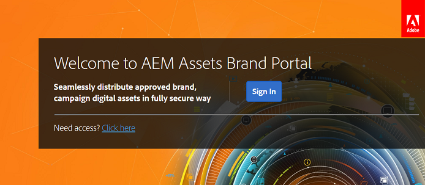

# 初回のログイン操作 {#first-time-login-experience}

管理者を含む、Experience Manager Assets Brand Portalの新規ユーザーはすべて、初回のログイン操作は同じです。 管理者によって組織のBrand Portal アカウントに追加されたユーザーは、招待を受け入れる必要なく、自動的に追加されます。 組織のBrand Portal アカウントにアクセスするためのリンクが記載された、お知らせメールが届きます。

Brand Portal に初めてログインするユーザーが実行する手順は以下のとおりです。

1. ウェルカムメールを開いて、「**[!UICONTROL 使用を開始]**」をクリックします。

1. 新規登録ページで、詳細（名前、パスワード、国／地域など）を指定します。

   >[!NOTE]
   >
   >既存のAdobe Experience Cloud ユーザーの場合は、サインアップページではなく、ログインページが表示されます。 Adobe Experience Cloudにログインするには、Adobe IDとパスワードを入力します。

   >[!NOTE]
   >
   >組織で Enterprise ID を使用している場合は、新規登録ページは表示されずに、エンタープライズログインページにリダイレクトされます。詳細については、[Enterprise ID、サインイン、およびアカウント ヘルプ &#x200B;](https://helpx.adobe.com/jp/enterprise/kb/enterprise-id-faq.html) を参照してください。

1. 「**[!UICONTROL 続行]**」をクリックして、組織の Brand Portal ページに進みます。
1. Brand Portal ログインページの「**[!UICONTROL ログイン]**」をクリックして、Brand Portal にログインします。

   

   >[!NOTE]
   >
   >Brand Portalにログインするには、1 つ以上のExperience Manager Assets製品プロファイルに対する権限が付与されている必要があります。
