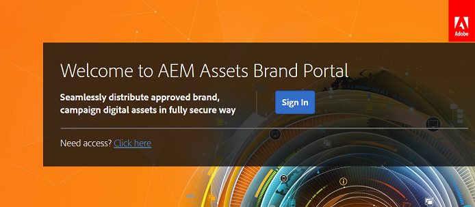

# 初回のログイン操作 {#first-time-login-experience}

管理者を含む新しいExperience Manager Assets Brand Portal ユーザーはすべて、同じ初回ログイン体験を持ちます。 管理者が組織のBrand Portal アカウントにユーザーを追加すると、招待に応じる必要はなく、自動的にユーザーが追加されます。 組織のBrand Portal アカウントにアクセスするためのリンクが記載されたウェルカムメールが届きます。

Brand Portal に初めてログインするユーザーが実行する手順は以下のとおりです。

1. ウェルカムメールを開いて、「**[!UICONTROL 使用を開始]**」をクリックします。

1. 新規登録ページで、詳細（名前、パスワード、国／地域など）を指定します。

   >[!NOTE]
   >
   >既存のAdobe Experience Cloud ユーザーの場合は、サインアップページの代わりにサインインページが表示されます。 Adobe Experience Cloudにログインするには、Adobe IDとパスワードを入力します。

   >[!NOTE]
   >
   >組織で Enterprise ID を使用している場合は、新規登録ページは表示されずに、エンタープライズログインページにリダイレクトされます。 詳しくは、[Enterprise ID、ログイン、アカウントのヘルプ &#x200B;](https://helpx.adobe.com/jp/enterprise/kb/enterprise-id-faq.html)を参照してください。

1. 「**[!UICONTROL 続行]**」をクリックして、組織の Brand Portal ページに進みます。
1. Brand Portal ログインページの「**[!UICONTROL ログイン]**」をクリックして、Brand Portal にログインします。

   

   >[!NOTE]
   >
   >Brand Portalにログインするには、少なくとも1つのExperience Manager Assets製品プロファイルの権限が必要です。
