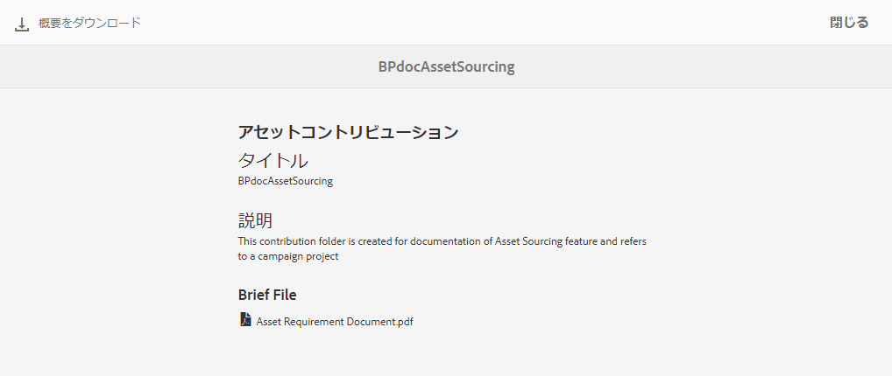
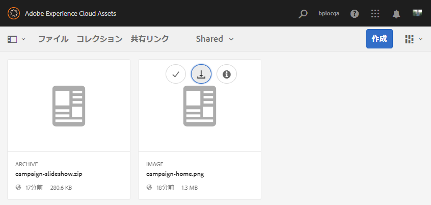
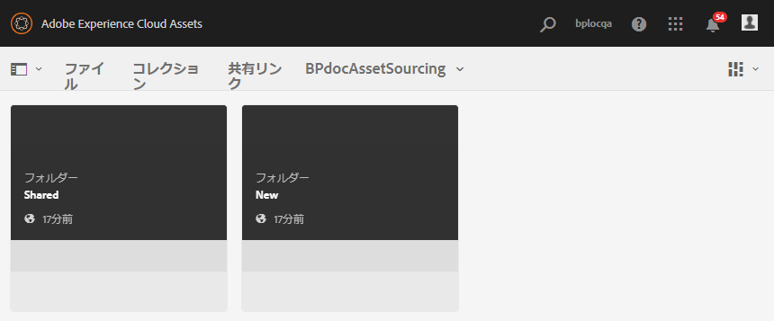
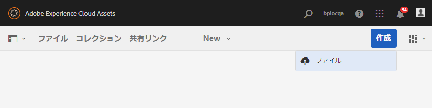
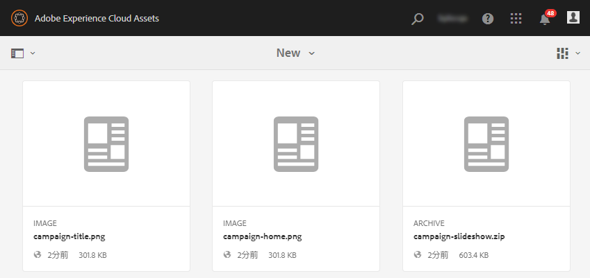
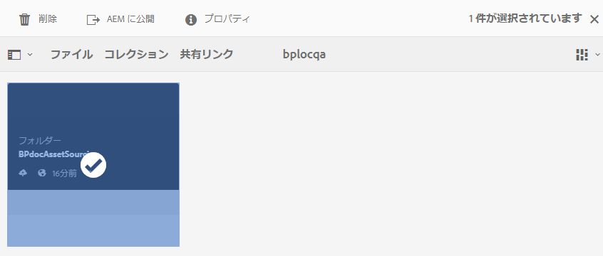
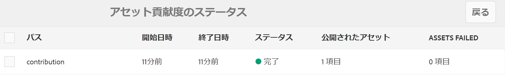
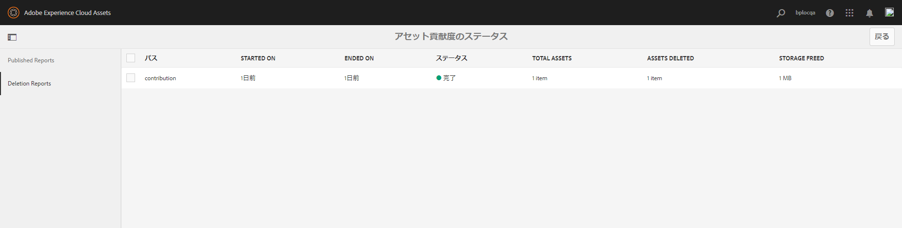
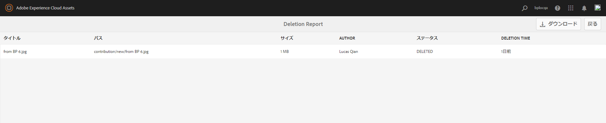

# Experience Manager Assets への投稿フォルダーの公開 {#using-asset-souring-in-bp}

適切な権限を持つ Brand Portal ユーザーは、複数のアセットや、複数のアセットを含むフォルダーを投稿フォルダーにアップロードできます。ただし、Brand Portal ユーザーは **NEW** フォルダーにのみアセットをアップロードできます。す。**SHARED** フォルダーは、Brand Portal ユーザーが投稿用の新しいアセットを作成する際に使用するベースラインアセット（参照コンテンツ）を配布するためのものです。

投稿フォルダーへのアクセス権を持つ Brand Portal ユーザーは、次のアクティビティを実行できます。

* [アセット要件のダウンロード](#download-asset-requirements)
* [投稿フォルダーへの新しいアセットのアップロード](#uplad-new-assets-to-contribution-folder)
* [Experience Manager Assets への投稿フォルダーの公開](#publish-contribution-folder-to-aem)

## アセット要件のダウンロード {#download-asset-requirements}

Brand Portal ユーザーが投稿フォルダーを共有すると、Experience Manager Assets ユーザーはメールとパルスの通知を自動的に受け取ります。 このワークフローを使用すると、ユーザーは **SHARED** フォルダーから概要（アセット要件）ドキュメントとベースラインアセット（参照用コンテンツ）をダウンロードして、アセット要件を理解できます。

Brand Portal ユーザーは、アセット要件をダウンロードするために、次のアクティビティを実行します。

* **概要をダウンロード** – 投稿フォルダーに添付された概要（アセット要件ドキュメント）をダウンロードします。 アセットのタイプ、目的、サポートされている形式、最大アセットサイズなど、アセット関連の情報が含まれています。
* **ベースラインアセットのダウンロード** - ベースラインアセットをダウンロードします。必要なアセットのタイプを理解するのに使用できます。 Brand Portal ユーザーは、これらのアセットを参照用に使用して、投稿用の新しいアセットを作成します。

新しく共有された投稿フォルダーと共に、Brand Portal ユーザーに対して許可された既存のすべてのフォルダーが Brand Portal ダッシュボードに反映されます。この例では、Brand Portal ユーザーは、新しく作成された投稿フォルダーにのみアクセスできます。 他の既存のフォルダーはユーザーと共有されません。

**アセット要件をダウンロードするには：**

1. Brand Portal インスタンスにログインします。
1. Brand Portalダッシュボードから投稿フォルダーを選択します。
1. 「**[!UICONTROL プロパティ]**」をクリックします。投稿フォルダーの詳細を表示したプロパティーウィンドウが開きます。

   

   

1. 「**[!UICONTROL 概要をダウンロード]**」オプションをクリックして、アセット要件ドキュメントをローカルマシンにダウンロードします。

   

1. Brand Portal ダッシュボードに戻ります。
1. 投稿フォルダーをクリックして開きます。 投稿フォルダー内に 2 つのサブフォルダー **[!UICONTROL SHARED]** および **[!UICONTROL NEW]** が表示されます。 SHARED フォルダーには、管理者によって共有されたすべてのベースラインアセット（参照用コンテンツ）が含まれます。
1. すべてのベースラインアセットを含む **[!UICONTROL SHARED]** フォルダーをローカルマシンにダウンロードできます。
または、「**[!UICONTROL 共有]**」フォルダーを開き、「**ダウンロード**」アイコンをクリックして、個々のファイルやフォルダーをダウンロードすることもできます。

   

   

概要（アセット要件ドキュメント）を確認し、ベースラインアセットを参照して、アセット要件を理解します。これで、投稿用の新しいアセットを作成して、投稿フォルダーにアップロードできます。

## 投稿フォルダーへのアセットのアップロード {#upload-new-assets-to-contribution-folder}

Brand Portal ユーザーは、アセット要件を確認した後、投稿用の新しいアセットを作成して、投稿フォルダー内の新規フォルダーにアップロードできます。ユーザーは、複数のアセットをアセット投稿フォルダーにアップロードできます。ただし、一度に作成できるフォルダーは 1 つだけです。

>[!NOTE]
>
>Brand Portal ユーザーは、アセットを NEW フォルダーにアップロードできます（ファイルサイズごとに最大 2 GB）。
>
>Brand Portal テナントの最大アップロード数は 10 GB です。これは累積的にすべての投稿フォルダーに適用されます。
>
>Brand Portalにアップロードされたアセットは、レンディション用には処理されず、プレビューは含まれません。

>[!NOTE]
>
>Adobeでは、投稿フォルダーをExperience Manager Assetsに公開した後にアップロード領域を解放し、他のBrand Portal ユーザーが投稿に使用できるようにすることをお勧めします。
>
>Brand Portal テナントのアップロード制限を拡張して **10** GB を超えるようにする必要がある場合は、カスタマーサポートに連絡して、要件を指定してください。

**新しいアセットをアップロードするには：**

1. Brand Portal インスタンスにログインします。
新しく共有された投稿フォルダーと共に、Brand Portal ユーザーに対して許可された既存のすべてのフォルダーが Brand Portal ダッシュボードに反映されます。

1. 投稿フォルダーを選択し、クリックして開きます。投稿フォルダーには、**[!UICONTROL SHARED]** と **[!UICONTROL NEW]** の 2 つのサブフォルダーが含まれます。

1. **[!UICONTROL NEW]** フォルダーをクリックします。

   

1. **[!UICONTROL 作成]**／**[!UICONTROL ファイル]**&#x200B;をクリックして、複数のアセットを含む個別のファイルまたはフォルダー（.zip）をアップロードします。

   

1. アセット（ファイルまたはフォルダー）を参照し、**[!UICONTROL NEW]** フォルダーへとアップロードします。

   

すべてのアセットまたはフォルダーを NEW フォルダーにアップロードしたら、投稿フォルダーを Experience Manager Assets に公開します。

## Experience Manager Assets への投稿フォルダーの公開 {#publish-contribution-folder-to-aem}

Brand Portal ユーザーは、Experience Manager オーサーインスタンスにアクセスすることなく、投稿フォルダーを Experience Manager Assets に公開できます。

アセット要件を確認し、新しく作成したアセットを投稿フォルダー内の **NEW** フォルダーにアップロードします。

**投稿フォルダーを公開するには：**

1. Brand Portal インスタンスにログインします。

1. Brand Portalダッシュボードから投稿フォルダーを選択します。
1. 「**[!UICONTROL AEM に公開]**」をクリックします。

   

   

公開ワークフローの様々な段階で、メール／パルス通知が Brand Portal ユーザーおよび管理者に送信されます。

1. **キューに登録済み** - Brand Portal で公開ワークフローがトリガーされると、Brand Portal ユーザーおよび Brand Portal 管理者に通知が送信されます。

1. **完了** - 投稿フォルダーが Experience Manager Assets へ正常に公開されると、Brand Portal ユーザーおよび Brand Portal 管理者に通知が送信されます。

新しく作成したアセットを Experience Manager Assets に公開した後、Brand Portal のユーザーは、NEW フォルダーからそれらのアセットを削除できます。ただし、Brand Portal管理者は、NEW フォルダーと SHARED フォルダーの両方からアセットを削除できます。

投稿フォルダー作成の目的を達成したら、Brand Portal 管理者は投稿フォルダーを削除して、他のユーザーが使用できるようアップロード領域を解放できます。

## ジョブステータスの公開 {#publishing-job-status}

管理者は、2 つのレポートを使用して、Brand PortalからExperience Manager Assetsに公開されたアセット投稿フォルダーのステータスを表示できます。

* Brand Portal で、**[!UICONTROL ツール]**／**[!UICONTROL アセット投稿のステータス]**&#x200B;に移動します。このレポートには、公開ワークフローの様々な段階におけるすべての公開ジョブのステータスが表示されます。

  

* Experience Manager Assets（オンプレミス版または Managed Services 版）で、**[!UICONTROL アセット]**／**[!UICONTROL ジョブ]**&#x200B;に移動します。このレポートには、すべての公開ジョブの最終状態（成功またはエラー）が表示されます。

  

* Experience Manager Assets as a Cloud Service で、**[!UICONTROL アセット]**／**[!UICONTROL ジョブ]**&#x200B;に移動します。

  または、グローバルナビゲーションから&#x200B;**[!UICONTROL ジョブ]**&#x200B;に直接移動できます。

  このレポートには、Brand Portal から Experience Manager Assets as a Cloud Service へのアセットのインポートなど、すべての公開ジョブの最終状態（成功またはエラー）が表示されます。

  

<!--
>[!NOTE]
>
>Currently, no report is generated in AEM Assets as a Cloud Service for the Asset Sourcing workflow. 
-->

## Experience Manager Assets に公開されたアセットの投稿フォルダーからの自動削除 {#automatically-delete-published-assets-from-contribution-folder}

Brand Portal では、12 時間ごとに自動ジョブを実行して、すべての投稿フォルダーをスキャンし、AEM に公開されているすべてのアセットを削除するようになりました。その結果、投稿フォルダー内のアセットを手動で削除して、フォルダーサイズを[しきい値の制限](#upload-new-assets-to-contribution-folder)以下に保つ必要がなくなりました。また、過去 7 日間に自動的に実行された削除ジョブのステータスを監視することもできます。ジョブのレポートには、次の詳細が表示されます。

* ジョブの開始時間
* ジョブの終了時間
* ジョブステータス
* ジョブに含まれる合計アセット数
* ジョブで正常に削除された合計アセット数
* ジョブの実行の結果として使用可能になった合計ストレージ

  

さらにドリルダウンして、削除ジョブに含まれる各アセットの詳細を表示することもできます。 レポートには、アセットのタイトル、サイズ、作成者、削除ステータス、削除時間などの詳細が含まれます。

>[!NOTE]
>
> * お客様は、アドビカスタマーサポートに対して、自動削除ジョブ機能の無効化と再有効化、または実行頻度の変更をリクエストできます。
> * この機能は、Experience Manager 6.5.13.0 以降のリリースで使用できます。

### 削除レポートの表示とダウンロード {#view-delete-jobs}

削除ジョブのレポートを表示およびダウンロードするには：

1. Brand Portal で、**[!UICONTROL ツール]**／**[!UICONTROL アセット投稿のステータス]**／**[!UICONTROL 削除レポート]**&#x200B;オプションに移動します。

1. ジョブを選択し、「**[!UICONTROL 表示]**」をクリックして、レポートを表示します。

   削除ジョブに含まれている各アセットの詳細を表示します。レポートには、アセットのタイトル、サイズ、作成者、削除ステータス、削除時間などの詳細が含まれています。「**[!UICONTROL ダウンロード]**」をクリックして、ジョブのレポートを CSV 形式でダウンロードします。

   レポート内のアセットの削除ステータスは、次のいずれかの値を取ります。

   * **削除済み** - アセットは投稿フォルダーから正常に削除されました。

   * **見つかりません** - 投稿フォルダー内にアセットが見つかりませんでした。アセットは既にフォルダーから手動で削除されています。

   * **スキップ済み** - アセットに使用できる新しいバージョンが投稿フォルダーにあり、まだ Experience Manager に公開されていないので、アセットの削除がスキップされました。

   * **失敗** - アセットの削除に失敗しました。 `Failed` の削除ステータスを持つアセットについては、削除が 3 回再試行されます。アセットの 3 回目の削除再試行が失敗した場合は、アセットを手動で削除する必要があります。

### レポートの削除

Brand Portalでは、1 つまたは複数のレポートを選択して、手動で削除することもできます。

レポートを削除するには：

1. **[!UICONTROL ツール]**／**[!UICONTROL アセット投稿のステータス]**／**[!UICONTROL 削除レポート]**&#x200B;オプションに移動します。

1. 1 つ以上のレポートを選択し、「**[!UICONTROL 削除]**」をクリックします。

