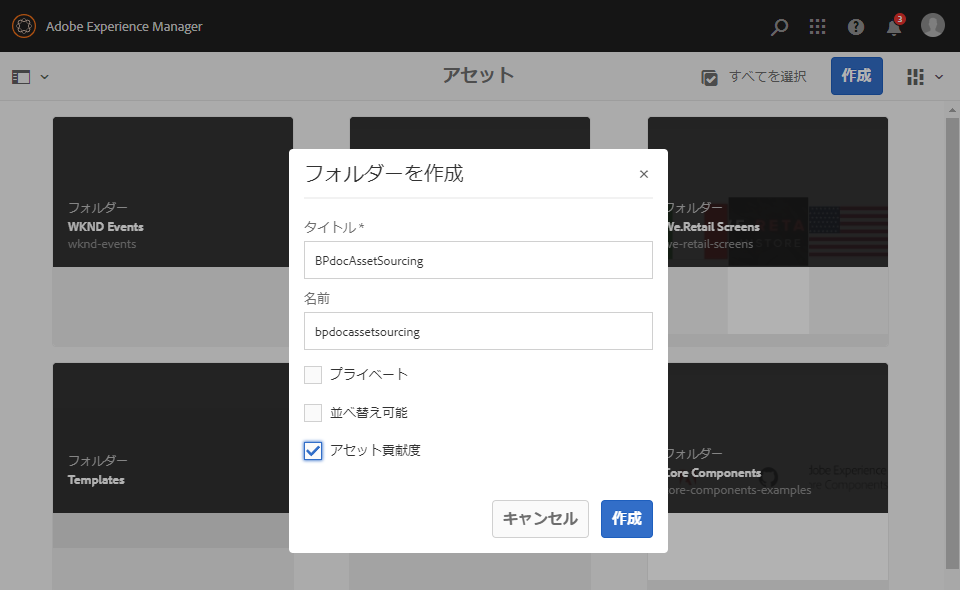
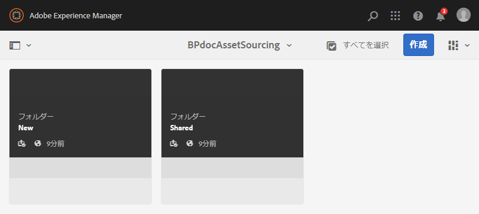
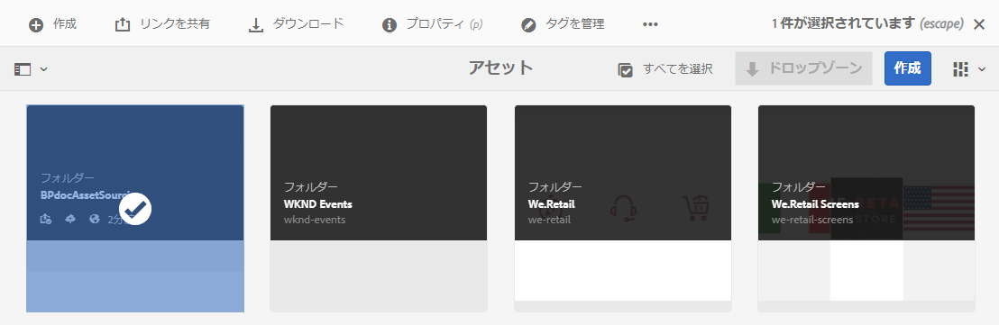
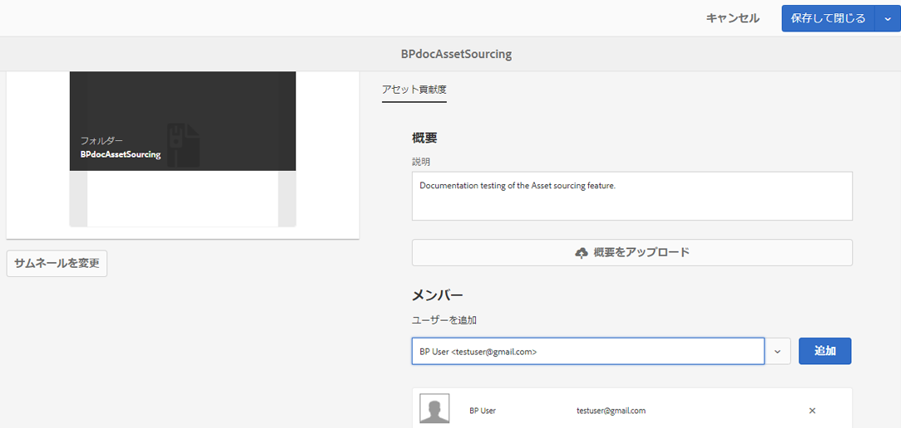
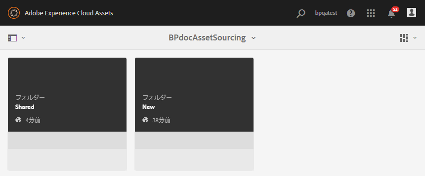
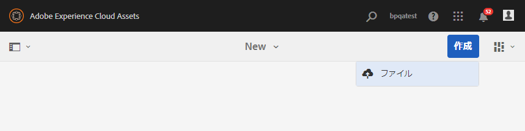
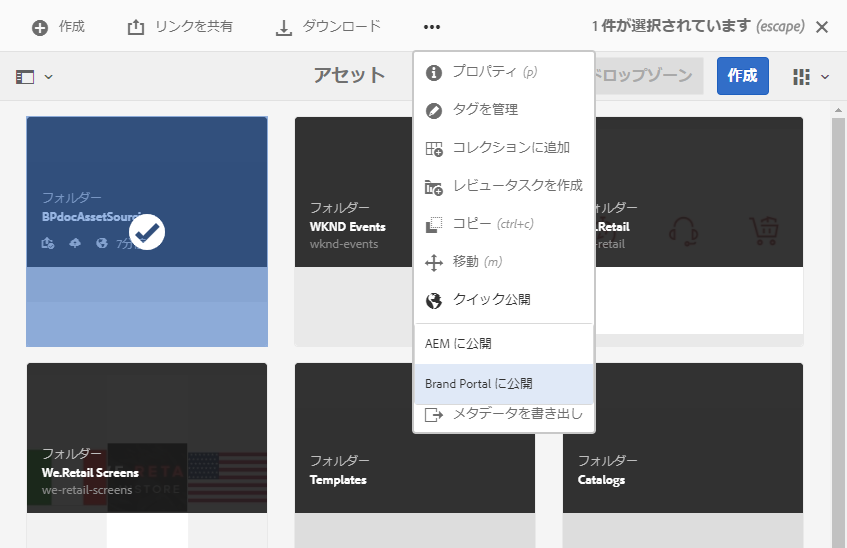

# Experience Manager Assets での投稿フォルダーの設定 {#configure-contribution-folder}

共同アセットソーシングの場合、Experience Manager Assets ユーザー（管理者および権限を持つ非管理者ユーザー）は **アセット投稿** タイプのフォルダーを作成できます。作成したフォルダーは、Brand Portal ユーザーがアセット送信に利用できます。  この方法では、新しく作成された **投稿** フォルダー内に **SHARED** および **NEW** という 2 つのサブフォルダーを追加作成するワークフローが自動的にトリガー設定されます。

Experience Manager Assets ユーザーは、投稿フォルダーに追加する必要があるアセットのタイプに関する概要をアップロードすることで、アセット要件を定義します。 また、一連のベースラインアセットを SHARED フォルダーにアップロードして、Brand Portalのユーザーが必要な情報を確実に入手できるようにします。 その後、管理者は、アクティブな Brand Portal ユーザーに投稿フォルダーへのアクセスを許可してから、新しく作成した投稿フォルダーを Brand Portal に公開することができます。

次のビデオでは、Experience Manager Assetsで投稿フォルダーを設定する方法を説明しています。

>[!VIDEO](https://video.tv.adobe.com/v/30547)

Experience Manager Assets ユーザーは、投稿フォルダーを設定する際に、次のアクティビティを実行します。

* [投稿フォルダーの作成](#create-contribution-folder)
* [アセット要件のアップロードと投稿者の割り当て](#configure-contribution-folder-properties)
* [ベースラインアセットのアップロード](#uplad-new-assets-to-contribution-folder)
* [Experience Manager Assets から Brand Portal への投稿フォルダーの公開](#publish-contribution-folder-to-brand-portal)

## 投稿フォルダーの作成 {#create-contribution-folder}

Experience Manager Assets管理者および新しいフォルダーを作成する権限を持つ非管理者ユーザーは、Experience Manager Assetsに投稿フォルダーを作成できます。
投稿フォルダーを作成するには、アセット投稿タイプのフォルダーを作成します。作成したフォルダーは、Brand Portal ユーザーがアセット送信に利用できます。 この方法では、投稿フォルダー内に SHARED および NEW という 2 つのサブフォルダーを追加作成するワークフローが自動的にトリガー設定されます。

>[!NOTE]
>
>管理者は、1 つのフォルダー内に複数のアセット投稿フォルダーを作成できます。
>
>アセット投稿フォルダーには、アセットの配布と投稿をおこなうための NEW フォルダーと SHARED フォルダーが含まれます。アセットフォルダーや、投稿フォルダー内の投稿フォルダーを作成しないでください。

投稿フォルダーの作成時だけでなく、個別に投稿フォルダーのプロパティを設定することもできます。この例では、プロパティが個別に設定されています。

**投稿フォルダーを作成するには：**

1. Experience Manager Assets インスタンスにログインします。

1. **[!UICONTROL Assets]**／**[!UICONTROL ファイル]**&#x200B;に移動します。Experience Manager Assets リポジトリに既に存在するすべてのフォルダーが一覧表示されます。

1. 「**[!UICONTROL 作成]**」をクリックして、新規フォルダーを作成します。「**[!UICONTROL フォルダーを作成]**」ダイアログが開きます。

1. フォルダーの **[!UICONTROL タイトル]** と **[!UICONTROL 名前]** を入力し、「**[!UICONTROL アセット投稿]**」チェックボックスを選択します。
Adobeでは、フォルダーに名前を付ける場合、スペースを入れずに小文字を使用することをお勧めします。

1. 「**[!UICONTROL 作成]**」をクリックします。Experience Manager Assets リポジトリに、投稿フォルダーがリストされます。

   >[!NOTE]
   >
   >管理者以外のユーザーは、アセット投稿フォルダーを作成および共有できますが、変更または削除することはできません。

   

1. 投稿フォルダーを開きます。 投稿フォルダー内に 2 つのサブフォルダー（**[!UICONTROL SHARED]** と **[!UICONTROL NEW]** が自動的に作成されているのを確認できます。

   

## 投稿フォルダーのプロパティの設定 {#configure-contribution-folder-properties}

Experience Manager Assets 管理者は、投稿フォルダーのプロパティを設定する際に、次のアクティビティを実行します。

* **説明を追加**：投稿フォルダーの大まかな説明を提供します。
* **概要のアップロード**：アセット関連情報を含むアセット要件ドキュメントをアップロードします。
* **投稿者を追加**：Brand Portal ユーザーを追加し投稿フォルダーへのアクセス権を付与します。

アセット要件は、管理者によって提供された詳細を参照して、投稿者（Brand Portal ユーザー）が投稿フォルダーのニーズおよび要件を理解できるようにします。管理者は、投稿フォルダーのアセットのタイプ（目的、画像のタイプ、最大サイズなど）の詳細を記載したアセット要件ドキュメントをアップロードします。

**投稿フォルダーのプロパティを設定するには：**

1. Experience Manager Assets インスタンスにログインします。

1. **[!UICONTROL Assets／ファイル]**&#x200B;に移動して、投稿フォルダーを探します。
1. 投稿フォルダーを選択し、「**[!UICONTROL プロパティ]**」をクリックしてフォルダーのプロパティウィンドウを開きます。

   

   

1. 「**[!UICONTROL アセット投稿]**」タブに移動します。
1. 投稿フォルダーの高レベルの **[!UICONTROL 説明]** を入力します。
1. **[!UICONTROL 概要をアップロード]**&#x200B;をクリックし、ローカルマシンから参照して&#x200B;**アセット要件ドキュメント**&#x200B;をアップロードします。

   

1. 「**[!UICONTROL ユーザーを追加]**」フィールドで、投稿フォルダーの共有相手となる Brand Portal ユーザーを追加します。これらのユーザーは、Brand Portal インターフェイスを使用して、投稿フォルダーにアクセスし、コンテンツをアップロードできます。
1. 「**[!UICONTROL 保存]**」をクリックします。

   

>[!NOTE]
>
>検索結果は、Experience Manager Assets に設定された Brand Portal ユーザーリストに基づきます。Brand Portal ユーザーリストを更新しておくようにします。

管理者は、[!DNL Admin Console] から `user.csv` ファイルをダウンロードして、Brand Portal ユーザーを追加する際の基本テンプレートとして使用できます。「[!UICONTROL ユーザー]」に移動し、「[!UICONTROL ユーザーリストを CSV に書き出す]」オプションをクリックして `users.csv` ファイルをダウンロードします。次のサンプルユーザーは、ユーザーの追加に必要な属性の詳細をリストします。ユーザーエントリに必須の属性は`Email` で、その他の属性はすべてオプションです。

[ファイルを入手](assets/users.csv)

## 投稿フォルダーへのアセットのアップロード {#uplad-new-assets-to-contribution-folder}

Experience Manager Assets ユーザーは、一連のベースラインアセットを **SHARED** フォルダーにアップロードして、Brand Portal ユーザーに必要な情報を提供できるようにします。

**ベースラインアセットをアップロードするには：**

1. Experience Manager Assets インスタンスにログインします。

1. **[!UICONTROL Assets／ファイル]**&#x200B;に移動して、投稿フォルダーを探します。

1. 投稿フォルダーを選択し、クリックして開きます。

1. **[!UICONTROL NEW]** フォルダーをクリックします。

   

1. **[!UICONTROL 作成]**／**[!UICONTROL ファイル]**&#x200B;をクリックして、複数のアセットを含む個別のファイルまたはフォルダー（.zip）をアップロードします。

   

1. アセット（ファイルまたはフォルダー）を参照し、**[!UICONTROL NEW]** フォルダーへとアップロードします。

   

すべてのアセットまたはフォルダーを NEW フォルダーにアップロードしたら、投稿フォルダーを Experience Manager Assets に公開します。

## Brand Portal への投稿フォルダーの公開 {#publish-contribution-folder-to-brand-portal}

投稿フォルダーが設定されると、Experience Manager Assets ユーザー（管理者／管理者以外のユーザー）は、Experience Manager Assets から Brand Portal に投稿フォルダーを公開できます。投稿フォルダーにアクセスする権限を持つBrand Portal ユーザーは、公開アクションの完了時にメールまたはパルス通知を受け取ります。

**投稿フォルダーを公開するには：**

1. Experience Manager Assets インスタンスにログインします。

1. **[!UICONTROL Assets／ファイル]**&#x200B;に移動して、Brand Portal に公開する投稿フォルダーを探します。
1. 投稿フォルダーを選択し、**[!UICONTROL クイックPublish]**/**[!UICONTROL Brand PortalへのPublish]** をクリックします。

   

   投稿フォルダーがBrand Portalに公開されると、成功メッセージが表示されます。

投稿フォルダーに割り当てられた Brand Portal ユーザーにメール／パルス通知が送信されます。Brand Portal ユーザーは投稿フォルダーにアクセスして、投稿を開始できます。 詳しくは、[Brand Portal での投稿フォルダーへのアセットのアップロードと Experience Manager Assets への投稿フォルダーの公開](brand-portal-publish-contribution-folder-to-aem-assets.md)を参照してください。
