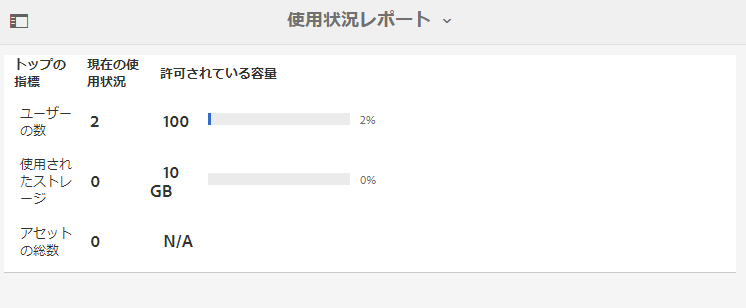

# レポートの操作 {#work-with-reports}

レポート機能は、Brand Portal の使用状況を調べたり、内部および外部ユーザーによる承認済みアセットの使用方法を確認したりするのに便利です。管理者は、Brand Portalの使用状況レポートを表示できます。このレポートは、常にアセットレポートページで利用できます。 ただし、ユーザーログインとアセットのダウンロード、期限切れ、公開、リンクを介した共有に関するレポートは、アセットレポート ページで生成および表示できます。 これらのレポートは、アセット導入を分析するために役立ちます。これらのレポートを利用して、承認されたアセットが組織の内外でどのくらい採用されたかを測定するための重要な成功指標を導き出すことができます。

レポート管理インターフェイスは直観的な設計になっており、保存済みレポートにアクセスするためのきめ細かいオプションとコントロールを備えています。レポートの表示、ダウンロード、削除はアセットレポートページで行います。このページには、過去に生成されたすべてのレポートが表示されます。

## レポートの表示 {#view-reports}

レポートを表示するには、以下の手順に従います。

1. 上部のツールバーで Experience Manager ロゴをクリックして、管理ツールにアクセスします。

   

1. 管理ツールパネルで **[!UICONTROL レポートの作成/管理]** をクリックして **[!UICONTROL アセットレポート]** ページを開きます。

   

1. アセットレポートページから **[!UICONTROL 使用状況]** レポートおよびその他の生成されたレポートにアクセスします。

   >[!NOTE]
   >
   >使用状況レポートは、Brand Portal で生成されるデフォルトのレポートです。作成または削除できません。 ただし、ダウンロード、有効期限、Publish、`Link Share`、ユーザーログインレポートを作成、ダウンロード、削除することはできます。

   レポートを表示するには、レポートのリンクをクリックします。または、レポートを選択して、ツールバーの表示アイコンをクリックします。

   **[!UICONTROL 使用状況レポート]** には、アクティブなBrand Portal ユーザーの数、すべてのアセットが占有しているストレージ容量、Brand Portal内の合計アセット数に関する情報が表示されます。 Admin Console内のどの製品プロファイルにも割り当てられていないBrand Portal ユーザーは、非アクティブユーザーと見なされ、**[!UICONTROL 使用状況レポート]** には反映されません。
また、それぞれの情報指標で許可されている容量も表示されます。

   

   **[!UICONTROL ユーザーログイン]** レポートには、Brand Portalにログインしたユーザーに関する情報が表示されます。 このレポートには、Brand Portal 6.4.2 を導入してからレポート生成時までの各ユーザーの名前、メール ID、ペルソナ（管理者、閲覧者、編集者、ゲスト）、最後のログイン、アクティビティのステータス、およびログイン回数が表示されます。

   

   **[!UICONTROL ダウンロード]**&#x200B;レポートには、特定の期間内にダウンロードされたすべてのアセットと、それらの詳細情報が表示されます。

   

   >[!NOTE]
   >
   >アセットの&#x200B;**[!UICONTROL ダウンロード]**&#x200B;レポートには、Brand Portal から個別に選択およびダウンロードされたアセットのみが表示されます。アセットを含んだフォルダーがダウンロードされた場合、そのフォルダーやフォルダー内のアセットはレポートに表示されません。

   **[!UICONTROL 有効期限]** レポートには、特定の期間内に期限切れになったすべてのアセットが一覧表示され、詳細が表示されます。

   

   **[!UICONTROL 公開]**&#x200B;レポートには、特定の期間内に Experience Manager Assets から Brand Portal に公開されたすべてのアセットと、それらに関する情報が表示されます。

   

   >[!NOTE]
   >
   >コンテンツフラグメントを Brand Portal に公開することはできないので、公開レポートにはコンテンツフラグメントに関する情報は表示されません。

   **[!UICONTROL リンク共有]** レポートには、特定の期間内にBrand Portal インターフェイスからのリンクを通じて共有されたすべてのアセットが一覧表示されます。 レポートには、アセットがリンクを通じて共有された日時、共有したユーザーおよびリンクの有効期限の詳細が表示されます。 また、テナントとユーザーの共有リンクの数も報告します。 リンク共有レポートの列をカスタマイズすることはできません。

   

   >[!NOTE]
   >
   >リンク共有レポートには、リンクを介して共有されたアセットにアクセスできるユーザーや、リンクを介してアセットをダウンロードしたユーザーは表示されません。
   >
   >共有リンクを介したダウンロードをトラッキングする場合は、「レポートの作成 ]**ページで**[!UICONTROL  リンク共有ダウンロードのみ ]**オプションを選択した後にダウンロードレポートを生成する必要が**[!UICONTROL  ります。 ただし、この場合、（がダウンロードした）ユーザーは匿名です。

## レポートの生成 {#generate-reports}

管理者は、次の標準レポートを生成および管理できます。 生成後、レポートは [ 後でアクセス ](../using/brand-portal-reports.md#main-pars-header) できるように保存されます。

* ユーザーログイン
* ダウンロード
* 有効期限
* 公開
* リンク共有

ダウンロード、有効期限、Publish レポートの列は、表示用にカスタマイズできます。 レポートを生成するには、次の手順に従います。

1. 上部のツールバーで Experience Manager ロゴをクリックして、管理ツールにアクセスします。

1. 管理ツールパネルで **[!UICONTROL レポートの作成/管理]** をクリックして **[!UICONTROL アセットレポート]** ページを開きます。

   

1. アセットレポートページで、「**[!UICONTROL 作成]**」をクリックします。
1. **[!UICONTROL レポートを作成]** ページから、作成するレポートを選択し、「**[!UICONTROL 次へ]**」をクリックします。

   

1. レポートの詳細を設定します。タイトル、説明、フォルダー構造（レポートの実行と統計情報の生成が必要な場所）、および日付範囲 **[!UICONTROL ダウンロード]**、**[!UICONTROL 有効期限]**、**[!UICONTROL Publish]** を指定します。

   

   **[!UICONTROL リンク共有]** レポートに必要なのは、タイトル、説明、日付範囲のパラメーターのみです。

   

   >[!NOTE]
   >
   >レポートを生成すると、タイトルの特殊文字 `#` と `%` がハイフン（–）に置き換えられます。

1. **[!UICONTROL 次へ]** をクリックして、ダウンロード、有効期限、Publishの各レポートの列を設定します。
1. 必要に応じて、適切なチェックボックスをオンまたはオフにします。例えば、（アセットをダウンロードした）ユーザーの名前を **[!UICONTROL ダウンロード]** レポートに表示するには、「**[!UICONTROL ダウンロードしたユーザー]**」を選択します。 次の画像は、ダウンロードレポートのデフォルトの列の選択を示しています。

   

   また、これらのレポートにカスタム列を追加して、カスタム要件に応じてより多くのデータを表示することもできます。

   ダウンロード、Publish、有効期限のレポートにカスタム列を追加するには、次の手順を実行します。

   1. カスタム列を表示するには、「**[!UICONTROL カスタム列 [!UICONTROL  内の]** 追加 ] をクリックします。
   1. 「列名 **[!UICONTROL フィールドに列の名前を指定し]** す。
   1. プロパティピッカーを使用して、列をマッピングする必要があるプロパティを選択します。

      
または、プロパティパスフィールドにパスを入力します。

      

      カスタム列をさらに追加するには、「**追加** をクリックし、手順 2 と 3 を繰り返します。

1. 「**[!UICONTROL 作成]**」をクリックします。レポートの生成が開始されたことを通知するメッセージが表示されます。

## ダウンロードレポート {#download-reports}

レポートを.csv ファイルとして保存してダウンロードするには、次のいずれかの操作を行います。

* アセットレポートページでレポートを選択し、上部のツールバーにある **[!UICONTROL ダウンロード]** をクリックします。

* アセットレポートページから、レポートを開きます。レポートページの上部にある「**[!UICONTROL ダウンロード]**」オプションを選択します。

## レポートの削除 {#delete-reports}

既存のレポートを削除するには、**[!UICONTROL アセットレポート]** ページでレポートを選択し、上部のツールバーの **[!UICONTROL 削除]** をクリックします。

>[!NOTE]
>
>**[!UICONTROL 使用状況]**&#x200B;レポートを削除することはできません。
