# レポートの操作 {#work-with-reports}

レポート機能は、Brand Portal の使用状況を調べたり、内部および外部ユーザーによる承認済みアセットの使用方法を確認したりするのに便利です。 管理者は、Brand Portalの使用状況レポートを表示できます。このレポートは、アセットレポート ページで常に使用できます。 ただし、ユーザーのログイン情報やアセットのダウンロード、有効期限の切れ、公開、リンクを介したアセットの共有に関するレポートは、アセットレポートページから生成して表示できます。 これらのレポートは、アセット導入を分析するために役立ちます。これらのレポートを利用して、承認されたアセットが組織の内外でどのくらい採用されたかを測定するための重要な成功指標を導き出すことができます。

レポート管理インターフェイスは直観的な設計になっており、保存済みレポートにアクセスするためのきめ細かいオプションとコントロールを備えています。 レポートの表示、ダウンロード、削除はアセットレポートページで行います。このページには、過去に生成されたすべてのレポートが表示されます。

## レポートの表示 {#view-reports}

レポートを表示するには、以下の手順に従います。

1. 上部のツールバーで Experience Manager ロゴをクリックして、管理ツールにアクセスします。

   

1. 管理ツールパネルで「**[!UICONTROL レポートの作成と管理]**」をクリックして、**[!UICONTROL アセットレポート]** ページを開きます。

   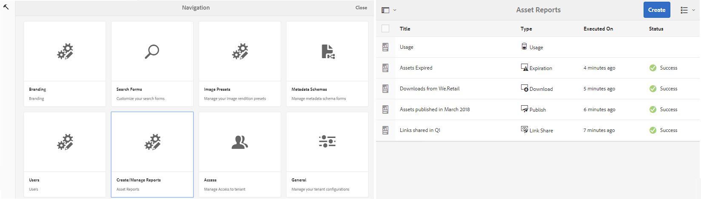

1. アセットレポートページから&#x200B;**[!UICONTROL 使用状況]** レポートおよびその他の生成レポートにアクセスします。

   >[!NOTE]
   >
   >使用状況レポートは、Brand Portal で生成されるデフォルトのレポートです。 作成または削除できません。 ただし、ダウンロード、有効期限、公開、`Link Share`、およびユーザーのログインに関するレポートを作成、ダウンロード、削除できます。

   レポートを表示するには、レポートのリンクをクリックします。 または、レポートを選択し、ツールバーの表示アイコンをクリックします。

   **[!UICONTROL 使用状況レポート]**&#x200B;には、アクティブなBrand Portal ユーザーの数、すべてのアセットが占めるストレージ容量、Brand Portalの合計アセット数に関する情報が表示されます。 Admin Console でどの製品プロファイルにも割り当てられていない Brand Portal ユーザーは、非アクティブユーザーと見なされ、**[!UICONTROL 使用状況レポート]**には反映されません。
また、それぞれの情報指標で許可されている容量も表示されます。

   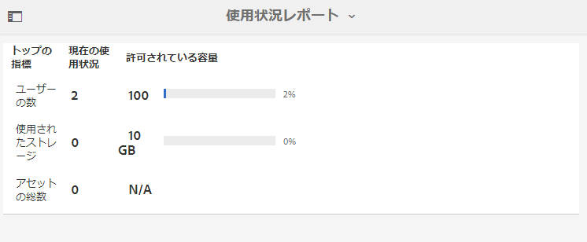

   **[!UICONTROL User Logins]** レポートには、Brand Portalにログインしたユーザーに関する情報が表示されます。 このレポートには、Brand Portal 6.4.2のデプロイメントからレポート作成時までの各ユーザーの名前、メール ID、ペルソナ（管理者、ビューア、エディター、ゲスト）、グループ、最終ログイン、アクティビティステータス、ログイン数が表示されます。

   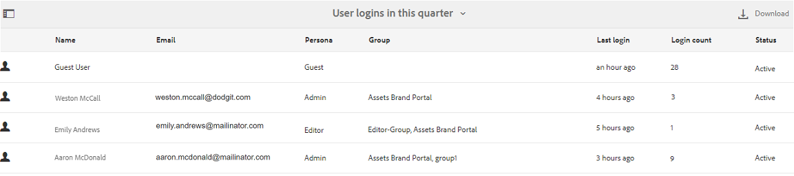

   **[!UICONTROL ダウンロード]**&#x200B;レポートには、特定の期間内にダウンロードされたすべてのアセットと、それらの詳細情報が表示されます。

   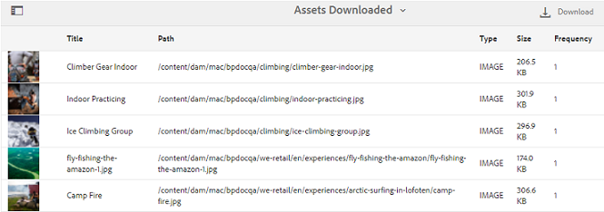

   >[!NOTE]
   >
   >アセットの&#x200B;**[!UICONTROL ダウンロード]**&#x200B;レポートには、Brand Portal から個別に選択およびダウンロードされたアセットのみが表示されます。 アセットを含んだフォルダーがダウンロードされた場合、そのフォルダーやフォルダー内のアセットはレポートに表示されません。

   **[!UICONTROL 有効期限]** レポートには、特定の時間枠で期限切れになったすべてのアセットが一覧表示され、詳細が表示されます。

   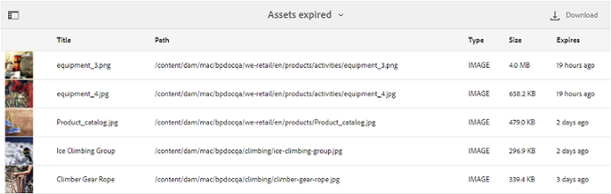

   **[!UICONTROL 公開]**&#x200B;レポートには、特定の期間内に Experience Manager Assets から Brand Portal に公開されたすべてのアセットと、それらに関する情報が表示されます。

   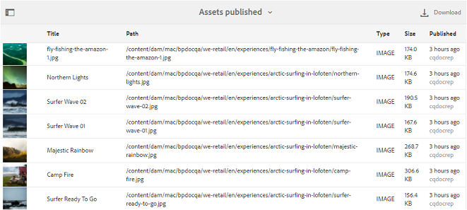

   >[!NOTE]
   >
   >コンテンツフラグメントを Brand Portal に公開することはできないので、公開レポートにはコンテンツフラグメントに関する情報は表示されません。

   **[!UICONTROL リンク共有]** レポートには、Brand Portal インターフェイスからリンクを介して共有されたすべてのアセットが、特定の時間枠で一覧表示されます。 レポートでは、リンクを介してアセットを共有した日時、共有したユーザー、リンクの有効期限が詳細に表示されます。 また、テナントとユーザーの共有リンクの数も報告されます。 リンク共有レポートの列はカスタマイズできません。

   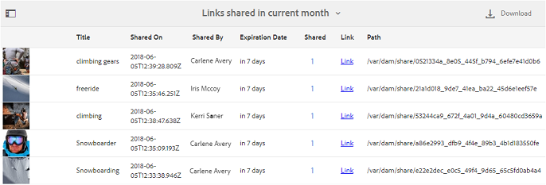

   >[!NOTE]
   >
   >リンク共有レポートには、リンクを介して共有されたアセットへのアクセス権を持つユーザーや、リンクを介してアセットをダウンロードしたユーザーは表示されません。
   >
   >共有リンクを通じてダウンロードを追跡するには、**[!UICONTROL レポートの作成]** ページで「**[!UICONTROL リンク共有ダウンロードのみ]**」オプションを選択した後で、ダウンロードレポートを生成する必要があります。 ただし、この場合、ユーザー（ダウンロード者）は匿名です。

## レポートの生成 {#generate-reports}

管理者は、次の標準レポートを生成および管理できます。 生成後、レポートは[以降のアクセス ](../using/brand-portal-reports.md#main-pars-header)用に保存されます。

* ユーザーログイン
* ダウンロード
* 有効期限
* 公開
* リンク共有

ダウンロード、有効期限、公開レポートの列は、表示用にカスタマイズできます。 レポートを生成するには、次の手順に従います。

1. 上部のツールバーで Experience Manager ロゴをクリックして、管理ツールにアクセスします。

1. 管理ツールパネルで「**[!UICONTROL レポートの作成と管理]**」をクリックして、**[!UICONTROL アセットレポート]** ページを開きます。

   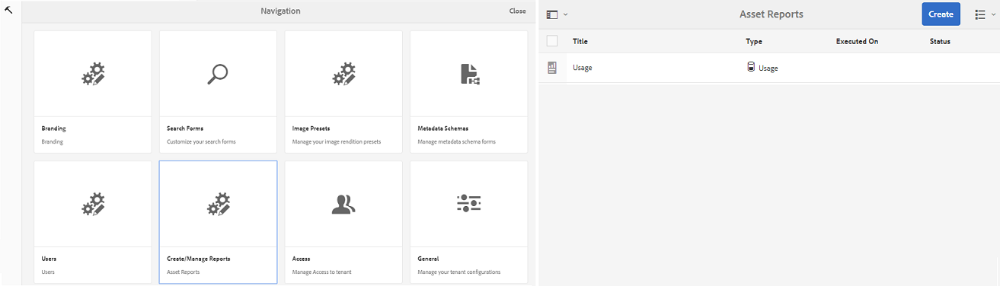

1. アセットレポート ページで、**[!UICONTROL 作成]**&#x200B;をクリックします。
1. **[!UICONTROL レポートの作成]** ページで、作成するレポートを選択し、**[!UICONTROL 次へ]**&#x200B;をクリックします。

   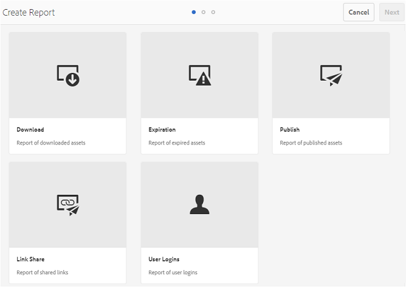

1. レポートの詳細を設定します。 **[!UICONTROL ダウンロード]**、**[!UICONTROL 有効期限]**、**[!UICONTROL 公開]** レポートのタイトル、説明、フォルダー構造（レポートを実行して統計を生成する必要がある場所）、日付範囲を指定します。

   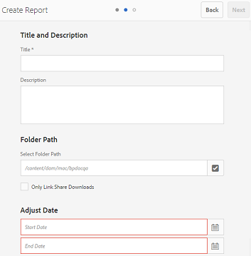

   **[!UICONTROL リンク共有]** レポートには、タイトル、説明、日付範囲のパラメーターのみが必要です。

   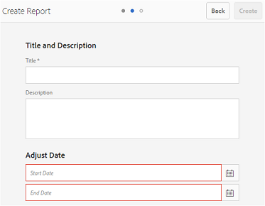

   >[!NOTE]
   >
   >レポートを生成すると、タイトルの特殊文字`#`と`%`がハイフン（ – ）に置き換えられます。

1. 「**[!UICONTROL 次へ]**」をクリックして、ダウンロード、有効期限、公開レポートの列を設定します。
1. 必要に応じて、適切なチェックボックスをオンまたはオフにします。 例えば、**[!UICONTROL ダウンロード]** レポートでユーザー（アセットをダウンロードしたユーザー）の名前を表示するには、**[!UICONTROL ダウンロード者]**&#x200B;を選択します。 次の図は、ダウンロードレポートでデフォルトの列を選択する様子を示しています。

   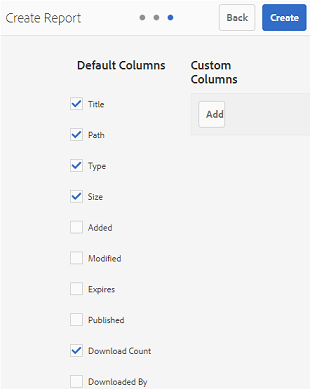

   これらのレポートにカスタム列を追加して、カスタム要件に関する詳細データを表示することもできます。

   カスタム列を「ダウンロード」、「公開」または「有効期限」レポートに追加するには、次の操作を行います。

   1. カスタム列を表示するには、[!UICONTROL  カスタム列]内の&#x200B;**[!UICONTROL 追加]**&#x200B;をクリックします。
   1. **[!UICONTROL 列名]** フィールドに列の名前を指定します。
   1. プロパティピッカーを使用して、列のマッピング先となるプロパティを選択します。

      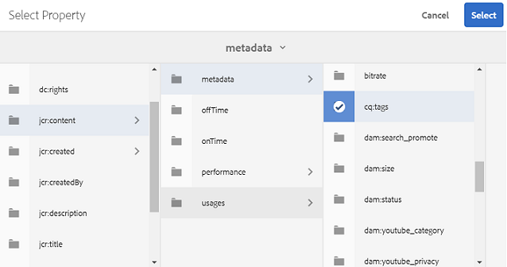
または、プロパティパスフィールドにパスを入力します。

      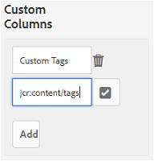

      カスタム列をさらに追加するには、**追加**&#x200B;をクリックし、手順2と3を繰り返します。

1. 「**[!UICONTROL 作成]**」をクリックします。 レポートの生成が開始されたことを通知するメッセージが表示されます。

## ダウンロードレポート {#download-reports}

レポートを.csv ファイルとして保存してダウンロードするには、次のいずれかの操作を行います。

* アセットレポート ページでレポートを選択し、上部のツールバーから「**[!UICONTROL ダウンロード]**」をクリックします。

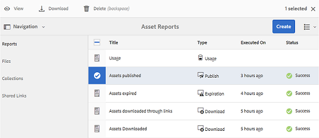

* アセットレポートページから、レポートを開きます。 レポートページの上部から「**[!UICONTROL ダウンロード]**」オプションを選択します。

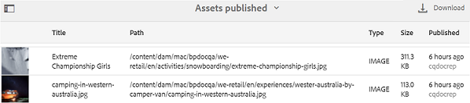

## レポートの削除 {#delete-reports}

既存のレポートを削除するには、**[!UICONTROL アセットレポート]** ページからレポートを選択し、上部のツールバーから&#x200B;**[!UICONTROL 削除]**&#x200B;をクリックします。

>[!NOTE]
>
>**[!UICONTROL 使用状況]**&#x200B;レポートを削除することはできません。
