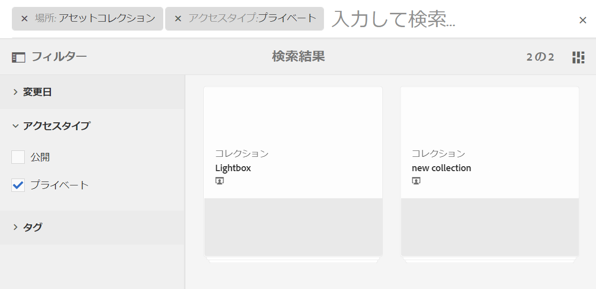

# Brand Portal でのアセットの検索 {#search-assets-on-brand-portal}

Brand Portalの検索機能ではオムニサーチと、検索をさらに絞り込むことができるフィルターを使用したファセット検索を使用して、関連するアセットをすばやく検索できます。 ファイルレベルまたはフォルダーレベルでアセットを検索し、検索結果をスマートコレクションとして保存できます。

>[!NOTE]
>
>Brand Portalは、オムニサーチを使用したコレクション検索をサポートしていません。
>
>ただし、[検索フィルターを使用して、関連するコレクションのリストを取得する](#search-collection)ことができます。

## オムニサーチを使用したアセット検索 {#search-assets-using-omnisearch}

Brand Portal 上でアセットを検索するには、次のようにします。

1. ツールバーで **[!UICONTROL 検索]** アイコンをクリックするか、**[!UICONTROL /]** （スラッシュ）キーを押してオムニサーチを起動します。

   

1. 検索ボックスに、検索するアセットのキーワードを入力します。

   

   >[!NOTE]
   >
   >* オムニサーチで検索候補が表示されるには、3 文字以上入力する必要があります。
   >* `mountain biking` を検索すると、オムニサーチでは、検索結果に、メタデータフィールドで使用できる `mountain` と `biking` の両方を含むすべてのアセットを返します。 例： `Title`フィールド内の`mountain`と`Description`フィールド内の`biking` 検索結果に表示するには、両方の単語がメタデータフィールドで使用可能である必要があります。 ただし、スマートタグのメタデータフィールドで使用できる単語が 2 つのうち 1 つだけの場合でも、オムニサーチでは、検索結果でそのアセットを返します。 例えば、あるアセットがスマートタグとして `mountain` を持っているが、他のメタデータフィールドには `biking` を欠いているとします。 次に、`mountain biking` を検索します。 オムニサーチでは、検索結果でアセットを返します。 このワークフローにより、関連するタグを持つアセットが見落とされることはありません。

1. ドロップダウンリストに表示される関連候補の中から選択すれば、関連するアセットにすばやくアクセスできます。

   

   *オムニサーチを使用したアセット検索*

スマートタグ付きアセットを使用した検索動作について詳しくは、[ 検索結果と動作について ](https://experienceleague.adobe.com/ja/docs/experience-manager-65/content/assets/using/search-assets) を参照してください。

## フィルターパネルでのファセットを使用した検索 {#search-using-facets-in-filters-panel}

フィルターパネルの検索ファセットを使用すると、検索エクスペリエンスに精度が追加され、検索機能が効率化されます。 検索ファセットでは、複数のディメンション（述語）を使用して、より複雑な検索を実行できます。検索の焦点をさらに絞り込むために、必要な詳細レベルまで簡単にドリルダウンできます。

例えば、画像を検索する場合、ビットマップ画像とベクトル画像のどちらを検索するかを選択できます。ファイルタイプ検索ファセットで画像の MIME タイプを指定して、検索範囲をさらに絞り込むことができます。 同様に、ドキュメントを検索する場合は、PDF や MS® Word などの形式を指定できます。

**[!UICONTROL フィルター]** パネルには、**[!UICONTROL パスブラウザー]**、**[!UICONTROL ファイルタイプ]**、**[!UICONTROL ファイルサイズ]**、**[!UICONTROL ステータス]**、**[!UICONTROL 方向]** など、いくつかの標準ファセットが含まれています。
ただし、[ カスタム検索ファセットを追加 ](../using/brand-portal-search-facets.md) したり、**[!UICONTROL フィルター]** パネルから特定のファセットを削除したりできます。 基になる検索フォームで述語を編集するだけです。 詳しくは、[Brand Portal で利用可能な検索用述語の一覧](../using/brand-portal-search-facets.md#list-of-search-predicates)を参照してください。

利用可能な[検索ファセット](../using/brand-portal-search-facets.md)を使用して検索にフィルターを適用するには、次のようにします。

1. オーバーレイアイコンをクリックし、「**[!UICONTROL フィルター]**」を選択します。

   

1. 左側の **[!UICONTROL フィルター]** パネルから、適切なオプションを選択して、関連するフィルターを適用します。
例えば、以下の標準のフィルターを使用します。

   * **[!UICONTROL パスブラウザー]**：特定のディレクトリ内のアセットを検索します。パスブラウザー用の述語のデフォルトの検索パスは `/content/dam/mac/<tenant-id>/` です。これは、デフォルトの検索フォームを編集して設定できます。

   >[!NOTE]
   >
   >管理者以外のユーザーには、[!UICONTROL  フィルター ] パネルの [!UICONTROL  パスブラウザー ] には、共有されているフォルダー（およびその上位フォルダー）のコンテンツ構造のみが表示されます。\
   >管理者ユーザーは、パスブラウザーを使用して、Brand Portal の任意のフォルダーに移動できます。

   * **[!UICONTROL ファイルタイプ]**：検索するアセットファイルのタイプ（画像、ドキュメント、マルチメディア、アーカイブ）を指定します。さらに、例えば画像の MIME タイプ（Tiff、ビットマップ、GIMP 画像）やドキュメントの形式（PDF、MS® Word）を指定して、検索の範囲を絞り込むことができます。
   * **[!UICONTROL ファイルサイズ]**：ファイルサイズに基づいてアセットを検索します。サイズ範囲の下限と上限を指定して検索を絞り込むことができます。また、検索の単位を指定できます。
   * **[!UICONTROL ステータス]**：承認のステータス（承認済み、リクエストされた変更、却下、保留）や有効期限などのアセットのステータスに基づいてアセットを検索します。
   * **[!UICONTROL 平均評価]**：アセットの評価に基づいてアセットを検索します。
   * **[!UICONTROL 回転角度]**：アセットの回転角度（水平方向、垂直方向、四角形）に基づいてアセットを検索します。
   * **[!UICONTROL スタイル]**：アセットのスタイル（カラー、モノクロ）に基づいてアセットを検索します。
   * **[!UICONTROL ビデオ形式]**：形式（DVI、Flash、MPEG4、MPEG、OGG Theora、QuickTime、Windows Media、WebM）に基づいてビデオアセットを検索します。

   フィルターパネルで[カスタム検索ファセット](../using/brand-portal-search-facets.md)を使用できるようにするには、基礎となる検索フォームを編集します。

   * **[!UICONTROL プロパティの述語]** 検索フォームで使用すると、述語がマッピングされているメタデータプロパティに一致するアセットを検索できます。\
     例えば、プロパティの述語が `jcr:content/metadata/dc:title` にマッピングされている場合は、タイトルに基づいてアセットを検索できます。\
     [!UICONTROL プロパティの述語]では、以下の場合のテキスト検索をサポートしています。

     **部分フレーズ**
プロパティの述語で部分的な語句を使用したアセット検索を許可するには、検索フォームの「**[!UICONTROL 部分検索]**」チェックボックスを有効にします。 この方法を使用すると、アセットメタデータで使用する語句を指定しなくても、目的のアセットを検索できます。

     >[!NOTE]
     >
     > Brand Portal では、部分検索用に次のフィールドをサポートしています。
     >
     >* `jcr:content/metadata/dc:title`
     >* `jcr:content/jcr:title`
     >* `jcr:content/metadata/dc:format`

     次の操作を実行できます。
      * 検索する語句で使用されている単語を、フィルターパネルのファセットで指定します。 例えば、「**climb**」という用語を検索すると（そして、プロパティの述語が `dc:title` プロパティにマッピングされる）、タイトルフレーズで「**climb**」という単語が使用されているアセットがすべて返されます。
      * 検索する語句で使用されている単語の一部を指定し、不明な箇所をワイルドカード文字（&#42;）で補完します。
例えば、次のようになります。
         * **climb&#42;** を検索すると、「climb」という文字列で始まる単語がタイトルフレーズで使用されているアセットがすべて返されます。
         * **&#42;climb** を検索すると、「climb」という文字列で終わる単語がタイトルフレーズで使用されているアセットがすべて返されます。
         * **&#42;climb&#42;** を検索すると、「climb」という部分文字列を含んだ単語がタイトルフレーズで使用されているアセットがすべて返されます。

     **大文字と小文字を区別しないテキスト**
プロパティの述語で大文字と小文字を区別しない検索を許可できます。 検索フォームで「**[!UICONTROL 大文字と小文字を区別しない]**」チェックボックスを有効にするだけです。 デフォルトでは、Property Predicate のテキスト検索では大文字と小文字が区別されます。

   >[!NOTE]
   >
   >「**[!UICONTROL 部分検索]**」チェックボックスを選択すると、デフォルトで **[!UICONTROL 大文字と小文字を区別しない]** が選択されます。

   

   適用したフィルターに従って検索結果が表示され、同時に検索結果数も表示されます。

   

   検索結果数を使用したアセット検索結果。

1. 検索結果から特定の項目に移動した後、ブラウザーの戻るボタンを使用して元の検索結果に簡単に戻ることができます。検索クエリを再実行する必要はありません。

## 検索設定をスマートコレクションとして保存 {#save-your-searches-as-smart-collection}

検索設定をスマートコレクションとして保存しておくと、同じ検索をすぐに再実行することができ、後で同じ設定をし直す必要がなくなります。 ただし、コレクションに検索フィルターを適用することはできません。

検索設定をスマートコレクションとして保存するには：

1. 「**[!UICONTROL スマートコレクションを保存]**」をクリックし、スマートコレクションの名前を指定します。

   すべてのユーザーがアクセスできるスマートコレクションにするには、「**[!UICONTROL 公開]**」を選択します。スマートコレクションが作成され、保存済みの検索の一覧に追加されたことを示すメッセージが表示されます。

   >[!NOTE]
   >
   >管理者以外のユーザーがスマートコレクションを公開できないように制限すると、管理者以外のユーザーが作成した多数の公開スマートコレクションが組織のBrand Portalに格納されるのを回避できます。 組織は、管理ツールパネルの **[!UICONTROL 一般]** 設定から「**[!UICONTROL 公開スマートコレクションの作成を許可]** 設定を無効にすることができます。

   

1. スマートコレクションを別の名前で保存したり、「**[!UICONTROL 公開]**」チェックボックスをオンまたはオフにするには、「**[!UICONTROL スマートコレクションを編集]**」をクリックします。

   

1. **[!UICONTROL スマートコレクションを編集]**&#x200B;ダイアログボックスで、「**[!UICONTROL 名前を付けて保存]**」を選択し、スマートコレクションの名前を入力します。「**[!UICONTROL 保存]**」をクリックします。

   

## コレクションを検索 {#search-collection}

コレクションでは、オムニサーチはサポートされていません。 ただし、検索フィルターを適用して、[!UICONTROL コレクション]インターフェイス内で関連するコレクションを一覧表示することができます。

[!UICONTROL コレクション]インターフェイスで、オーバーレイアイコンをクリックし、左側のパネルでフィルターパネルを開きます。使用可能なフィルターから 1 つまたは複数の検索フィルターを適用します（`modified date`、`access type`、および `tags`）。適用されたフィルターに基づいて、最も関連性の高いコレクションのセットが一覧表示されます。

