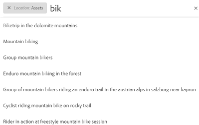
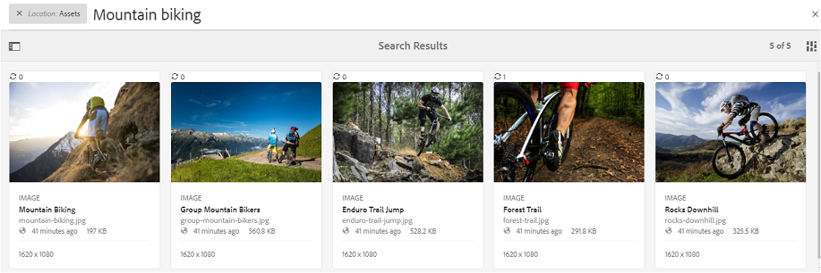
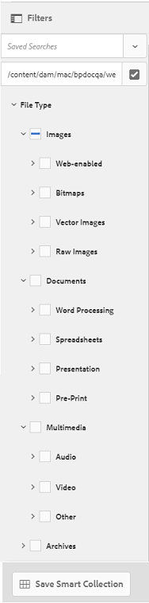
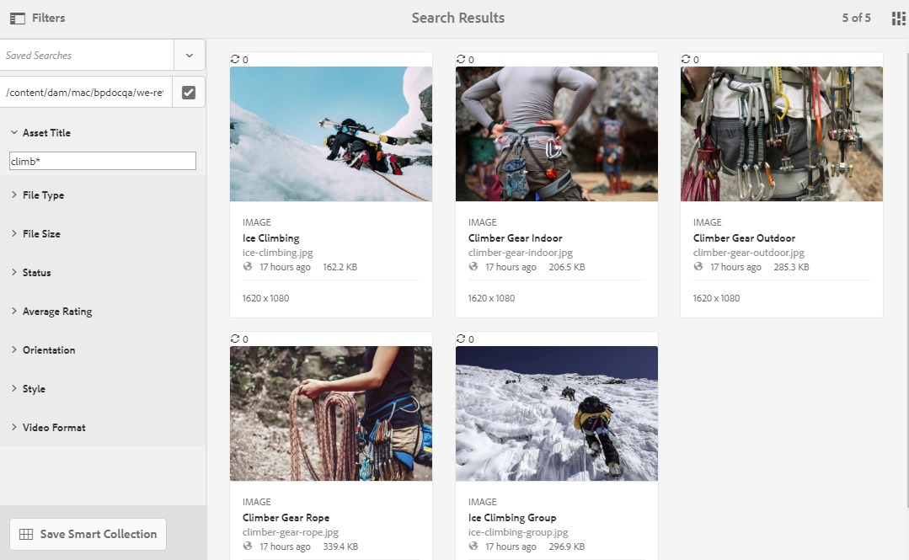
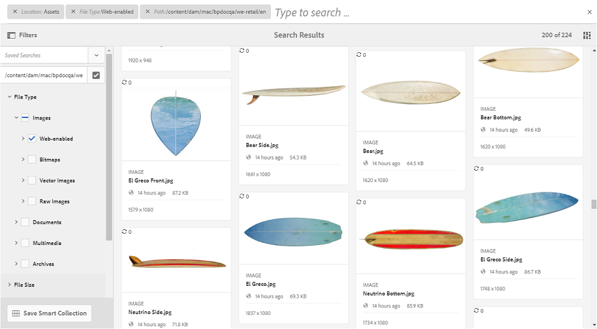
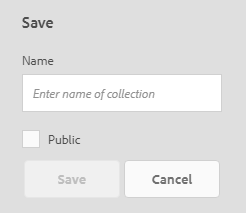
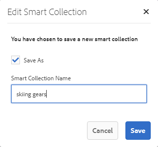
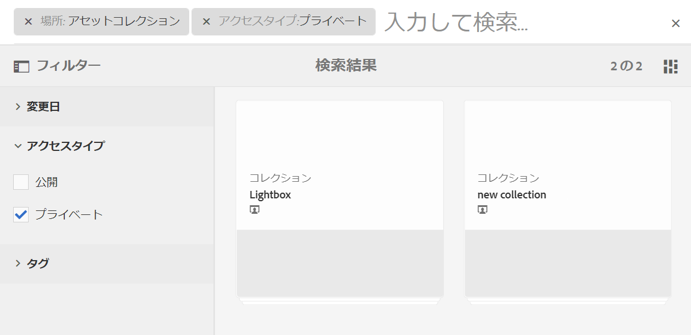

# Brand Portal でのアセットの検索 {#search-assets-on-brand-portal}

Brand Portalでは、オムニサーチを利用して関連アセットをすばやく検索し、フィルターを利用してファセット検索を利用して検索の絞り込みを支援します。 ファイルレベルまたはフォルダーレベルでアセットを検索し、検索結果をスマートコレクションとして保存できます。

>[!NOTE]
>
>Brand Portalでは、オムニサーチを使用したコレクション検索はサポートされていません。
>
>ただし、[検索フィルターを使用して、関連するコレクションのリストを取得する](#search-collection)ことができます。

## オムニサーチを使用したアセット検索 {#search-assets-using-omnisearch}

Brand Portal 上でアセットを検索するには、次のようにします。

1. ツールバーから、**[!UICONTROL 検索]** アイコンをクリックするか、**[!UICONTROL /]** （スラッシュ）キーを押してオムニサーチを起動します。

   

1. 検索ボックスに、検索するアセットのキーワードを入力します。

   

   >[!NOTE]
   >
   >* 検索候補を表示するには、オムニサーチで少なくとも3文字が必要です。
   >* `mountain biking`を検索すると、オムニサーチは、メタデータ フィールドで`mountain`と`biking`の両方が使用可能な検索結果のすべてのアセットを返します。 例： `Title`フィールド内の`mountain`と`Description`フィールド内の`biking` 検索結果に表示するには、両方の単語がメタデータフィールドで使用可能である必要があります。 ただし、スマートタグのメタデータフィールドで2つの用語のうち1つしか使用できない場合でも、オムニサーチは検索結果でアセットを返します。 例えば、アセットに`mountain`がスマートタグとして含まれているが、その他のメタデータフィールドに`biking`が含まれていないとします。 次に、`mountain biking`を検索します。 オムニサーチでは、検索結果のアセットが引き続き返されます。 このワークフローにより、関連するタグを持つアセットを見落とすことがなくなります。

1. ドロップダウンリストに表示される関連候補から選択して、関連するアセットにすばやくアクセスできます。

   

   *オムニサーチを使用したアセット検索*

スマートタグ付きアセットでの検索動作について詳しくは、[検索結果と動作について](https://experienceleague.adobe.com/ja/docs/experience-manager-65/content/assets/using/search-assets)を参照してください。

## フィルターパネルでのファセットを使用した検索 {#search-using-facets-in-filters-panel}

フィルターパネルの検索ファセットを使用すると、検索エクスペリエンスを詳細に指定し、検索機能をより効率的にできます。 検索ファセットでは、複数のディメンション（述語）を使用して、より複雑な検索を実行できます。 検索の焦点をさらに絞り込むために、必要な詳細レベルまで簡単にドリルダウンできます。

例えば、画像を検索する場合、ビットマップ画像とベクトル画像のどちらを検索するかを選択できます。 ファイルタイプ検索ファセットで画像のMIME タイプを指定することで、検索範囲をさらに絞り込むことができます。 同様に、ドキュメントを検索する場合は、PDF や MS® Word などの形式を指定できます。

**[!UICONTROL フィルター]** パネルには、**[!UICONTROL パスブラウザー]**、**[!UICONTROL ファイルタイプ]**、**[!UICONTROL ファイルサイズ]**、**[!UICONTROL ステータス]**、**[!UICONTROL 方向]**など、いくつかの標準ファセットが含まれています。
ただし、[ カスタム検索ファセット ](../using/brand-portal-search-facets.md)を追加したり、**[!UICONTROL フィルター]** パネルから特定のファセットを削除したりできます。 基礎となる検索フォームで述語を編集するだけです。 詳しくは、[Brand Portal で利用可能な検索用述語の一覧](../using/brand-portal-search-facets.md#list-of-search-predicates)を参照してください。

利用可能な[検索ファセット](../using/brand-portal-search-facets.md)を使用して検索にフィルターを適用するには、次のようにします。

1. オーバーレイアイコンをクリックし、「**[!UICONTROL フィルター]**」を選択します。

   

1. 左側の **[!UICONTROL フィルター]** パネルから、適切なオプションを選択して、関連するフィルターを適用します。
例えば、以下の標準のフィルターを使用します。

   * **[!UICONTROL パスブラウザー]**：特定のディレクトリ内のアセットを検索します。 パス ブラウザーの述語の既定の検索パスは`/content/dam/mac/<tenant-id>/`です。既定の検索フォームを編集して設定できます。

   >[!NOTE]
   >
   >管理者以外のユーザーの場合、[!UICONTROL  フィルター] パネルの[!UICONTROL  パスブラウザー]には、共有されているフォルダー（およびその祖先フォルダー）のコンテンツ構造のみが表示されます。\
   >管理者ユーザーは、パスブラウザーを使用して、Brand Portal の任意のフォルダーに移動できます。

   * **[!UICONTROL ファイルタイプ]**：検索するアセットファイルのタイプ（画像、ドキュメント、マルチメディア、アーカイブ）を指定します。 さらに、例えば画像の MIME タイプ（Tiff、ビットマップ、GIMP 画像）やドキュメントの形式（PDF、MS® Word）を指定して、検索の範囲を絞り込むことができます。
   * **[!UICONTROL ファイルサイズ]**：ファイルサイズに基づいてアセットを検索します。 サイズ範囲の下限と上限を指定して検索を絞り込むことができます。また、検索の単位を指定できます。
   * **[!UICONTROL ステータス]**：承認のステータス（承認済み、リクエストされた変更、却下、保留）や有効期限などのアセットのステータスに基づいてアセットを検索します。
   * **[!UICONTROL 平均評価]**：アセットの評価に基づいてアセットを検索します。
   * **[!UICONTROL 回転角度]**：アセットの回転角度（水平方向、垂直方向、四角形）に基づいてアセットを検索します。
   * **[!UICONTROL スタイル]**：アセットのスタイル（カラー、モノクロ）に基づいてアセットを検索します。
   * **[!UICONTROL ビデオ形式]**：形式（DVI、Flash、MPEG4、MPEG、OGG Theora、QuickTime、Windows Media、WebM）に基づいてビデオアセットを検索します。

   フィルターパネルで[カスタム検索ファセット](../using/brand-portal-search-facets.md)を使用できるようにするには、基礎となる検索フォームを編集します。

   * **[!UICONTROL プロパティ述語]**&#x200B;を検索フォームで使用すると、述語がマッピングされているメタデータプロパティに一致するアセットを検索できます。\
     例えば、プロパティの述語が `jcr:content/metadata/dc:title` にマッピングされている場合は、タイトルに基づいてアセットを検索できます。\
     [!UICONTROL プロパティの述語]では、以下の場合のテキスト検索をサポートしています。

     **一部のフレーズ**
プロパティの述語で部分的なフレーズを使用してアセット検索を許可するには、検索フォームで「**[!UICONTROL 部分検索]**」チェックボックスを有効にします。 この方法を使用すると、アセットのメタデータで使用される正確な単語やフレーズを指定しない場合でも、目的のアセットを検索できます。

     >[!NOTE]
     >
     > Brand Portal では、部分検索用に次のフィールドをサポートしています。
     >
     >* `jcr:content/metadata/dc:title`
     >* `jcr:content/jcr:title`
     >* `jcr:content/metadata/dc:format`

     次の操作を実行できます。
      * 検索したフレーズに含まれる単語をフィルターパネルのファセットで指定します。 例えば、「**climb**」という語句を検索した場合（および「`dc:title`」プロパティに「**climb**」という単語が含まれているすべてのアセットがタイトルフレーズに返されます）。
      * 検索したフレーズに含まれる単語の一部と、ワイルドカード文字（&#42;）を指定して、ギャップを埋めます。
例えば、次のようになります。
         * **climb&#42;** を検索すると、「climb」という文字列で始まる単語がタイトルフレーズで使用されているアセットがすべて返されます。
         * **&#42;climb** を検索すると、「climb」という文字列で終わる単語がタイトルフレーズで使用されているアセットがすべて返されます。
         * **&#42;climb&#42;** を検索すると、「climb」という部分文字列を含んだ単語がタイトルフレーズで使用されているアセットがすべて返されます。

     **大文字と小文字を区別しないテキスト**
プロパティ述語では、大文字と小文字を区別しない検索を許可できます。 検索フォームで「**[!UICONTROL ケースを無視]**」チェックボックスを有効にするだけです。 デフォルトでは、プロパティ述語のテキスト検索では大文字と小文字が区別されます。

   >[!NOTE]
   >
   >「**[!UICONTROL 部分検索]**」チェックボックスを選択すると、デフォルトで「**[!UICONTROL 大文字と小文字を区別しない]**」がオンになります。

   

   検索結果は、適用されたフィルタに従って、検索結果カウントとともに表示される。

   

   アセットの検索結果と検索結果の数。

1. 検索結果から特定の項目に移動した後、ブラウザーの戻るボタンを使用して元の検索結果に簡単に戻ることができます。検索クエリを再実行する必要はありません。

## 検索設定をスマートコレクションとして保存 {#save-your-searches-as-smart-collection}

検索設定をスマートコレクションとして保存すると、後で同じ設定をやり直すことなく、同じ検索をすばやく繰り返すことができます。 ただし、コレクションに検索フィルターを適用することはできません。

検索設定をスマートコレクションとして保存するには：

1. 「**[!UICONTROL スマートコレクションを保存]**」をクリックし、スマートコレクションの名前を指定します。

   すべてのユーザーがアクセスできるスマートコレクションにするには、「**[!UICONTROL 公開]**」を選択します。 スマートコレクションが作成され、保存済みの検索の一覧に追加されたことを示すメッセージが表示されます。

   >[!NOTE]
   >
   >管理者以外のユーザーがスマートコレクションを公開することを制限して、管理者以外のユーザーが組織のBrand Portalで作成する膨大な数の公開スマートコレクションを避けることができます。 組織は、管理ツールパネルで使用できる&#x200B;**[!UICONTROL 一般]**&#x200B;設定から&#x200B;**[!UICONTROL 公開スマートコレクション作成を許可]**&#x200B;設定を無効にできます。

   

1. スマートコレクションを別の名前で保存したり、「**[!UICONTROL 公開]**」チェックボックスをオンまたはオフにするには、「**[!UICONTROL スマートコレクションを編集]**」をクリックします。

   

1. **[!UICONTROL スマートコレクションを編集]**&#x200B;ダイアログボックスで、「**[!UICONTROL 名前を付けて保存]**」を選択し、スマートコレクションの名前を入力します。 「**[!UICONTROL 保存]**」をクリックします。

   

## コレクションを検索 {#search-collection}

コレクションでは、オムニサーチはサポートされていません。 ただし、検索フィルターを適用して、[!UICONTROL コレクション]インターフェイス内で関連するコレクションを一覧表示することができます。

[!UICONTROL コレクション]インターフェイスで、オーバーレイアイコンをクリックし、左側のパネルでフィルターパネルを開きます。 使用可能なフィルターから 1 つまたは複数の検索フィルターを適用します（`modified date`、`access type`、および `tags`）。 適用されたフィルターに基づいて、最も関連性の高いコレクションのセットが一覧表示されます。

