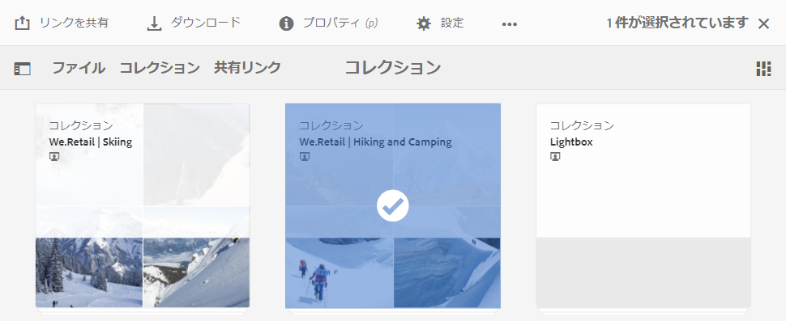

# コレクションを共有{#share-collections}

コレクションは、Adobe Experience Managerアセットブランドポータルにまとめて保存される、関連アセットのグループを表します。 ユーザーは、Omnisearchまたはファセット検索を適用してスマートコレクションを作成し、関連アセット[をフィルターで除外し、一緒に保存して、簡単にアクセスし、他のBrand Portalユーザーと共有できます。](brand-portal-searching.md)

管理者は、許可されたBrand Portalユーザーとコレクションを共有および共有解除できます。 エディターとビューアは、自分が作成したコレクション、共有したコレクション、公開コレクションに表示して共有できます。

>[!NOTE]
>
>編集者はパブリックコレクションを非パブリックコレクションに変更できないため、**[!UICONTROL コレクション設定]**&#x200B;ダイアログで使用できる「**[!UICONTROL パブリックコレクション]**」チェックボックスはありません。

## コレクションの共有 {#share-collection}

承認されたBrand Portalユーザーとコレクションを共有する手順は次のとおりです。

1. Brand Portalテナントにログインします。 デフォルトでは、**[!UICONTROL ファイル]**&#x200B;表示が開き、発行済みのすべてのアセットとフォルダーが含まれます。

1. 上部のクイックナビゲーションで、「**[!UICONTROL コレクション]**」をクリックします。

1. **[!UICONTROL コレクション]**&#x200B;コンソールで、以下のいずれかの手順を実行します。

   * 共有するコレクションの上にマウスポインターを置きます。そのコレクションで使用できるクイックアクションサムネールから、**[!UICONTROL 設定]**&#x200B;アイコンをクリックします。

      

   * 共有するコレクションを選択します。上部のツールバーの「**[!UICONTROL 設定]**」をクリックします。

      

1. **[!UICONTROL コレクション設定]**&#x200B;ダイアログボックスで、コレクションを共有するユーザーを選択し、グローバルロールに一致するユーザーのロールを選択します。 例えば、グローバルエディタにエディタロールを割り当て、グローバルビューアにビューアロールを割り当てます。

   また、グループのメンバーシップと役割に関係なく、すべてのユーザーがコレクションを利用できるようにするには、「**[!UICONTROL 公開コレクション]**」チェックボックスをオンにして、コレクションを公開にします。

   >[!NOTE]
   >
   >ただし、公開コレクションが大量に作成されてシステムの容量に影響しないように、管理者以外のユーザーによる公開コレクションの作成を制限できます。組織は、管理ツールパネルの&#x200B;**[!UICONTROL 一般的な]**&#x200B;設定から、**[!UICONTROL パブリックコレクションの作成を許可]**&#x200B;設定を無効にできます。

   

   編集者はパブリックコレクションを非パブリックコレクションに変更できないため、**[!UICONTROL コレクション設定]**&#x200B;ダイアログで使用できる「**[!UICONTROL パブリックコレクション]**」チェックボックスはありません。

   

1. **[!UICONTROL 追加]**&#x200B;ボタンをクリックしてユーザーを追加し、**[!UICONTROL 「保存]**」をクリックします。 コレクションはユーザーと共有されます。

   >[!NOTE]
   >
   >コレクション内のアセットやフォルダーへのアクセスは、ユーザーの役割によって決まります。アセットへのアクセス権を持たないユーザーは、空のコレクションを共有します。また、コレクションに対して実行できるアクションも、ユーザーの役割によって決まります。

## コレクションの共有解除  {#unshare-a-collection}

コレクションの共有を解除するには、以下の手順を実行します。

1. **[!UICONTROL コレクション]**&#x200B;コンソールで、共有を解除するコレクションを選択します。

   上部のツールバーの「**[!UICONTROL 設定]**」をクリックします。

   

1. **[!UICONTROL コレクション設定]**&#x200B;ダイアログボックスの「**[!UICONTROL メンバー]**」セクションで、ユーザーの横の&#x200B;**[!UICONTROL x]**&#x200B;記号をクリックして、コレクションにアクセスしているユーザーのリストから削除します。

   

1. 警告メッセージが表示されます。 **[!UICONTROL 「]**&#x200B;確認&lt;a1/>」をクリックして、コレクションの共有を解除します。

1. 「**[!UICONTROL 保存]**」をクリックして変更を適用します。

   ユーザーが共有リストーから削除されると、非共有コレクションはユーザーの&#x200B;**[!UICONTROL コレクション]**&#x200B;コンソールから削除されます。

<!--
1. Click the overlay icon on the left, and choose **[!UICONTROL Navigation]**.

   

1. From the siderail on the left, click **[!UICONTROL Collections]**.

   

1. From the **[!UICONTROL Collections]** console, do one of the following:

    * Hover the pointer over the collection you want to share. From the quick action thumbnails available for the collection, click the **[!UICONTROL Settings]** icon.

   

    * Select the collection you want to share. From the toolbar at the top, click **[!UICONTROL Settings]**.
    
   

1. In the [!UICONTROL Collection Settings] dialog box, select the users or groups with whom you want to share the collection and select the role for a user or a group to match their global role. For example, assign the Editor role to a global editor, the Viewer role to a global viewer.

   Alternatively, to make the collection available to all users irrespective of their group membership and role, make it public by selecting the **[!UICONTROL Public Collection]** check-box.

   >[!NOTE]
   >
   >However, non-admin users can be restricted from creating public collections, to avoid having numerous public collections so that system space can be saved. Organizations can disable the **[!UICONTROL Allow public collections creation]** configuration from [!UICONTROL General] settings available in admin tools panel.

   

   Editors cannot change a public collection to a non-public collection and, therefore, do not have **[!UICONTROL Public Collection]** check-box available in **[!UICONTROL Collection Settings]** dialog.

   

1. Select **[!UICONTROL Add]**, and then **[!UICONTROL Save]**. The collection is shared with the chosen users.

   >[!NOTE]
   >
   >A user's role governs access to the assets and folders inside a collection. If a user does not have access to assets, an empty collection is shared with the user. Also, a user's role governs the actions available for collections.

## Unshare a collection {#unshare-a-collection}

To unshare a previously shared collection, do the following:

1. From the **[!UICONTROL Collections]** console, select the collection you want to unshare.

   In the toolbar, click **[!UICONTROL Settings]**.

   

1. On the **[!UICONTROL Collection Settings]** dialog box, under **[!UICONTROL Members]**, click the **[!UICONTROL x]** symbol next to users or groups to remove them from the list of users you shared the collection with.

   

1. In the warning message box, click **[!UICONTROL Confirm]** to confirm unshare.

   Click **[!UICONTROL Save]**.

1. Log in to Brand Portal with the credentials of the user you removed from the shared list. The collection is removed from the **[!UICONTROL Collections]** console.
-->