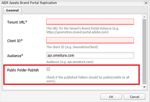
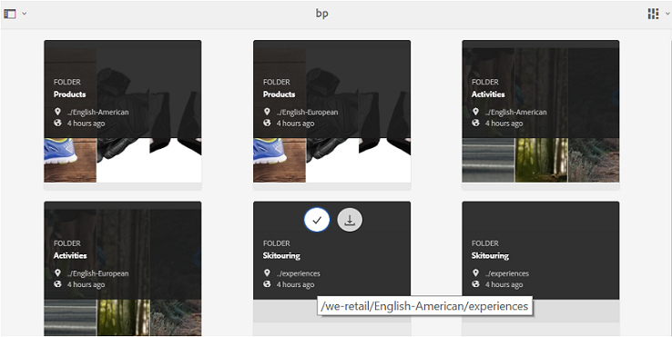
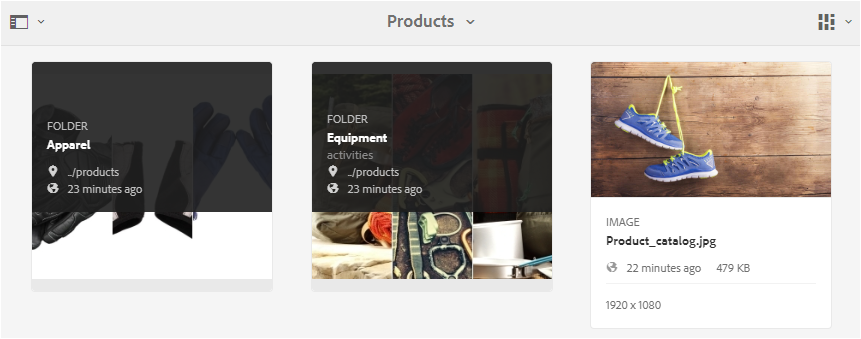
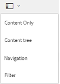
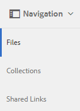
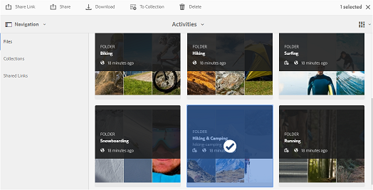
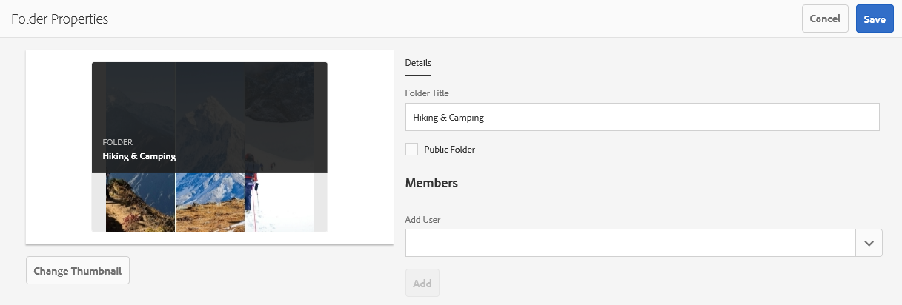
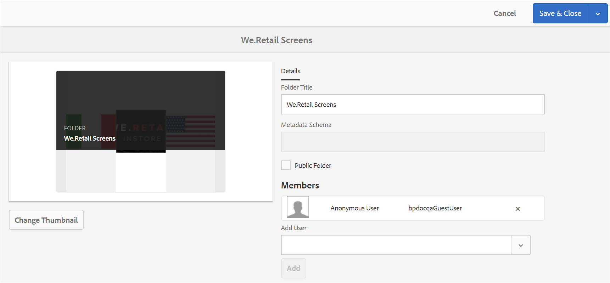
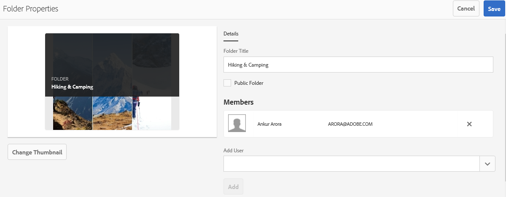

# Brand Portal でフォルダーを共有する {#share-folders}

Brand Portal は、アセットの取り込みをサポートしていません。したがって、事前設定済みの Experience Manager オーサーインスタンスから Brand Portal にアセットを公開する必要があります。

## Brand Portalのフォルダー共有ワークフロー {#folder-sharing-workflow-in-brand-portal}

以下に、フォルダー共有のワークフローとユーザーアクセスを示します。

* Experience Manager Assets から Brand Portal に公開されるすべてのフォルダーは、レプリケーションの設定時に「公開」として指定されていない限り、デフォルトで Brand Portal 管理者にのみ表示されます。
* 管理者は、**[!UICONTROL フォルダーのプロパティ]**&#x200B;コンソールを使用して、一部の選択したユーザーやグループとのみフォルダーを共有します。 フォルダーが共有されているユーザーまたはグループのみが、Brand Portalにログインした後にフォルダーを表示できます。 フォルダーは他のユーザーには表示されません。
* 管理者は、**[!UICONTROL フォルダーのプロパティ]**&#x200B;コンソールの「**[!UICONTROL 公開フォルダー]**」チェックボックスを利用して、フォルダーを公開フォルダーとして設定できます。 パブリックフォルダーは、すべてのユーザーに表示されます。

* ユーザーの役割や権限に関係なく、ユーザーがBrand Portalにログインすると、すべての公開フォルダーと、ユーザーと直接共有されているフォルダー、またはユーザーが属するグループと共有されているフォルダーが表示されます。 プライベートフォルダー、または他のユーザーと共有されているフォルダーは、すべてのユーザーには表示されません。

### Brand Portal 上でフォルダーをユーザーグループと共有する {#sharing-folders-with-user-groups-on-brand-portal}

フォルダーのアセットに対するアクセス権は、その親フォルダーに対するアクセス権に依存します。子フォルダーの設定には関係ありません。 AEMの[ACL](https://experienceleague.adobe.com/en/docs/experience-manager-65/content/security/security)がこのビヘイビアーを管理し、子フォルダーは親フォルダーからACLを継承します。 例えば、フォルダーAにフォルダーBがあり、フォルダーCが含まれているとします。次に、フォルダーAにアクセス権を持つユーザーグループ（またはユーザー）は、フォルダーBとフォルダーCにも同じアクセス権を持ちます。フォルダーBはAの子フォルダーであり、フォルダーCはBの子フォルダーはそのACLを継承します。

同様に、フォルダーBのみにアクセスする権限を持つユーザーグループ（またはユーザー）は、フォルダーCに対しては同じアクセス権限を持ちますが、フォルダーAにはアクセスできません。Adobeでは、最も公開されたアセットが子フォルダーに配置されるようにコンテンツを整理し、子フォルダーからルートフォルダーまでのアクセスを制限することをお勧めします。

### 公開フォルダーの公開 {#public-folder-publish}

管理者以外のユーザー（エディターやビューアーなど）は、AEM AssetsからBrand Portalに公開されたアセットにアクセスできます。ただし、Brand Portal レプリケーション設定中に「**[!UICONTROL 公開フォルダーの公開]**」オプションが選択されている場合に限ります。

「**[!UICONTROL 公開フォルダーの公開]**」オプションが無効になっている場合、管理者は、共有機能を使用して、管理者以外のユーザーとこれらのアセットを特に共有する必要があります。

>[!NOTE]
>
>**[!UICONTROL 公開フォルダー公開]**&#x200B;を有効にするオプションは、AEM 6.3.2.1以降で使用できます。

## 共有フォルダーへのアクセス {#access-to-shared-folders}

次のマトリックスでは、様々なユーザーの役割に対するアセットを共有または非共有するためのアクセス権と権利について説明します。

|               | AEM AssetsからBrand Portalに公開されたすべてのフォルダーへのアクセス | 共有フォルダーへのアクセス | フォルダーの権限を共有または共有解除する |
|---------------|-----------|-----------|------------|
| 管理者 | はい | はい | はい |
| 編集者 | 不可* | 可。ただし、そのユーザーと共有されている場合、またはそのユーザーの所属グループと共有されている場合のみ。 | 可。ただし、そのユーザーと共有されているフォルダー、またはそのユーザーの所属グループと共有されているフォルダーのみ。 |
| 閲覧者 | 不可* | 可。ただし、そのユーザーと共有されている場合、またはそのユーザーの所属グループと共有されている場合のみ。 | 不可 |
| ゲストユーザー | 不可* | 可。ただし、そのユーザーと共有されている場合、またはそのユーザーの所属グループと共有されている場合のみ。 | いいえ |

>[!NOTE]
>
>AEM オーサーインスタンスと Brand Portal のレプリケーションを設定する際、「**[!UICONTROL 公開フォルダーの公開]**」オプションはデフォルトで無効になっています。 このオプションが有効になっている場合、Brand Portalに公開されたフォルダーは、デフォルトですべてのユーザー（管理者以外のユーザーも）がアクセスできます。

### 管理者以外のユーザーによる共有フォルダーへのアクセス {#non-admin-user-access-to-shared-folders}

管理者以外のユーザーは、Brand Portal 上でそのユーザーに共有されているフォルダーにのみアクセスできます。 ただし、これらのフォルダーがログインしたときにポータルに表示される方法は、**[!UICONTROL フォルダー階層を有効にする]**&#x200B;設定によって異なります。

**設定が無効になっている場合**

管理者以外のユーザーは、Brand Portalにログインすると、ランディングページで共有されているすべてのフォルダーを表示できます。

**設定が有効になっている場合**

管理者以外のユーザーがBrand Portalにログインすると、フォルダーツリー（ルートフォルダーから始まる）と、それぞれの親フォルダー内に配置された共有フォルダーが表示されます。

これらの親フォルダーは仮想フォルダーであり、アクションは実行できません。 これらの仮想フォルダーには、鍵のアイコンが付きます。

**[!UICONTROL カード表示]**&#x200B;でこれらをカーソルで指したり選択したりしても、共有フォルダーとは異なり、アクションタスクは表示されません。 **[!UICONTROL 概要]** ボタンは、**[!UICONTROL 列ビュー]**&#x200B;および&#x200B;**[!UICONTROL リストビュー]**&#x200B;で仮想フォルダーを選択する際に表示されます。

>[!NOTE]
>
>仮想フォルダーのデフォルトのサムネールは最初の共有フォルダーのサムネール画像になることに注意してください。

   

## フォルダーの共有 {#how-to-share-folders}

フォルダーを Brand Portal 上でユーザーと共有するには、次の手順を実行します。

1. 左側のオーバーレイアイコンをクリックし、「**[!UICONTROL ナビゲーション]**」を選択します。

   

1. 左側のサイドパネルから、「**[!UICONTROL ファイル]**」を選択します。

   

1. Brand Portal インターフェイスで、共有するフォルダーを選択します。

   

1. 上部のツールバーの「**[!UICONTROL 共有]**」を選択します。

   

   [!UICONTROL &#x200B; フォルダープロパティ &#x200B;] コンソールが表示されます。

   

1. **[!UICONTROL フォルダープロパティ]** コンソールで、デフォルト名をユーザーに表示しない場合は、**[!UICONTROL フォルダータイトル]** フィールドにフォルダータイトルを指定します。
1. 「**[!UICONTROL ユーザーを追加]**」リストで、フォルダーを共有するユーザーまたはグループを選択して、「**[!UICONTROL 追加]**」をクリックします。
フォルダーをゲストユーザーとのみ共有し、他のユーザーとは共有しない場合は、「**[!UICONTROL メンバー]**」ドロップダウンから「**[!UICONTROL 匿名ユーザー]**」を選択します。

   

   >[!NOTE]
   >
   >グループのメンバーシップや役割に関係なく、すべてのユーザーがフォルダーを使用できるようにするには、「**[!UICONTROL 公開フォルダー]**」チェックボックスをオンにして、そのフォルダーを公開フォルダーに設定します。

1. 必要であれば、「**[!UICONTROL サムネールを変更]**」をクリックしてフォルダーのサムネール画像を変更します。
1. 「**[!UICONTROL 保存]**」をクリックします。

1. 共有フォルダーにアクセスするには、フォルダーを共有するユーザーの資格情報を使用して Brand Portal にログインします。 インターフェイスで共有フォルダーを確認します。

## フォルダーの共有を解除 {#unshare-the-folders}

共有フォルダーの共有を解除するには、以下の手順に従います。

1. Brand Portal インターフェイスで、共有を解除するフォルダーを選択します。

   

1. 上部のツールバーの「**[!UICONTROL 共有]**」をクリックします。
1. **[!UICONTROL フォルダーのプロパティ]**&#x200B;コンソールの「**[!UICONTROL メンバー]**」で、ユーザーの横にある **[!UICONTROL x]** 記号をクリックして、このユーザーを、フォルダーを共有しているユーザーの一覧から削除します。

   

1. 警告メッセージボックスの「**[!UICONTROL 確認]**」をクリックして、共有を解除することを確認します。
「**[!UICONTROL 保存]**」をクリックします。

1. 共有リストから削除したユーザーの資格情報を使用して、Brand Portal にログインします。 そのフォルダーは、そのユーザーの Brand Portal インターフェイスで利用できなくなっています。
