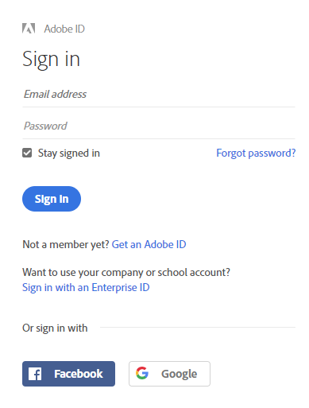
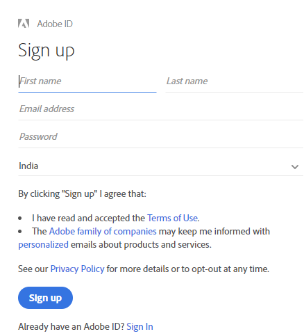
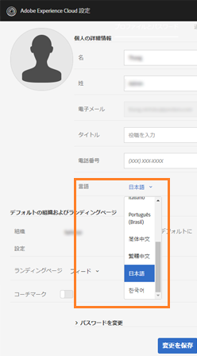
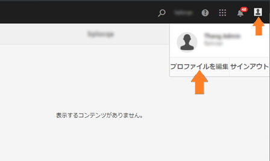

# Experience Manager Assets Brand Portal の概要 {#overview-of-aem-assets-brand-portal}

マーケターは、関連するデジタルコンテンツの作成、管理および顧客への迅速な配信を行うために、チャネルパートナーや内部のビジネスユーザーとの連携が必要となる場合があります。 関連するコンテンツをカスタマージャーニー全体にわたってタイミングよく配信することは、顧客のニーズやコンバージョン、エンゲージメント、ロイヤリティを促進するために不可欠です。

ただし、承認済みのブランドロゴ、キャンペーンアセット、チーム、パートナー、販売者との製品ショットなど、効率的で安全な共有をサポートするソリューションを開発することは困難です。 このプロセスで効率とセキュリティの両方を確保するには、慎重な計画と実行が必要です。

**Adobe Experience Manager（AEM）Assets Brand Portalは** アセット配信機能とアセット投稿機能を提供することで、世界中に分散しているBrand Portal ユーザーと効果的に共同作業するという、マーケターのニーズに重点を置いています。

アセット配布を使用すると、承認されたクリエイティブアセットを取得、制御し、それらのアセットを、デバイスの種類を問わず、外部の関係者や内部のビジネスユーザーに安全に配布できます。 ただし、アセット投稿を使用すると、Brand Portal ユーザーは、オーサー環境にアクセスすることなく、Brand Portalにアセットをアップロードしたり、Experience Manager Assetsに公開したりできます。 投稿機能は、**Brand Portal でのアセットソーシング**&#x200B;と呼ばれます。これらにより、Brand Portal ユーザー（外部の代理店／チーム）からのアセット配布および投稿の全体的な Brand Portal エクスペリエンスを向上させ、アセットの市場投入までの時間を短縮し、コンプライアンス違反や不正アクセスのリスクを低減できます。
[Brand Portal でのアセットソーシング](brand-portal-asset-sourcing.md)を参照してください。

ブラウザーベースのポータル環境により、アセットのアップロード、参照、検索、プレビューおよびエクスポートを、承認済み形式で簡単に行うことができます。

## Experience Manager Assets と Brand Portal の連携の設定 {#configure-brand-portal}

Adobe Experience Manager Assets と Brand Portal の連携を設定すると、Brand Portal ユーザー向けにアセットの公開、アセットの配布、アセットの投稿機能が可能になります。

>[!NOTE]
>
>Experience Manager Assets と Brand Portal の連携の設定は、Experience Manager Assets as a Cloud Service および Experience Manager Assets 6.3 以降でサポートされています。

>[!IMPORTANT]
>
> * Brand Portalは現在メンテナンス中です。
> * ユースケースの詳細とCloud Managerを使用してAdobeをアクティブ化するための具体的な要件については、Brand Portal担当者にお問い合わせください。
> * Brand Portalは、Assets PrimeまたはAssets Ultimateでは使用できません。 ただし、既にAssetsへのアクセス権を持つ既存のAssets Cloud Services のお客様は、Brand Portal Ultimateに移行する際にアクセス権を保持できます。

<!--Experience Manager Assets as a Cloud Service is automatically configured with Brand Portal by activating Brand Portal from the Cloud Manager. The activation workflow creates the required configurations at the backend and activates Brand Portal on the same IMS org as of the Experience Manager Assets as a Cloud Service instance.-->

ただし、Experience Manager Assets（オンプレミスおよび Managed Service）とBrand Portalの連携は、Adobe Developer Consoleを使用して手動で設定されます。このサービスは、Brand Portal テナントの認証に使用するAdobe Identity Management Services （IMS）トークンを調達します。

詳しくは、[Experience Manager Assets と Brand Portal の連携の設定](../using/configure-aem-assets-with-brand-portal.md)を参照してください。

## Brand Portal でのユーザーのペルソナ {#Personas}

Brand Portal では次のユーザー役割をサポートしています。

* ゲストユーザー
* 閲覧者
* 編集者
* 管理者

次の表に、これらの役割を持つユーザーが実行できるタスクを示します。

|  | **参照** | **検索** | **ダウンロード** | **フォルダーの共有** | **コレクションの共有** | **アセットをリンクとして共有** | **管理ツールにアクセス** |
|--- |--- |--- |--- |--- |--- |--- |--- |
| **ゲストユーザー** | ✓* | ✓* | ✓* | x | x | x | x |
| **閲覧者** | ✓ | ✓ | ✓ | x | x | x | x |
| **編集者** | ✓ | ✓ | ✓ | ✓ | ✓ | ✓ | x |
| **管理者** | ✓ | ✓ | ✓ | ✓ | ✓ | ✓ | ✓ |

>[!NOTE]
>
>ゲストユーザーは、公開フォルダーおよび公開コレクション内にあるアセットのみを参照、アクセス、および検索できます。

<!--
&#42; Viewer users can access and download the public assets shared with them, and can add these assets to create their own collections.

>[!NOTE]
>
>There is a known issue that the share link for collections is currently visible to the viewer users. The viewer users does not have the privilege to add users to create a share link. This issue will be fixed in the upcoming release, the option to share link for the collections will not be available to the viewer users.
-->

### ゲストユーザー {#guest-user}

Experience Manager Assets Brand Portal では、Brand Portal への[ゲストによるアクセス](#request-access-to-brand-portal)を許可します。ゲストユーザーは資格情報がなくてもポータルに入ることができ、公開フォルダー（およびコレクション）にアクセスできます。ゲストユーザーは、アセットの詳細を参照したり、公開フォルダーおよび公開コレクションのメンバーの完全なアセットを表示したりできます。 公開アセットを検索、ダウンロードおよび [!UICONTROL Lightbox] コレクションに追加できます。

ただし、ゲストセッションでは、コレクションや保存済みの検索の作成は制限され、さらに共有されます。 ゲストセッション中のユーザーはフォルダーやコレクションの設定にアクセスしたり、アセットをリンクとして共有したりすることはできません。次に、ゲストユーザーが実行できるタスクの一覧を示します。

* [公開アセットの参照および公開アセットへのアクセス](browse-assets-brand-portal.md)

* [公開アセットの検索](brand-portal-searching.md)

* [公開アセットのダウンロード](brand-portal-download-assets.md)

* [[!UICONTROL Lightbox] へのアセットの追加](brand-portal-light-box.md#add-assets-to-lightbox)

詳しくは、[Brand Portalへのゲストによるアクセス ](../using/guest-access.md) を参照してください。

### 閲覧者 {#viewer}

[!DNL Admin Console] で定義され閲覧者のロールでBrand Portalへのアクセス権を持つBrand Portal ユーザーです。 このロールを持つユーザーは、Brand Portalにログインし、許可されたフォルダー、コレクションおよびアセットにアクセスできます。 また、アセット（元のアセットまたは特定のレンディション）を参照、プレビュー、ダウンロードおよび書き出したり、アカウント設定を指定したり、アセットを検索したりすることもできます。次に、閲覧者が実行できるタスクの一覧を示します。

* [アセットの参照](browse-assets-brand-portal.md)

* [アセットの検索](brand-portal-searching.md)

* [アセットのダウンロード](brand-portal-download-assets.md)

### 編集者 {#editor}

編集者の役割を持つユーザーは、閲覧者が実行できるタスクをすべて実行できます。また、管理者が共有するファイルやフォルダーをエディターで表示することもできます。 また、編集者の役割を持つユーザーは、コンテンツ（ファイル、フォルダー、コレクション）を他のユーザーと共有することもできます。

編集者は、閲覧者が実行できるタスクに加えて、次のタスクを実行できます。

* [フォルダーの共有](brand-portal-sharing-folders.md)

* [コレクションの共有](brand-portal-share-collection.md)

* [アセットをリンクとして共有](brand-portal-link-share.md)

### 管理者 {#administrator}

管理者には、[!UICONTROL Admin Console] でシステム管理者またはBrand Portal製品管理者としてマークされたユーザーが含まれます。 管理者は、システム管理者とユーザーを追加／削除したり、プリセットを定義したりできます。また、ユーザーにメールを送信したり、ポータルの使用状況とストレージに関するレポートを表示したりできます。

>[!NOTE]
>
>Brand Portalでは、[!UICONTROL Admin Console] のサポート管理者の役割とマークが付けられているユーザーは、システム管理者と同じ権限を持っています。

管理者は、編集者が実行可能なすべてのタスクを実行できます。管理者が実行できるその他のタスクを次に示します。

* [ユーザー、グループ、ユーザーの役割の管理](brand-portal-adding-users.md)
* [壁紙、ページヘッダーおよびメールのカスタマイズ](brand-portal-branding.md)
* [カスタム検索ファセットの使用](brand-portal-search-facets.md)
* [メタデータスキーマの使用](brand-portal-metadata-schemas.md)
* [画像プリセットまたは動的レンディションの適用](brand-portal-image-presets.md)
* [レポートの操作](brand-portal-reports.md)

AEM Assets の作成者は、上記のタスクに加えて、次のタスクを実行できます。

* [AEM Assets と Brand Portal の連携の設定](../using/configure-aem-assets-with-brand-portal.md)
* [Brand Portal へのフォルダーの公開](https://experienceleague.adobe.com/ja/docs/experience-manager-65/content/assets/brandportal/brand-portal-publish-folder)
* [Brand Portal へのコレクションの公開](https://experienceleague.adobe.com/ja/docs/experience-manager-65/content/assets/brandportal/brand-portal-publish-collection)

## Brand Portal URL の代替エイリアス {#tenant-alias-for-portal-url}

Brand Portal 6.4.3 以降では、Brand Portal テナントの既存の URL ごとに 1 つの代替（エイリアス） URL を設定できます。 エイリアス URL を作成するには、既存の URL に代替接頭辞を含めます。\
テナント名が 32 文字を超える場合は、テナントエイリアスを作成する必要があります。
カスタマイズできるのは Brand Portal URL の接頭辞のみであり、URL 全体でないことに注意してください。例えば、`geomettrix.brand-portal.adobe.com` という既存ドメインを持つ組織は、アドビに依頼することで `geomettrixinc.brand-portal.adobe.com` という URL を作成できます。

ただし、AEM オーサーインスタンスを [ 設定 ](../using/configure-aem-assets-with-brand-portal.md) する際には、テナント ID URL のみを使用できます。テナントエイリアス（代替） URL は使用できません。

>[!NOTE]
>
>既存のポータル URL 中のテナント名のエイリアスを取得するには、各組織からカスタマーサポートへ新規テナント名の作成依頼を出す必要があります。 最初に、エイリアスが使用可能かどうかを確認し、次にこのリクエストを処理するためのエイリアスを作成します。
>
>古いエイリアスを置き換えたり、削除したりするには、同じ手続きに従う必要があります。

## Brand Portal へのアクセス権の申請 {#request-access-to-brand-portal}

ユーザーは、Brand Portal へのアクセス権をログイン画面から申請できます。この申請は Brand Portal 管理者に送信され、この管理者が Adobe [!UICONTROL Admin Console] を通じてユーザーにアクセス権を付与します。アクセス権が付与されると、ユーザーに通知メールが届きます。

アクセス権を申請するには、以下の手順を実行します。

1. Brand Portal ログインページから、「**[!UICONTROL アクセスが必要ですか？]**」の横にある「**[!UICONTROL ここをクリックしてください]**」を選択します。ただし、ゲストセッションに入るには、「**[!UICONTROL ゲストとしてアクセスしますか？]**」の横にある「**[!UICONTROL ここをクリックしてください]**」を選択します。

   

   [!UICONTROL アクセスを申請]ページが開きます。

1. 組織の Brand Portal へのアクセスを申請するには、有効な [!UICONTROL Adobe ID]、[!UICONTROL Enterprise ID] または [!UICONTROL Federated ID] を持っている必要があります。

   [!UICONTROL アクセスを申請]ページで、自分の ID を使用してログインするか（シナリオ 1）、[!UICONTROL Adobe ID] を作成します（シナリオ 2）。

   ![[!UICONTROL アクセスの申請]](assets/bplogin_request_access_2.png)

   **シナリオ 1**

   1. [!UICONTROL Adobe ID]、[!UICONTROL Enterprise ID] または [!UICONTROL Federated ID] を持っている場合は、「**[!UICONTROL ログイン]**」をクリックします。
[!UICONTROL &#x200B; ログイン &#x200B;] ページが開きます。

   1. [!UICONTROL Adobe ID] の資格情報を入力し、「**[!UICONTROL ログイン]**」をクリックします。

      

   [!UICONTROL アクセスを申請]ページにリダイレクトされます。

   **シナリオ 2**

   1. [!UICONTROL Adobe ID] を持っていない場合は、[!UICONTROL アクセスを申請]ページの「**[!UICONTROL Adobe ID を取得]**」をクリックして、Adobe ID を作成します。
[!UICONTROL &#x200B; ログイン &#x200B;] ページが開きます。
   1. 「**[!UICONTROL Adobe ID を取得]**」をクリックします。
[!UICONTROL &#x200B; サインアップ &#x200B;] ページが開きます。
   1. 名前、メール ID およびパスワードを入力します。
   1. 「**[!UICONTROL 新規登録]**」をクリックします。

      

   [!UICONTROL アクセスを申請]ページにリダイレクトされます。

1. アクセスの申請に使用する現在のユーザーの名前とメール ID が次のページに表示されます。管理者のコメントは空欄のまま、「**[!UICONTROL 送信]**」をクリックします。

   

## 製品管理者によるアクセス権の付与 {#grant-access-to-brand-portal}

Brand Portal 製品管理者は Brand Portal の通知領域および自分のインボックス内のメールでアクセス申請を受け取ります。

アクセスを許可するには、管理者はBrand Portalの通知領域で関連通知をクリックし、「**[!UICONTROL アクセスの許可]**」をクリックする必要があります。
または、アクセス申請メールに記載されているリンクをたどってAdobe [!UICONTROL Admin Consoleにアクセスし &#x200B;] 該当する製品設定にユーザーを追加することもできます。

[Adobe [!UICONTROL Admin Console]](https://adminconsole.adobe.com/enterprise/overview) ホームページにリダイレクトされます。Adobe [!UICONTROL Admin Console] を使用してユーザーを作成し、製品プロファイル （旧称：製品設定）に割り当てます。製品プロファイルは、Brand Portalでグループとして表示されます。 [!UICONTROL Admin Console] でのユーザーの追加について詳しくは、[ ユーザーの追加 ](brand-portal-adding-users.md#add-a-user) を参照してください（ユーザーを追加するには、手順 4～7 に従います）。

## Brand Portal の言語 {#brand-portal-language}

Brand Portalの言語は、Adobe [!UICONTROL Experience Cloud Settings] から変更できます。

言語を変更するには：

1. 上部メニューから、[!UICONTROL ユーザー]／[!UICONTROL プロファイルを編集]を選択します。

   

1. [!UICONTROL Experience Cloud設定 &#x200B;] ページで、「言語 [!UICONTROL &#x200B; ドロップダウンメニューから言語を選択 &#x200B;] ます。

## Brand Portal のメンテナンス通知 {#brand-portal-maintenance-notification}

Brand Portal のメンテナンスのために停止が予定されている場合は、Brand Portal にログインすると、バナー通知が表示されます。以下に通知の例を示します。

この通知を解除すると、Brand Portal を引き続き使用できます。この通知は、新しいセッションのたびに表示されます。

## リリースおよびシステム情報 {#release-and-system-information}

* [新機能](whats-new.md)
* [リリースノート](brand-portal-release-notes.md)
* [サポートされているファイル形式](brand-portal-supported-formats.md)

## 関連リソース {#related-resources}

<!--
* [Adobe Customer Support]()
-->

* [AEM フォーラム](https://experienceleaguecommunities.adobe.com/t5/adobe-experience-manager/ct-p/adobe-experience-manager-community)
