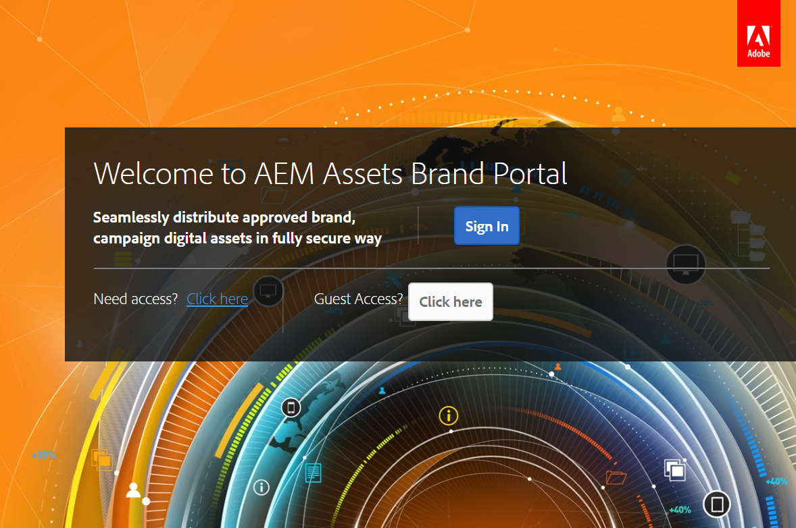
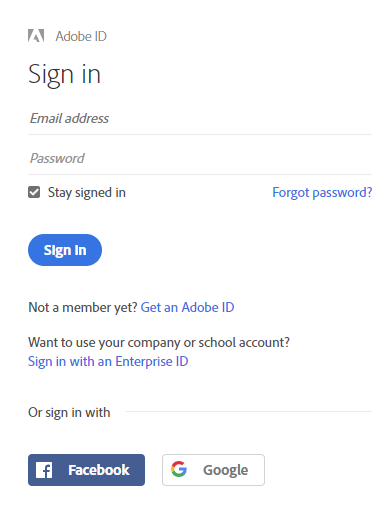
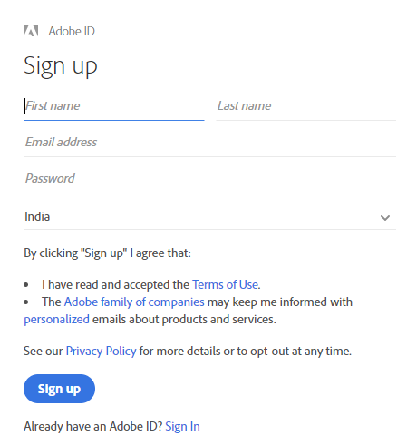
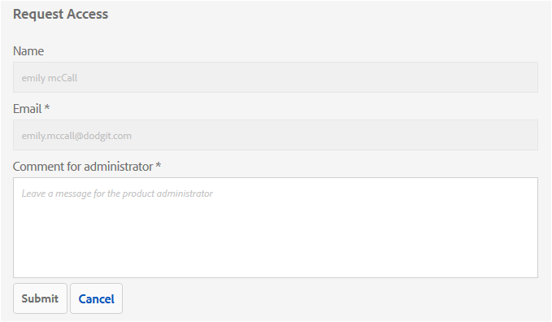
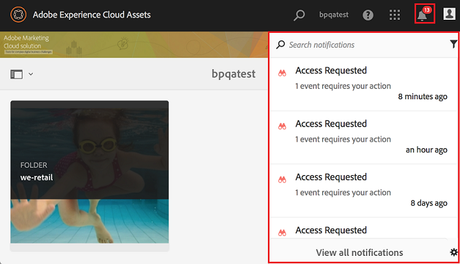
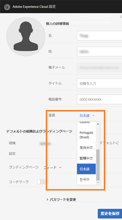
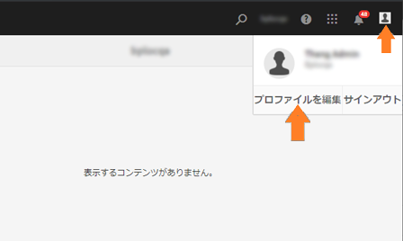
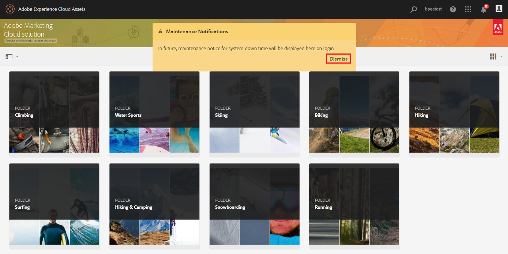

# Experience Manager Assets Brand Portal の概要 {#overview-of-aem-assets-brand-portal}

マーケターは、適切なデジタルコンテンツを制作、管理し、顧客にすばやく提供するために、チャネルパートナーや社内のビジネスユーザーと連携する必要があることもあります。 関連するコンテンツをカスタマージャーニー全体にわたってタイミングよく配信することは、顧客のニーズやコンバージョン、エンゲージメント、顧客の忠誠度を促進するために不可欠です。

しかし、承認済みのブランドロゴ、キャンペーンアセット、製品写真などをチーム、パートナー、リセラーと効率的かつ安全に共有するためのソリューションの開発には困難が伴います。 このプロセスで効率性とセキュリティの両方を確保するには、入念な計画と実行が必要です。

**Adobe Experience Manager（AEM） Assets Brand Portal**&#x200B;は、アセット配信機能とアセット貢献機能を提供することで、マーケターがグローバルに分散しているBrand Portal ユーザーと効果的にコラボレーションする必要性に注目しています。

アセット配布を使用すると、承認されたクリエイティブアセットを取得、制御し、デバイス間で外部の関係者や社内のビジネスユーザーに安全に配布できます。 ただし、Brand Portal ユーザーは、アセットをBrand PortalにアップロードしてExperience Manager Assetsに公開できます。その際、オーサー環境にアクセスする必要はありません。 投稿機能は、**Brand Portal でのアセットソーシング**と呼ばれます。 これらにより、Brand Portal ユーザー（外部の代理店／チーム）からのアセット配布および投稿の全体的な Brand Portal エクスペリエンスを向上させ、アセットの市場投入までの時間を短縮し、コンプライアンス違反や不正アクセスのリスクを低減できます。
[Brand Portal でのアセットソーシング](brand-portal-asset-sourcing.md)を参照してください。

ブラウザーベースのポータル環境では、承認済みの形式でアセットを簡単にアップロード、参照、検索、プレビュー、エクスポートできます。

## Experience Manager Assets と Brand Portal の連携の設定 {#configure-brand-portal}

Adobe Experience Manager Assets と Brand Portal の連携を設定すると、Brand Portal ユーザー向けにアセットの公開、アセットの配布、アセットの投稿機能が可能になります。

>[!NOTE]
>
>Experience Manager Assets と Brand Portal の連携の設定は、Experience Manager Assets as a Cloud Service および Experience Manager Assets 6.3 以降でサポートされています。

>[!IMPORTANT]
>
> * Brand Portal はメンテナンスモードです。 すべての新しい製品イノベーションは[コンテンツハブ](https://experienceleague.adobe.com/ja/docs/experience-manager-cloud-service/content/assets/content-hub/product-overview)で使用できます。
> * Brand Portal を引き続きアクティベートする必要がある場合、ユースケースやその他の特定の要件について詳しくは、アドビ担当者にお問い合わせください。
> * Brand Portal は、[Assets Prime](https://experienceleague.adobe.com/ja/docs/experience-manager-cloud-service/content/assets/assets-prime) または [Assets Ultimate](https://experienceleague.adobe.com/ja/docs/experience-manager-cloud-service/content/assets/assets-ultimate-overview) では使用できません。 ただし、既に Brand Portal へのアクセス権を持つ既存の Assets as a Cloud Service のお客様は、Assets Ultimate に移行しても Brand Portal を引き続き使用できます。

<!--Experience Manager Assets as a Cloud Service is automatically configured with Brand Portal by activating Brand Portal from the Cloud Manager. The activation workflow creates the required configurations at the backend and activates Brand Portal on the same IMS org as of the Experience Manager Assets as a Cloud Service instance.-->

ただし、Experience Manager Assets（オンプレミスおよびマネージドサービス）は、Adobe Developer Consoleを使用してBrand Portalを使用して手動で設定され、Brand Portal テナントの認証のためにAdobe Identity Management サービス（IMS）トークンを取得します。

詳しくは、[Experience Manager Assets と Brand Portal の連携の設定](../using/configure-aem-assets-with-brand-portal.md)を参照してください。

## Brand Portal でのユーザーのペルソナ {#Personas}

Brand Portal では次のユーザー役割をサポートしています。

* ゲストユーザー
* 閲覧者
* 編集者
* 管理者

次の表に、これらの役割を持つユーザーが実行できるタスクを示します。

|  | **参照** | **検索** | **ダウンロード** | **フォルダーの共有** | **コレクションの共有** | **アセットをリンクとして共有** | **管理ツールにアクセス** |
|--- |--- |--- |--- |--- |--- |--- |--- |
| **ゲストユーザー** | ✓* | ✓* | ✓* | x | x | x | x |
| **閲覧者** | ✓ | ✓ | ✓ | x | x | x | x |
| **編集者** | ✓ | ✓ | ✓ | ✓ | ✓ | ✓ | x |
| **管理者** | ✓ | ✓ | ✓ | ✓ | ✓ | ✓ | ✓ |

>[!NOTE]
>
>ゲストユーザーは、公開フォルダーおよび公開コレクション内にあるアセットのみを参照、アクセス、および検索できます。

<!--
&#42; Viewer users can access and download the public assets shared with them, and can add these assets to create their own collections.

>[!NOTE]
>
>There is a known issue that the share link for collections is currently visible to the viewer users. The viewer users does not have the privilege to add users to create a share link. This issue will be fixed in the upcoming release, the option to share link for the collections will not be available to the viewer users.
-->

### ゲストユーザー {#guest-user}

Experience Manager Assets Brand Portal では、Brand Portal への[ゲストによるアクセス](#request-access-to-brand-portal)を許可します。 ゲストユーザーは資格情報がなくてもポータルに入ることができ、公開フォルダー（およびコレクション）にアクセスできます。 ゲストユーザーは、アセットの詳細を参照し、公開フォルダーとコレクションのメンバーの完全なアセットビューを持つことができます。 公開アセットを検索、ダウンロードして、[!UICONTROL Lightbox] コレクションに追加できます。

ただし、ゲストセッションでは、コレクションや保存済み検索の作成が制限され、さらに共有されます。 ゲストセッション中のユーザーはフォルダーやコレクションの設定にアクセスしたり、アセットをリンクとして共有したりすることはできません。 次に、ゲストユーザーが実行できるタスクの一覧を示します。

* [公開アセットの参照および公開アセットへのアクセス](browse-assets-brand-portal.md)

* [公開アセットの検索](brand-portal-searching.md)

* [公開アセットのダウンロード](brand-portal-download-assets.md)

* [[!UICONTROL Lightbox] へのアセットの追加](brand-portal-light-box.md#add-assets-to-lightbox)

詳しくは、「[Brand Portalへのゲストアクセス ](../using/guest-access.md)」を参照してください。

### 閲覧者 {#viewer}

Viewerの役割を持つBrand Portalにアクセスできる[!DNL Admin Console]で定義されたBrand Portal ユーザー。 この役割を持つユーザーは、Brand Portalにログインして、許可されたフォルダー、コレクション、アセットにアクセスできます。 また、アセット（元のアセットまたは特定のレンディション）を参照、プレビュー、ダウンロードおよび書き出したり、アカウント設定を指定したり、アセットを検索したりすることもできます。 次に、閲覧者が実行できるタスクの一覧を示します。

* [アセットの参照](browse-assets-brand-portal.md)

* [アセットの検索](brand-portal-searching.md)

* [アセットのダウンロード](brand-portal-download-assets.md)

### 編集者 {#editor}

編集者の役割を持つユーザーは、閲覧者が実行できるタスクをすべて実行できます。 さらに、編集者は、管理者が共有するファイルとフォルダーを表示できます。 また、編集者の役割を持つユーザーは、コンテンツ（ファイル、フォルダー、コレクション）を他のユーザーと共有することもできます。

編集者は、閲覧者が実行できるタスクに加えて、次のタスクを実行できます。

* [フォルダーの共有](brand-portal-sharing-folders.md)

* [コレクションの共有](brand-portal-share-collection.md)

* [アセットをリンクとして共有](brand-portal-link-share.md)

### 管理者 {#administrator}

管理者には、[!UICONTROL Admin Console]でシステム管理者またはBrand Portal製品管理者としてマークされたユーザーが含まれます。 管理者は、システム管理者とユーザーを追加／削除したり、プリセットを定義したりできます。また、ユーザーにメールを送信したり、ポータルの使用状況とストレージに関するレポートを表示したりできます。

>[!NOTE]
>
>Brand Portalでは、[!UICONTROL Admin Console]でサポート管理者の役割が割り当てられたユーザーは、システム管理者と同じ権限を持ちます。

管理者は、編集者が実行可能なすべてのタスクを実行できます。 管理者が実行できる追加のタスクは次のとおりです。

* [ユーザー、グループ、ユーザーの役割の管理](brand-portal-adding-users.md)
* [壁紙、ページヘッダーおよびメールのカスタマイズ](brand-portal-branding.md)
* [カスタム検索ファセットの使用](brand-portal-search-facets.md)
* [メタデータスキーマの使用](brand-portal-metadata-schemas.md)
* [画像プリセットまたは動的レンディションの適用](brand-portal-image-presets.md)
* [レポートの操作](brand-portal-reports.md)

AEM Assets の作成者は、上記のタスクに加えて、次のタスクを実行できます。

* [AEM Assets と Brand Portal の連携の設定](../using/configure-aem-assets-with-brand-portal.md)
* [Brand Portal へのフォルダーの公開](https://experienceleague.adobe.com/ja/docs/experience-manager-65/content/assets/brandportal/brand-portal-publish-folder)
* [Brand Portal へのコレクションの公開](https://experienceleague.adobe.com/ja/docs/experience-manager-65/content/assets/brandportal/brand-portal-publish-collection)

## Brand Portal URL の代替エイリアス {#tenant-alias-for-portal-url}

Brand Portal 6.4.3以降、組織は、Brand Portal テナントの既存のURLごとに1つの代替（エイリアス） URLを持つことができます。 エイリアス URL を作成するには、既存の URL に代替接頭辞を含めます。\
テナント名が32文字を超える場合は、テナントエイリアスを作成する必要があります。
カスタマイズできるのは Brand Portal URL の接頭辞のみであり、URL 全体でないことに注意してください。 例えば、`geomettrix.brand-portal.adobe.com` という既存ドメインを持つ組織は、アドビに依頼することで `geomettrixinc.brand-portal.adobe.com` という URL を作成できます。

ただし、AEM オーサーインスタンスは、テナント ID URLのみで[設定](../using/configure-aem-assets-with-brand-portal.md)でき、テナントエイリアス（代替） URLでは設定できません。

>[!NOTE]
>
>既存のポータル URLでテナント名のエイリアスを取得するには、新しいテナントエイリアス作成リクエストをカスタマーサポートに連絡する必要があります。 まず、エイリアスが使用可能かどうかを確認し、このリクエストを処理するエイリアスを作成します。
>
>古いエイリアスを置き換えたり、削除したりするには、同じ手続きに従う必要があります。

## Brand Portal へのアクセス権の申請 {#request-access-to-brand-portal}

ユーザーは、Brand Portal へのアクセス権をログイン画面から申請できます。 この申請は Brand Portal 管理者に送信され、この管理者が Adobe [!UICONTROL Admin Console] を通じてユーザーにアクセス権を付与します。 アクセス権が付与されると、ユーザーに通知メールが届きます。

アクセス権を申請するには、以下の手順を実行します。

1. Brand Portal ログインページから、**[!UICONTROL アクセスが必要ですか？]**&#x200B;に対応する&#x200B;**[!UICONTROL ここをクリック]**&#x200B;を選択します。 ただし、ゲストセッションに入るには、「**[!UICONTROL ゲストとしてアクセスしますか？]**」の横にある「**[!UICONTROL ここをクリックしてください]**」を選択します。

   

   [!UICONTROL アクセスを申請]ページが開きます。

1. 組織の Brand Portal へのアクセスを申請するには、有効な [!UICONTROL Adobe ID]、[!UICONTROL Enterprise ID] または [!UICONTROL Federated ID] を持っている必要があります。

   [!UICONTROL アクセスを申請]ページで、自分の ID を使用してログインするか（シナリオ 1）、[!UICONTROL Adobe ID] を作成します（シナリオ 2）。

   ![[!UICONTROL アクセスの申請]](assets/bplogin_request_access_2.png)

   **シナリオ 1**

   1. [!UICONTROL Adobe ID]、[!UICONTROL Enterprise ID] または [!UICONTROL Federated ID] を持っている場合は、「**[!UICONTROL ログイン]**」をクリックします。
[!UICONTROL  ログイン ] ページが開きます。

   1. [!UICONTROL Adobe ID]の資格情報を入力し、**[!UICONTROL ログイン]**&#x200B;をクリックします。

      

   [!UICONTROL アクセスを申請]ページにリダイレクトされます。

   **シナリオ 2**

   1. [!UICONTROL Adobe ID] を持っていない場合は、[!UICONTROL アクセスを申請]ページの「**[!UICONTROL Adobe ID を取得]**」をクリックして、Adobe ID を作成します。
[!UICONTROL  ログイン ] ページが開きます。
   1. 「**[!UICONTROL Adobe ID を取得]**」をクリックします。
[!UICONTROL 登録] ページが開きます。
   1. 名前、メール ID およびパスワードを入力します。
   1. 「**[!UICONTROL 新規登録]**」をクリックします。

      

   [!UICONTROL アクセスを申請]ページにリダイレクトされます。

1. アクセスの申請に使用する現在のユーザーの名前とメール ID が次のページに表示されます。 管理者のコメントは空欄のまま、「**[!UICONTROL 送信]**」をクリックします。

   

## 製品管理者によるアクセス権の付与 {#grant-access-to-brand-portal}

Brand Portal 製品管理者は Brand Portal の通知領域および自分のインボックス内のメールでアクセス申請を受け取ります。

アクセス権を付与するには、製品管理者がBrand Portalの通知領域で関連する通知をクリックし、**[!UICONTROL アクセス権を付与]**をクリックする必要があります。
または、アクセス要求メールに記載されているリンクに従って、Adobe [!UICONTROL Admin Console]にアクセスし、関連する製品設定にユーザーを追加することもできます。

[Adobe [!UICONTROL Admin Console]](https://adminconsole.adobe.com/enterprise/overview) ホームページにリダイレクトされます。 Adobe [!UICONTROL Admin Console]を使用してユーザーを作成し、Brand Portalでグループとして表示される製品プロファイル（旧製品設定）に割り当てます。 [!UICONTROL Admin Console]でのユーザーの追加について詳しくは、[ ユーザーの追加](brand-portal-adding-users.md#add-a-user)を参照してください（ユーザーの追加手順4 ～ 7に従ってください）。

## Brand Portal の言語 {#brand-portal-language}

Brand Portalの言語は、Adobe [!UICONTROL Experience Cloud Settings]から変更できます。

言語を変更するには：

1. 上部メニューから、[!UICONTROL ユーザー]／[!UICONTROL プロファイルを編集]を選択します。

   

1. [!UICONTROL Experience Cloud設定] ページで、[!UICONTROL 言語] ドロップダウンメニューから言語を選択します。

## Brand Portal のメンテナンス通知 {#brand-portal-maintenance-notification}

Brand Portal のメンテナンスのために停止が予定されている場合は、Brand Portal にログインすると、バナー通知が表示されます。 以下に通知の例を示します。

この通知を解除すると、Brand Portal を引き続き使用できます。 この通知は、新しいセッションのたびに表示されます。

## リリースおよびシステム情報 {#release-and-system-information}

* [新機能](whats-new.md)
* [リリースノート](brand-portal-release-notes.md)
* [サポートされているファイル形式](brand-portal-supported-formats.md)

## 関連リソース {#related-resources}

<!--
* [Adobe Customer Support]()
-->

* [AEM フォーラム](https://experienceleaguecommunities.adobe.com/t5/adobe-experience-manager/ct-p/adobe-experience-manager-community)
