# Brand Portal でアセットを参照する {#browsing-assets-on-brand-portal}

Experience Manager Assets Brand Portalには、様々な機能やユーザーインターフェイスが用意されており、様々な表示オプションを使用して、リソースの参照、アセット階層の移動、アセットの検索を簡単に行うことができます。

上部のツールバーのExperience Managerロゴにより、管理者ユーザーは管理ツールパネルにアクセスできます。

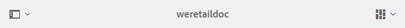

Brand Portalの左上にあるレール選択ドロップダウンでは、アセット階層への移動、検索の効率化、リソースの表示を行うオプションが表示されます。

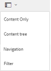

Brand Portalのビューセレクターで使用可能なビュー（カード、列、リスト）のいずれかを使用して、アセットを表示、移動、選択できます。

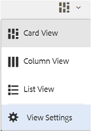

## リソースの表示と選択 {#viewing-and-selecting-resources}

概念上、表示、ナビゲーションおよび選択はすべての表示で同じ操作ですが、使用している表示によって処理がわずかに異なります。

使用可能な任意の表示方法で、リソースを表示、ナビゲーションおよび（追加のアクションを行うために）選択できます。

* 列表示
* カード表示
* リスト表示

### カード表示

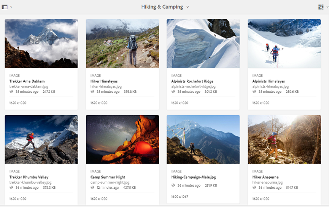

カード表示では、現在のレベルの各項目の情報カードが表示されます。 これらのカードには、次の詳細が記載されています。

* アセット／フォルダーの内容を視覚的に表現したもの。
* 種類
* タイトル
* 名前
* AEMからBrand Portalにアセットが公開された日時
* サイズ
* ディメンション寸法

階層を下に移動するには、カードをクリックするか（クイック操作を回避する必要があります）、ヘッダーの[パンくずを使用して再度上に移動します](https://experienceleague.adobe.com/ja/docs/experience-manager-65/content/sites/authoring/essentials/basic-handling)。

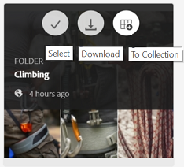

#### 管理者以外のユーザー向けカード表示

カード表示のフォルダーのカードは、管理者以外のユーザー（編集者、閲覧者、およびゲストユーザー）にフォルダー階層情報を表示します。 この機能により、ユーザーはアクセス中のフォルダーの場所を、親階層に関して知ることができます。

フォルダー階層情報は、別のフォルダー階層から共有されている他のフォルダーと名前が似ているフォルダーを区別するのに特に役立ちます。 管理者以外のユーザーが、自分たちに共有されているアセットのフォルダー構造を把握していない場合、似たような名前のアセット／フォルダーは紛らわしくなります。

* それぞれのカードに表示されるパスは、カードのサイズに合わせて切り詰めて表示されます。 ただし、切り捨てられたパスにカーソルを合わせると、フルパスがツールヒントとして表示されます。

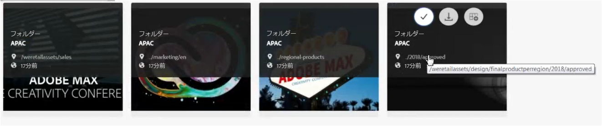

**アセットのプロパティを表示する「概要」オプション**

管理者以外のユーザー（エディター、ビューア、ゲストユーザー）は、概要オプションを使用して、選択したアセット/フォルダーのアセットプロパティを表示できます。 「概要」オプションは、次の場所に表示されます。

* アセット／フォルダーを選択する際、上部に表示されるツールバー。
* ドロップダウンで、レールセレクタを選択します。

アセットやフォルダーを選択した状態で「**[!UICONTROL 概要]**」オプションを選択すると、ユーザーはアセットのタイトル、パス、作成時刻を確認できます。 一方、アセットの詳細ページで「概要」オプションを選択すると、アセットのメタデータを確認できます。

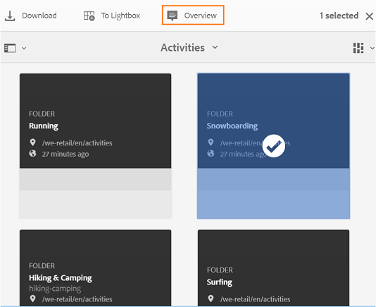

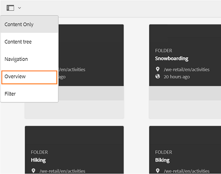

#### カード表示で設定を表示

表示セレクターから&#x200B;**[!UICONTROL 表示設定]**&#x200B;を選択すると、**[!UICONTROL 表示設定]**&#x200B;ダイアログボックスが開きます。 カードビューでアセットのサムネールのサイズを変更できます。 このようにして、表示をカスタマイズし、表示されるサムネールの数を制御できます。

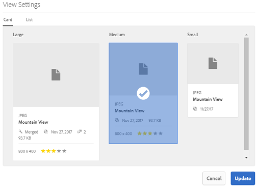

### リスト表示

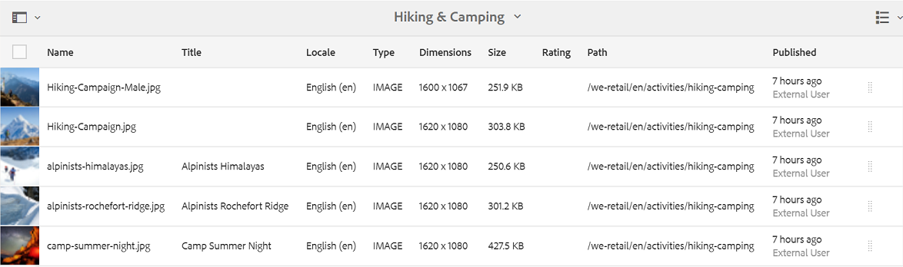

リストビューには、現在のレベルの各リソースに関する情報が表示されます。 リストビューには次の詳細が表示されます。

* アセットのサムネール画像
* 名前
* タイトル
* ロケール
* 種類
* 寸法
* サイズ
* レーティング
* アセット階層画像を示すフォルダーパス
* Brand Portal 上のアセットの公開日

パス列を使用すると、フォルダー階層内のアセットの場所を簡単に特定できます。 リソース名をクリックして階層を下に移動し、ヘッダーの[ブレッドクラム](https://experienceleague.adobe.com/ja/docs/experience-manager-65/content/sites/authoring/essentials/basic-handling)を使用して上に戻ることができます。

<!--
Comment Type: draft lastmodifiedby="mgulati" lastmodifieddate="2018-08-17T03:12:05.096-0400" type="annotation">Removed:- "Selecting assets in list view To select all items in the list, use the checkbox at the upper left of the list. When all items in the list are selected, this check box appears checked. To deselect all, click the checkbox. When only some items are selected, it appears with a minus sign. To select all, click the checkbox. To deselect all, click the checkbox again. You can change the order of items using the dotted vertical bar at the far right of each item in the list. Click the vertical selection bar and drag the item to a new position in the list."
 -->

### リスト表示の表示設定

リストビューでは、既定でアセット&#x200B;**[!UICONTROL Name]**&#x200B;が最初の列として表示されます。 アセットの&#x200B;**[!UICONTROL タイトル]**、**[!UICONTROL ロケール]**、**[!UICONTROL タイプ]**、**[!UICONTROL ディメンション]**、**[!UICONTROL サイズ]**、**[!UICONTROL レーティング]**、公開状態などの追加情報も表示されます。 ただし、「**[!UICONTROL 表示設定]**」を使用して、表示する列を選択することもできます。

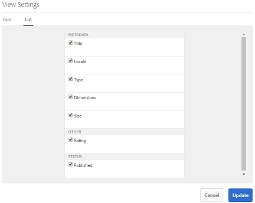

### 列表示

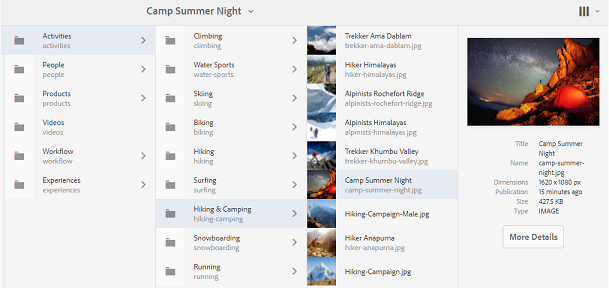

列表示を使用して、一連のカスケード表示された列間をコンテンツツリーで移動します。 この表示は、アセット階層の視覚化とトラバースに役立ちます。

最初（一番左）の列でリソースを選択すると、2 番目の列の右側に子リソースが表示されます。 2 列目でリソースを選択すると、右側の 3 列目に子リソースが表示され、以下同様に表示されます。

ツリー内を上下に移動できます。 リソース名またはリソース名の右側にある山形記号をクリックします。

* リソース名と山形記号は、クリックするとハイライト表示されます。
* サムネールをタップまたはクリックすると、リソースが選択されます。
* 選択すると、チェックマークがサムネールにオーバーレイ表示され、リソース名がハイライト表示されます。
* 選択されたリソースの詳細が最後の列に表示されます。

列表示でアセットを選択すると、アセットが次の詳細と共に最後の列に視覚的に表示されます。

* タイトル
* 名前
* ディメンション寸法
* AEMからBrand Portalにアセットが公開された日時
* サイズ
* 種類
* アセットの詳細ページに表示される「詳細」オプション

<!--
Comment Type: draft

<h3>Selecting Resources</h3>
-->

<!--
Comment Type: draft

Selecting a specific resource depends on a combination of the view and the device:

-->

<!--
Comment Type: draft

<table border="1" cellpadding="1" cellspacing="0" width="100%">
<tbody>
<tr>
<td> </td>
<td>Select</td>
<td>Deselect</td>
</tr>
<tr>
<td>Column View  </td>
<td>
<ul>
<li>Desktop:  Mouseover, then use the check mark quick action</li>
<li>Mobile device:  Tap the thumbnail</li>
</ul> </td>
<td>
<ul>
<li>Desktop:  Click the thumbnail</li>
<li>Mobile device:  Tap the thumbnail</li>
</ul> </td>
</tr>
<tr>
<td>Card View  </td>
<td>
<ul>
<li>Desktop:  Mouseover, then use the check mark quick action</li>
<li>Mobile device:  Tap-and-hold the card</li>
</ul> </td>
<td>
<ul>
<li>Desktop:  Click the card</li>
<li>Mobile device:  Tap the card</li>
</ul> </td>
</tr>
<tr>
<td>List View</td>
<td>
<ul>
<li>Desktop:  Mouseover, then use the check mark quick action</li>
<li>Mobile device:  Tap the thumbnail</li>
</ul> </td>
<td>
<ul>
<li>Desktop:  Click the thumbnail</li>
<li>Mobile device:  Tap the thumbnail</li>
</ul> </td>
</tr>
</tbody>
</table>
-->

<!--
Comment Type: draft

Deselecting All
-->

<!--
Comment Type: draft

In all cases, as you select items the count of the items selected is displayed at the upper right of the toolbar.

You can deselect all items and exit selection mode by clicking the X next to the count.

-->

<!--
Comment Type: draft

In all views, all items can be deselected by clicking escape on the keyboard if you are using a desktop device.

-->

## コンテンツツリー {#content-tree}

これらの表示に加え、3 つのツリー表示を使用して、目的のアセットやフォルダーを表示および選択しながらアセット階層をドリルダウンします。

ツリービューを開くには、左上のパネルセレクターをクリックし、メニューから **[!UICONTROL コンテンツツリー]** を選択します。

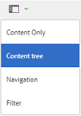

コンテンツ階層から目的のアセットに移動します。

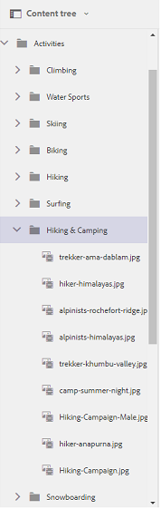

## アセットの詳細 {#asset-details}

アセットの詳細ページでは、アセットの表示、ダウンロード、アセットのリンクの共有、コレクションへの移動、アセットのプロパティページの表示を行うことができます。 同じフォルダーにある他のアセットの詳細ページを順番に移動することもできます。

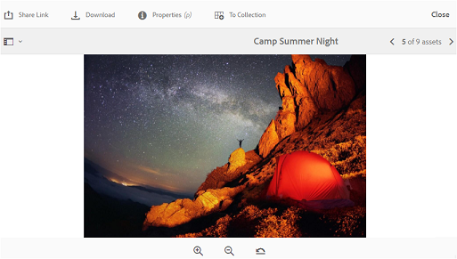

アセットのメタデータを表示したり、様々なレンディションを表示したりするには、アセットの詳細ページのパネルセレクターを使用します。

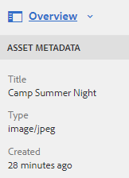

アセットの詳細ページでアセットの利用可能なレンディションをすべて表示し、「**[!UICONTROL レンディション]** パネルからレンディションを選択してプレビューできます。

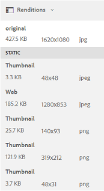

<!-- 
removed as it is fixed in 2022.02.0 release
>[!CAUTION]
>
>(**Experience Manager Assets as a Cloud Service** only) The following known issues will be fixed in the upcoming release:
>
>The **[!UICONTROL Renditions]** panel does not list all the static renditions of the assets that are published to Brand Portal after December 16, 2021.
>
>The **[!UICONTROL Renditions]** panel lists the smart crop renditions of the asset, however, the user cannot preview or download the smart crop renditions.
-->

アセットのプロパティページを開くには、上部のバーにある **[!UICONTROL プロパティ （p）]** オプションを使用します。

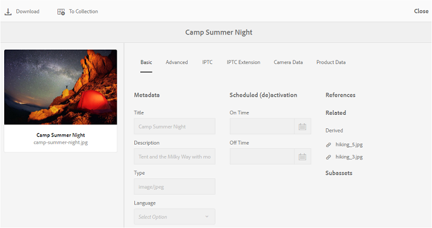

また、アセットの関係も AEM から Brand Portal に公開されているので、アセットのプロパティページですべての関連アセット（AEM 上のソースまたは派生アセット）のリストを表示することもできます。
