# Brand Portal でアセットを参照する {#browsing-assets-on-brand-portal}

Experience Manager Assets Brand Portalには、リソースの参照、アセット階層の移動、様々なビューオプションを使用したアセットの検索を容易にする、様々な機能とユーザーインターフェイス要素が用意されています。

上部のツールバーにあるExperience Manager ロゴを使用すると、管理者ユーザーは管理ツールパネルにアクセスできます。

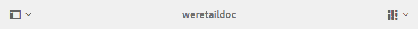

Brand Portalの左上にあるレールセレクターのドロップダウンを使用すると、アセット階層への移動、検索の合理化、リソースの表示などのオプションを表示できます。

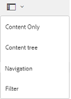

Brand Portalのビューセレクターで利用可能なビュー（カード、列、リスト）を使用して、アセットを表示、移動、選択できます。

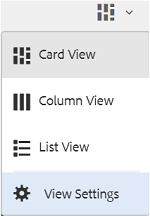

## リソースの表示と選択 {#viewing-and-selecting-resources}

概念上、表示、ナビゲーションおよび選択はすべての表示で同じ操作ですが、使用している表示によって処理がわずかに異なります。

使用可能な任意の表示方法で、リソースを表示、ナビゲーションおよび（追加のアクションを行うために）選択できます。

* 列表示
* カード表示
* リスト表示

### カード表示

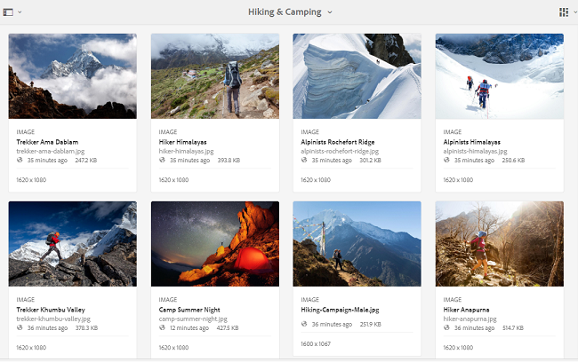

カード表示では、現在のレベルの各項目の情報カードが表示されます。 これらのカードには、次の詳細が記載されています。

* アセット／フォルダーの内容を視覚的に表現したもの。
* 種類
* タイトル
* 名前
* AEMからBrand Portalにアセットが公開された日時
* サイズ
* ディメンション寸法

階層を下に移動するには、カードをクリックするか（クイックアクションを避けるために注意を払う）、ヘッダー](https://experienceleague.adobe.com/en/docs/experience-manager-65/content/sites/authoring/essentials/basic-handling)の[ パンくずリストを使用して再び上に移動します。

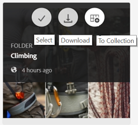

#### 管理者以外のユーザー向けカード表示

カード表示のフォルダーのカードは、管理者以外のユーザー（編集者、閲覧者、およびゲストユーザー）にフォルダー階層情報を表示します。 この機能を使用すると、ユーザーはアクセスしているフォルダーの場所を親階層に関して知ることができます。

フォルダー階層情報は、他のフォルダー階層と共有されている他のフォルダーと類似した名前を持つフォルダーを区別する際に特に役立ちます。 管理者以外のユーザーが、自分たちに共有されているアセットのフォルダー構造を把握していない場合、似たような名前のアセット／フォルダーは紛らわしくなります。

* それぞれのカードに表示されるパスは、カードのサイズに合わせて切り詰めて表示されます。 ただし、切り捨てられたパスの上にカーソルを置くと、完全なパスがツールヒントとして表示されます。

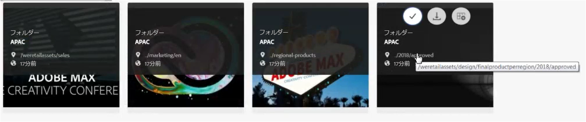

**アセットのプロパティを表示する「概要」オプション**

管理者以外のユーザー（エディター、ビューアー、ゲストユーザー）が、選択したアセット/フォルダーのアセットプロパティを表示する場合は、「概要」オプションを使用できます。 「概要」オプションは、次の場所に表示されます。

* アセット／フォルダーを選択する際、上部に表示されるツールバー。
* ドロップダウンで、レールセレクターを選択します。

アセット/フォルダーが選択されている間に&#x200B;**[!UICONTROL 概要]** オプションを選択すると、ユーザーはアセット作成のタイトル、パス、時間を確認できます。 一方、アセットの詳細ページで「概要」オプションを選択すると、アセットのメタデータを確認できます。

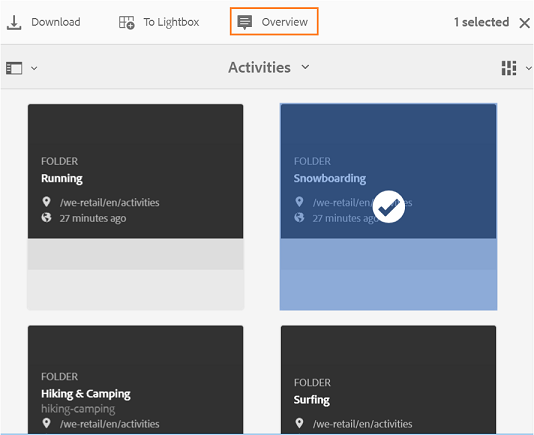

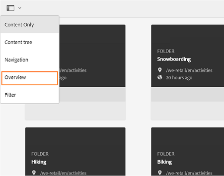

#### カード表示での設定の表示

**[!UICONTROL 表示設定]** ダイアログボックスが開き、表示セレクターから「**[!UICONTROL 表示設定]**」を選択します。 カード表示でアセットのサムネールのサイズを変更できます。 これにより、ビューをパーソナライズし、表示されるサムネールの数を制御できます。

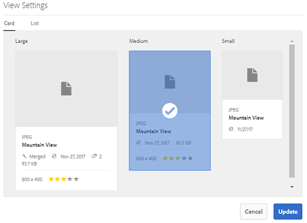

### リスト表示

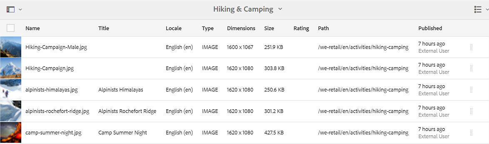

リストビューには、各リソースの情報が現在のレベルで表示されます。 リストビューには、次の詳細が表示されます。

* アセットのサムネール画像
* 名前
* タイトル
* ロケール
* 種類
* 寸法
* サイズ
* レーティング
* アセット階層画像を示すフォルダーパス
* Brand Portal 上のアセットの公開日

パス列を使用すると、フォルダー階層内のアセットの場所を簡単に特定できます。 リソース名をクリックして階層を下に移動し、ヘッダー](https://experienceleague.adobe.com/en/docs/experience-manager-65/content/sites/authoring/essentials/basic-handling)の[ パンくずリストを使用してバックアップできます。

<!--
Comment Type: draft lastmodifiedby="mgulati" lastmodifieddate="2018-08-17T03:12:05.096-0400" type="annotation">Removed:- "Selecting assets in list view To select all items in the list, use the checkbox at the upper left of the list. When all items in the list are selected, this check box appears checked. To deselect all, click the checkbox. When only some items are selected, it appears with a minus sign. To select all, click the checkbox. To deselect all, click the checkbox again. You can change the order of items using the dotted vertical bar at the far right of each item in the list. Click the vertical selection bar and drag the item to a new position in the list."
 -->

### リスト表示の表示設定

リストビューには、デフォルトでアセット **[!UICONTROL Name]**&#x200B;が最初の列として表示されます。 アセットの&#x200B;**[!UICONTROL タイトル]**、**[!UICONTROL ロケール]**、**[!UICONTROL タイプ]**、**[!UICONTROL ディメンション]**、**[!UICONTROL サイズ]**、**[!UICONTROL レーティング]**、公開状態などの追加情報も表示されます。 ただし、「**[!UICONTROL 表示設定]**」を使用して、表示する列を選択することもできます。

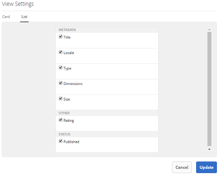

### 列表示

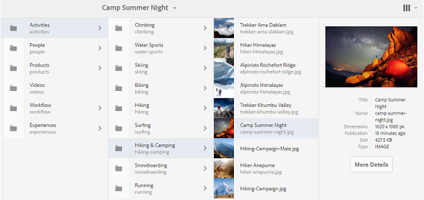

列ビューを使用すると、一連のカスケーディング列を通してコンテンツツリーを移動できます。 このビューは、アセット階層を視覚化し、トラバースするのに役立ちます。

最初の（一番左）列でリソースを選択すると、2番目の列の子リソースが右側に表示されます。 2番目の列でリソースを選択すると、3番目の列の子リソースが右側に表示されます。

ツリー内を上下に移動できます。 リソース名またはリソース名の右側にある山形をクリックします。

* クリックすると、リソース名と山形がハイライト表示されます。
* サムネールをタップまたはクリックすると、リソースが選択されます。
* 選択すると、サムネールにチェックマークがオーバーレイされ、リソース名がハイライト表示されます。
* 選択されたリソースの詳細が最後の列に表示されます。

列ビューでアセットを選択すると、アセットの視覚的な表現が最終列に表示され、次の詳細が表示されます。

* タイトル
* 名前
* ディメンション寸法
* AEMからBrand Portalにアセットが公開された日時
* サイズ
* 種類
* アセットの詳細ページに表示される「詳細」オプション

<!--
Comment Type: draft

<h3>Selecting Resources</h3>
-->

<!--
Comment Type: draft

Selecting a specific resource depends on a combination of the view and the device:

-->

<!--
Comment Type: draft

<table border="1" cellpadding="1" cellspacing="0" width="100%">
<tbody>
<tr>
<td> </td>
<td>Select</td>
<td>Deselect</td>
</tr>
<tr>
<td>Column View  </td>
<td>
<ul>
<li>Desktop:  Mouseover, then use the check mark quick action</li>
<li>Mobile device:  Tap the thumbnail</li>
</ul> </td>
<td>
<ul>
<li>Desktop:  Click the thumbnail</li>
<li>Mobile device:  Tap the thumbnail</li>
</ul> </td>
</tr>
<tr>
<td>Card View  </td>
<td>
<ul>
<li>Desktop:  Mouseover, then use the check mark quick action</li>
<li>Mobile device:  Tap-and-hold the card</li>
</ul> </td>
<td>
<ul>
<li>Desktop:  Click the card</li>
<li>Mobile device:  Tap the card</li>
</ul> </td>
</tr>
<tr>
<td>List View</td>
<td>
<ul>
<li>Desktop:  Mouseover, then use the check mark quick action</li>
<li>Mobile device:  Tap the thumbnail</li>
</ul> </td>
<td>
<ul>
<li>Desktop:  Click the thumbnail</li>
<li>Mobile device:  Tap the thumbnail</li>
</ul> </td>
</tr>
</tbody>
</table>
-->

<!--
Comment Type: draft

Deselecting All
-->

<!--
Comment Type: draft

In all cases, as you select items the count of the items selected is displayed at the upper right of the toolbar.

You can deselect all items and exit selection mode by clicking the X next to the count.

-->

<!--
Comment Type: draft

In all views, all items can be deselected by clicking escape on the keyboard if you are using a desktop device.

-->

## コンテンツツリー {#content-tree}

これらの表示に加え、3 つのツリー表示を使用して、目的のアセットやフォルダーを表示および選択しながらアセット階層をドリルダウンします。

ツリービューを開くには、左上のレールセレクターをクリックし、メニューから&#x200B;**[!UICONTROL コンテンツツリー]**&#x200B;を選択します。

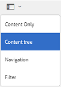

コンテンツ階層から目的のアセットに移動します。

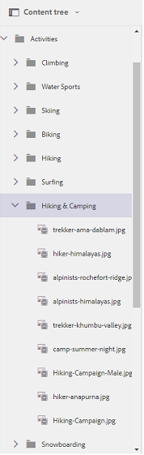

## アセットの詳細 {#asset-details}

アセットの詳細ページでは、アセットの表示、ダウンロード、アセットのリンクの共有、コレクションへの移動、プロパティ ページの表示を行うことができます。 また、同じフォルダーの他のアセットの詳細ページを連続して移動することもできます。

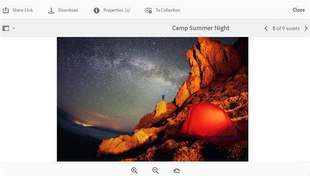

アセットのメタデータを表示したり、様々なレンディションを表示したりするには、アセットの詳細ページのレールセレクターを使用します。

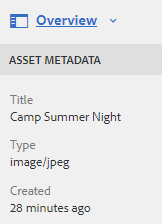

アセットの使用可能なすべてのレンディションをアセットの詳細ページで表示し、**[!UICONTROL レンディション]** パネルからレンディションを選択してプレビューできます。

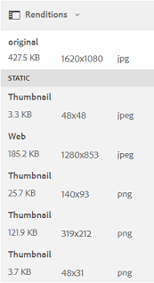

<!-- 
removed as it is fixed in 2022.02.0 release
>[!CAUTION]
>
>(**Experience Manager Assets as a Cloud Service** only) The following known issues will be fixed in the upcoming release:
>
>The **[!UICONTROL Renditions]** panel does not list all the static renditions of the assets that are published to Brand Portal after December 16, 2021.
>
>The **[!UICONTROL Renditions]** panel lists the smart crop renditions of the asset, however, the user cannot preview or download the smart crop renditions.
-->

アセットプロパティページを開くには、上部バーの「**[!UICONTROL プロパティ（p）]**」オプションを使用します。

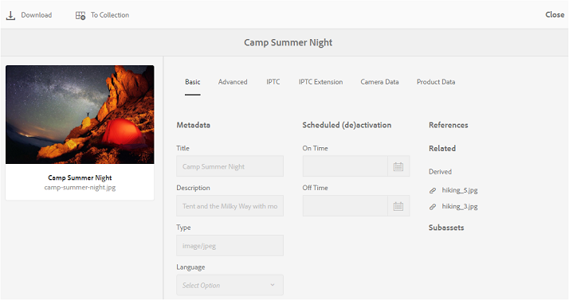

また、アセットの関係も AEM から Brand Portal に公開されているので、アセットのプロパティページですべての関連アセット（AEM 上のソースまたは派生アセット）のリストを表示することもできます。
