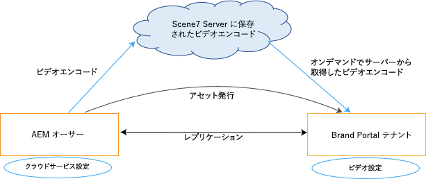
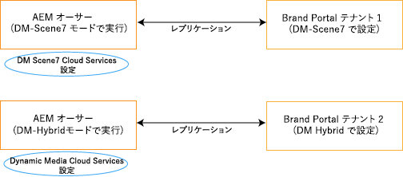
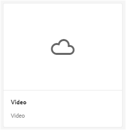
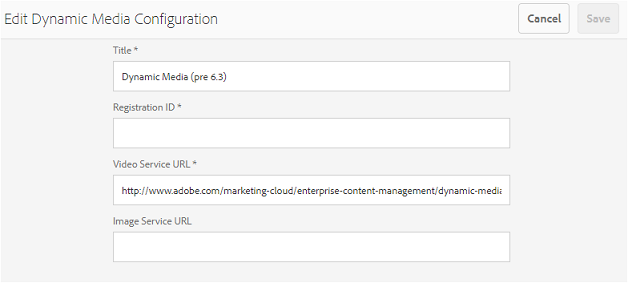
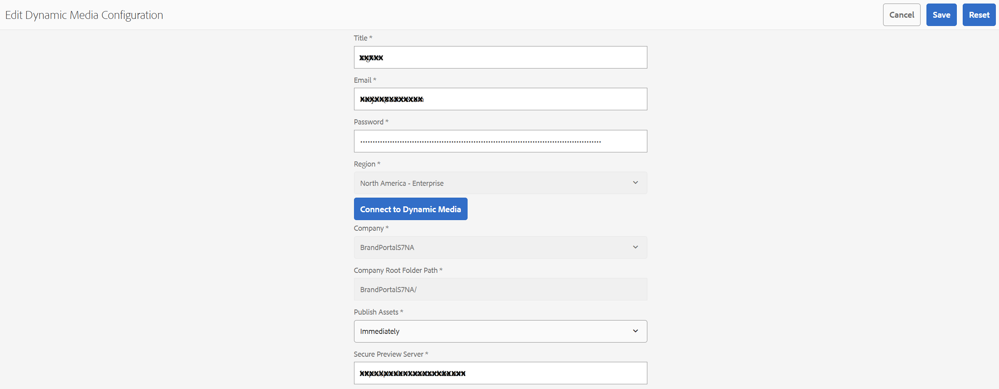

# Brand Portal でのダイナミックビデオのサポート {#dynamic-video-support-on-brand-portal}

Dynamic Media をサポートしている Brand Portal でビデオをアダプティブにプレビューおよび再生します。 また、ポータルおよび共有リンクから動的レンディションをダウンロードします。
Brand Portal を使用すると、次のことが可能になります。

* アセットの詳細ページ、カード表示、リンク共有プレビューページのビデオをプレビューします。
* アセットの詳細ページでビデオエンコードを再生します。
* アセットの詳細ページの「レンディション」タブで、ダイナミックレンディションを表示します。
* ビデオを格納したフォルダーとビデオエンコードをダウンロードします。

>[!NOTE]
>
>ビデオを操作してBrand Portalに公開するには、Experience Manager オーサーインスタンスがDynamic Media ハイブリッドモードまたはDynamic Media **[!DNL Scene7]** モードで設定されていることを確認します。

ビデオをプレビュー、再生、ダウンロードするために、Brand Portal では次の 2 つの設定を管理者に公開しています。

* [Dynamic Media ハイブリッド設定](#configure-dm-hybrid-settings)
Experience Manager オーサーインスタンスがDynamic Media - ハイブリッドモードで実行されている場合。
* [Dynamic Media [!DNL Scene7] 設定](#configure-dm-scene7-settings)
Experience Manager オーサーインスタンスがDynamic Media - **[!DNL Scene7]** モードで実行されている場合。
Brand Portal テナントがレプリケートされるExperience Manager オーサーインスタンスで設定した設定に基づいて、これらの設定のいずれかを設定します。

>[!NOTE]
>
>**[!UICONTROL Scene7 Connect]**&#x200B;実行モードで動作するExperience Manager オーサーで設定されたBrand Portal テナントでは、動的ビデオはサポートされていません。

## ダイナミックビデオの再生方法 {#how-are-dynamic-videos-played}

Dynamic Media設定（[&#x200B; ハイブリッド &#x200B;](../using/dynamic-video-brand-portal.md#configure-dm-hybrid-settings)または[[!DNL Scene7]](../using/dynamic-video-brand-portal.md#configure-dm-scene7-settings)設定）がBrand Portalで設定されている場合、動的レンディションは&#x200B;**[!DNL Scene7]** サーバーから取得されます。 したがって、ビデオエンコードは遅延や品質の劣化なしにプレビューおよび再生されます。

Brand Portal リポジトリーは、ビデオエンコードを保存せず、**[!DNL Scene7]** サーバーから取得します。 Adobe Experience Manager オーサーインスタンスとBrand Portalの両方のDynamic Media設定が同じであることを確認します。

>[!NOTE]
>
>Brand Portal では、ビデオビューアとビューアプリセットはサポートされません。 ビデオは Brand Portal のデフォルトのビューアでプレビューおよび再生されます。

## 前提条件 {#prerequisites}

Brand Portal 上でダイナミックビデオを操作するには、必ず以下を行ってください。

* **Dynamic Media モードでExperience Manager オーサーを起動**

  [Dynamic Media - [!DNL Scene7]  モード &#x200B;](https://experienceleague.adobe.com/ja/docs/experience-manager-65/content/assets/dynamic/config-dms7#enabling-dynamic-media-in-scene-mode)または[Dynamic Media - ハイブリッドモード &#x200B;](https://experienceleague.adobe.com/ja/docs/experience-manager-65/content/assets/dynamic/config-dynamic)のいずれかで（Brand Portalが設定されている）Experience Manager オーサーインスタンスを開始するか

* **Experience Manager オーサーインスタンスでのDynamic Media Cloud Servicesの設定**

  Experience Manager オーサーが実行中のDynamic Media モード（Scene7 モードまたはハイブリッドモード）に基づいて、**ツール** | **クラウドサービス** | **Dynamic Media**&#x200B;から[Dynamic Media Cloud Services （[!DNL Scene7] モード） &#x200B;](https://experienceleague.adobe.com/ja/docs/experience-manager-65/content/assets/dynamic/config-dms7#configuring-dynamic-media-cloud-services)または[Dynamic Media Cloud Services （ハイブリッドモード） &#x200B;](https://experienceleague.adobe.com/ja/docs/experience-manager-65/content/assets/dynamic/config-dms7#configuring-dynamic-media-cloud-services)をExperience Manager オーサーに設定します。

* **Brand PortalでのDynamic Mediaの設定**

  Experience Manager オーサーのDynamic Media Cloud設定に基づいて、Brand Portal管理ツールから[Dynamic Media settings](#configure-dm-hybrid-settings)または[[!DNL Scene7] settings](#configure-dm-scene7-settings)を設定します。

  Dynamic Media - **[!UICONTROL Scene7]** モードで設定した Experience Manager オーサーインスタンスと、Dynamic Media - ハイブリッドモードで設定した Experience Manager オーサーインスタンスでは、[別々の Brand Portal テナント](#separate-tenants)を使用してください。 Dynamic Media **[!UICONTROL S7]**&#x200B;とDynamic Media ハイブリッドの機能を使用する場合、このアプローチは特に重要です。

* **ビデオエンコードが適用されたフォルダーをBrand Portalに公開**

  [&#x200B; ビデオエンコーディング &#x200B;](https://experienceleague.adobe.com/ja/docs/experience-manager-65/content/assets/dynamic/video-profiles)を適用し、リッチメディアアセットを含むフォルダーをExperience Manager オーサーインスタンスからBrand Portalに公開します。

* **セキュアプレビューが有効になっている場合、SPSでエグレス IPを許可リストに加えるする**

  Dynamic Media-**[!DNL Scene7]** （企業の場合は[&#x200B; セキュアプレビューが有効](https://experienceleague.adobe.com/ja/docs/dynamic-media-classic/using/upload-publish/testing-assets-making-them-public)）を使用している場合は、SPS （**[!UICONTROL Scene7]** Publishing System）フラッシュ UIを使用して、各地域の&#x200B;**[!DNL Scene7]**&#x200B;会社管理者[公開エグレス IP](https://experienceleague.adobe.com/ja/docs/dynamic-media-classic/using/upload-publish/testing-assets-making-them-public#testing-the-secure-testing-service)を許可リストに加えるすることをお勧めします。

  エグレス IP は次のとおりです。

  | **地域** | **エグレス IP** |
  |--- |--- |
  | 該当なし | 130.248.160.68、20.94.203.130 |
  | EMEA | 185.34.189.3、51.132.146.75 |
  | APAC | 172.82.240.74, 172.82.240.75 |

  これらのエグレス IPのいずれかを許可リストに加えるするには、[&#x200B; セキュアなテストサービスのアカウントの準備](https://experienceleague.adobe.com/ja/docs/dynamic-media-classic/using/upload-publish/testing-assets-making-them-public#testing-the-secure-testing-service)を参照してください。

## ベストプラクティス

Brand Portal（および共有リンク）から動的なビデオアセットが正常にプレビュー、再生、ダウンロードされていることを確認します。次の手順に従います。

### Dynamic Media - Scene7 と Dynamic Media - ハイブリッドモードで別々のテナント {#separate-tenants}

Dynamic Media - **[!DNL Scene7]** モードと Dynamic Media - ハイブリッドモードの両方の機能を使用している場合、Dynamic Media - **[!DNL Scene7]** と Dynamic Media - ハイブリッドモードで設定された Experience Manager オーサーインスタンスには、異なる Brand Portal テナントを使用します。

### Experience Manager オーサーインスタンスと Brand Portal で設定の詳細が同じ

Brand Portal と **[!UICONTROL Experience Manager クラウド設定]**&#x200B;で設定の詳細が同じであることを確認します。 設定の詳細が同じものには、以下が含まれます。

* **[!UICONTROL タイトル]**
* **[!UICONTROL 登録 ID]**
* **[!UICONTROL Dynamic Media - ハイブリッドモード]**&#x200B;での&#x200B;**[!UICONTROL ビデオサービス URL]**
* **[!UICONTROL タイトル]**
* 資格情報（**[!UICONTROL メール]**&#x200B;およびパスワード）
* **[!UICONTROL 地域]**
* Dynamic Media - **[!DNL Scene7]** モードでの&#x200B;**[!UICONTROL 会社情報]**

### Dynamic Media Scene7 モードの公開エグレス IP を許可リストに登録する

Dynamic Media **[!UICONTROL Scene7]** （[&#x200B; セキュアプレビューが有効](https://experienceleague.adobe.com/ja/docs/dynamic-media-classic/using/upload-publish/testing-assets-making-them-public)）を使用してビデオアセットをBrand Portalに配信する場合、**[!UICONTROL Scene7]**&#x200B;はステージング環境または内部アプリケーション用の専用イメージサーバーを確立します。 このサーバーへのリクエストはすべて、発信元 IP アドレスをチェックします。 受信リクエストが IP アドレスの承認済みリストに含まれていない場合は、失敗のレスポンスが返されます。
したがって、**[!UICONTROL Scene7]**&#x200B;の会社管理者は、**[!UICONTROL SPS]** （Scene7 パブリッシングシステム）フラッシュ UIを使用して、会社の&#x200B;**[!UICONTROL セキュアテスト]**&#x200B;環境用の承認済みIP アドレスのリストを設定します。 該当するそれぞれの地域のエグレス IP（以下を参照）を、その承認済みリストに必ず追加してください。
これらのエグレス IPのいずれかを許可リストに加えるするには、[&#x200B; セキュアなテストサービスのアカウントの準備](https://experienceleague.adobe.com/ja/docs/dynamic-media-classic/using/upload-publish/testing-assets-making-them-public#testing-the-secure-testing-service)を参照してください。
エグレス IP は次のとおりです。

| **地域** | **エグレス IP** |
|--- |--- |
| 該当なし | 130.248.160.68、20.94.203.130 |
| EMEA | 51.132.146.75、130.248.244.202、130.248.244.203、130.248.244.204、130.248.244.210、130.248.244.211、130.248.244.212 |
| APAC | 63.140.44.54 |

## Dynamic Media ハイブリッドの設定 {#configure-dm-hybrid-settings}

Experience Manager オーサーインスタンスがDynamic Media ハイブリッドモードで動作している場合は、管理ツールパネルの&#x200B;**[!UICONTROL Video]** タイルを使用してDynamic Media ゲートウェイ設定を行います。

>[!NOTE]
>
>[&#x200B; ビデオエンコーディングプロファイル &#x200B;](https://experienceleague.adobe.com/ja/docs/experience-manager-65/content/assets/dynamic/video-profiles)は、Brand Portalに公開されません。 代わりに、**[!UICONTROL Scene7]** サーバーから取得されます。 そのため、ビデオエンコードが Brand Portal で正常に再生されるためには、設定の詳細を Experience Manager オーサーインスタンスの [Dynamic Media クラウドサービス（[!DNL Scene7] モード）](https://experienceleague.adobe.com/ja/docs/experience-manager-65/content/assets/dynamic/config-dms7#configuring-dynamic-media-cloud-services)と同じにする必要があります。

Brand Portal テナントで Dynamic Media 設定をセットアップするには：

1. Experience Manager ロゴを選択して、Brand Portalの上部にあるツールバーから管理ツールにアクセスできるようにします。
1. 管理ツールパネルで&#x200B;**[!UICONTROL ビデオ]**&#x200B;タイルを選択します。

   

   **[!UICONTROL Dynamic Media 設定を編集]**&#x200B;ページが開きます。

   

1. 「**[!UICONTROL 登録 ID]**」と「**[!UICONTROL ビデオサービスの URL]**」（DM ゲートウェイの URL）を指定します。 これらの詳細が、Experience Manager オーサーインスタンスの&#x200B;**[!UICONTROL ツール／クラウドサービス]**&#x200B;で指定した内容と同じであることを確認してください。
1. 「**保存**」をクリックして、設定を保存します。

## Dynamic Media Scene7 の設定 {#configure-dm-scene7-settings}

Experience Manager オーサーインスタンスがDynamic Media - **[!UICONTROL Scene7]** モードで実行されている場合は、管理ツールパネルの&#x200B;**[!UICONTROL Dynamic Media Configuration]** タイルを使用して、**[!UICONTROL Scene7]** サーバー設定を設定します。

Brand Portal テナントで Dynamic Media **[!UICONTROL Scene7]** 設定をセットアップするには：

1. Experience Manager ロゴを選択して、Brand Portalの上部にあるツールバーから管理ツールにアクセスできるようにします。

2. 管理ツールパネルで **[!UICONTROL Dynamic Media 設定]**&#x200B;タイルを選択します。

   ![Brand Portal での DM [!UICONTROL Scene7] の設定](assets/DMS7-Tile.png)

   **[!UICONTROL Dynamic Media設定の編集]** ページが表示されます。

   

3. 以下を指定します。

   * **[!UICONTROL タイトル]**
   * Scene7 サーバーにアクセスするための認証情報（**[!UICONTROL メール ID]** と&#x200B;**[!UICONTROL パスワード]**）
   * **[!UICONTROL 地域]**

   これらの値が、Experience Manager オーサーインスタンスにある値と同じであることを確認してください。

4. 「**[!UICONTROL Dynamic Media に接続]**」をクリックします。

5. **[!UICONTROL 会社名]**&#x200B;を指定し、設定を&#x200B;**[!UICONTROL 保存]**&#x200B;します。

6. **[!UICONTROL リセット]**&#x200B;を選択して、変更をクリアし、パスワードをリセットして、設定をデフォルトの状態に復元します。

