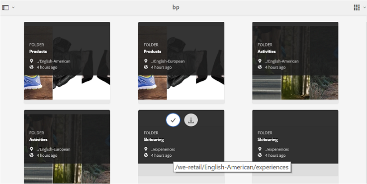
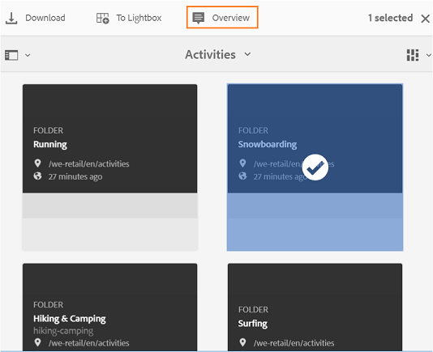
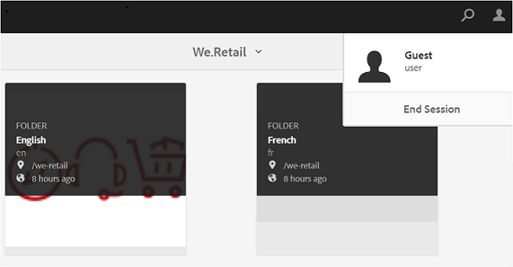

# Brand Portal へのゲストによるアクセス {#guest-access-to-brand-portal}

Experience Manager Assets Brand Portal では、ゲストによるポータルへのアクセスを許可します。ゲストユーザーは資格情報がなくてもポータルに入ることができ、ポータルの公開アセット（およびコレクション）にアクセスできます。ゲストセッション中のユーザーは Lightbox（非公開コレクション）にアセットを追加でき、セッションが終了するまで、またはゲストユーザーが[[!UICONTROL セッションの終了]](#exit-guest-session)を選択した場合を除いて、同様にダウンロードすることができます。ゲストユーザーセッションは 15 分間アクティブのままになります。

ゲストによるアクセス機能を使用すれば、組織は対象オーディエンスのオンボーディングを行わなくても ](../using/brand-portal-sharing-folders.md#how-to-share-folders) 承認済みアセットをすばやく共有 [ することができます。 Brand Portal 6.4.2 以降には、複数の同時ゲストユーザー（組織あたりの合計ユーザークォータの 10%）に対応する機能が搭載されています。ゲストによるアクセスを許可することで、Brand Portal の限られた機能を使用するユーザーのスコアの管理やオンボーディングにかかる時間を節約できます。\
管理ツールパネルの「**[!UICONTROL アクセス]**」設定の「**[!UICONTROL ゲストによるアクセスを許可]**」オプションを使用して、組織のBrand Portal アカウントでのゲストによるアクセスを有効化（または無効化）できます。

<!--
Comment Type: annotation
Last Modified By: mgulati
Last Modified Date: 2018-08-17T10:42:59.879-0400
Removed the first para: "AEM Assets Brand Portal allows public users to enter the portal anonymously and have restricted access to the allowed public resources as guests. Organization users with guest role need not seek access and authentication from administrators."
-->

## ゲストセッションの開始 {#begin-guest-session}

匿名でBrand Portalに入るには、Brand Portalのようこそ画面の **[!UICONTROL `Guest Access?`]** に対応する **[!UICONTROL ここをクリック]** を選択します。 CAPTCHA セキュリティチェックを入力して、Brand Portal へのアクセスを許可します。

## ゲストセッションの期間 {#guest-session-duration}

ゲストユーザーセッションは 15 分間アクティブのままになります。
この操作により、セッション開始時刻から 15 分間、**[!UICONTROL Lightbox]** の状態が保持されます。 その後、現在のゲストセッションが再起動し、Lightbox の状態が失われます。

例えば、ゲストユーザーが 15 時 00 分に Brand Portal にログインし、15 時 05 分にダウンロード対象のアセットを **[!UICONTROL Lightbox]** に追加するとします。ユーザーが 15 時 15 分より前（ログインから 15 分以内）に **[!UICONTROL Lightbox]** コレクション（またはそのアセット）をダウンロードしない場合、ユーザーはセッションを再起動する必要があります。 **[!UICONTROL Lightbox]** は空です。つまり、セッションが失われた場合、アップロードしたアセットは使用できなくなります。

## 許可されている同時ゲストセッション {#concurrent-guest-sessions-allowed}

同時ゲストセッションの数は、組織あたりの合計ユーザークォータの 10% に制限されます。つまり、ユーザークォータが 200 の組織の場合、最大 20 人のゲストユーザーが同時に作業をすることができます。 21 番目のゲストユーザーはアクセスを拒否され、20 人のアクティブなゲストユーザーのいずれかがセッションを終了した場合にのみゲストとしてアクセスできるようになります。

>[!NOTE]
>
>ライセンスを取得したユーザーの数が契約値（クォータ）を超えても、Brand Portal は通知を送信しません。また、ライセンスを取得したユーザーのアクティビティは制限されません。

## ゲストユーザーの Brand Portal の操作 {#guest-user-interaction-with-brand-portal}

### ゲスト UI ナビゲーション

ゲストとして Brand Portal に入ると、すべてのユーザーまたはゲストユーザーのみと[共有されているアセットおよびフォルダー](../using/brand-portal-sharing-folders.md#sharefolders)をすべて表示できます。これはコンテンツのみの表示であり、アセットがカード、リストまたは列レイアウトで表示されます。

管理者が [ フォルダー階層を有効にする ](../using/brand-portal-general-configuration.md#main-pars-header-1621071021) を有効にした場合、ゲストユーザーがBrand Portalにログインすると、ルートフォルダーのフォルダーツリーと親フォルダー内の共有フォルダーが表示されます。

これらの親フォルダーは仮想フォルダーで、アクションを実行することはできません。 これらの仮想フォルダーには、鍵のアイコンが付きます。

**[!UICONTROL カード表示]**&#x200B;でこれらをカーソルで指したり選択したりしても、共有フォルダーとは異なり、アクションタスクは表示されません。**[!UICONTROL 列表示]** および **[!UICONTROL リスト表示]** で仮想フォルダーを選択すると、**[!UICONTROL 概要]** ボタンが表示されます。

>[!NOTE]
>
>最初の共有フォルダーのサムネール画像が仮想フォルダーのデフォルトのサムネールになります。

   

「**[!UICONTROL 設定を表示]**」オプションを使用すると、ゲストユーザーは **[!UICONTROL カード表示]** または **[!UICONTROL リスト表示]** に表示する列でカードのサイズを調整できます。

**[!UICONTROL コンテンツツリー]** を使用すると、アセット階層内を移動できます。

Brand Portalでは、ゲストユーザーが選択したアセットやフォルダーの **[!UICONTROL アセットのプロパティ]** を表示できる **[!UICONTROL 概要]** オプションが用意されています。 「**[!UICONTROL 概要]**」オプションは、次の場所に表示されます。

* 上部のツールバーでアセットまたはフォルダーを選択します。
* パネルセレクターを選択する際のドロップダウン。

アセットまたはフォルダーを選択した状態で「**[!UICONTROL 概要]**」オプションを選択すると、タイトル、パス、アセット作成時間を確認できます。 一方、アセットの詳細ページで「**[!UICONTROL 概要]**」オプションを選択すると、アセットのメタデータを確認できます。

左側のパネルの **[!UICONTROL ナビゲーション]** オプションを使用すると、ファイルからコレクションへ、そしてゲストセッションに戻って移動できるので、ユーザーはファイルまたはコレクション内のアセットを参照できます。

「**[!UICONTROL フィルター]**」オプションを使用すると、ゲストユーザーは、管理者が設定した検索用述語を使用してアセットファイルおよびフォルダーをフィルタリングできます。

### ゲストユーザーの機能

ゲストユーザーは Brand Portal の公開アセットにアクセスできますが、制約もいくつかあります（これについては後で説明します）。

**ゲストユーザーが実行できる操作**：

* すべての Brand Portal ユーザー向けのすべての公開フォルダーと公開コレクションにアクセスする。
* メンバーや詳細ページを参照し、すべての公開フォルダーおよび公開コレクションのメンバーの完全なアセット表示を行う。
* 公開フォルダーおよび公開コレクション全体でアセットを検索する。
* Lightbox コレクションにアセットを追加する。コレクションに対するこれらの変更は、セッションの間保持されます。
* アセットを直接、または Lightbox コレクションからダウンロードする。

**ゲストユーザーが実行できない操作**：

* コレクションや保存済みの検索結果を作成、またはそれらを共有する。
* フォルダーやコレクションの設定にアクセスする。
* アセットをリンクとして共有する。

### ゲストセッションでのアセットのダウンロード

ゲストユーザーは、公開アセット、またはゲストユーザーのみと共有されたアセットを Brand Portal で直接ダウンロードできます。また、ゲストユーザーは **[!UICONTROL Lightbox]**（公開コレクション）にアセットを追加したり、セッションが期限切れになる前に **[!UICONTROL Lightbox]** コレクションをダウンロードしたりできます。

アセットやコレクションをダウンロードするには、次の場所のダウンロードアイコンを使用します。

* アセットまたはコレクションにカーソルを合わせると表示されるクイックアクションサムネール
* アセットまたはコレクションを選択すると表示される上部のツールバー

[!UICONTROL  ダウンロード ] ダイアログボックスで **[!UICONTROL ダウンロードの高速化を有効にする]** を選択すると、[ ダウンロードのパフォーマンスを向上させる ](../using/accelerated-download.md) ことができます。

## ゲストセッションの終了 {#exit-guest-session}

ゲストセッションを終了するには、ヘッダーにあるオプションから「**[!UICONTROL セッションを終了]**」を使用します。ただし、ゲストセッションに使用されるブラウザータブが非アクティブになっている場合、アクティビティが行われなくなってから 2 時間が経過するとセッションは自動的に期限切れとなります。

## ゲストユーザーアクティビティの監視 {#monitoring-guest-user-activities}

管理者は、Brand Portal でのゲストユーザーの操作を監視できます。Brand Portal で生成されたレポートは、ゲストユーザーアクティビティに関する重要なインサイトを提供できます。例えば、**[!UICONTROL ダウンロード]** レポートを使用して、ゲストユーザーによってダウンロードされたアセットの数を追跡できます。 **[!UICONTROL ユーザーログイン]** レポートは、ゲストユーザーが最後にポータルにログインした時間と、指定した期間にログインした頻度を通知できます。
