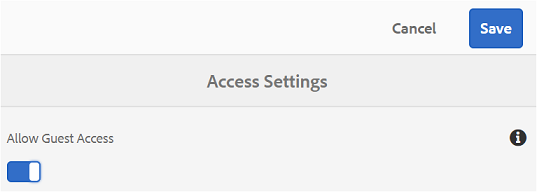
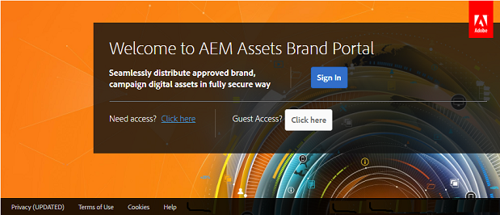
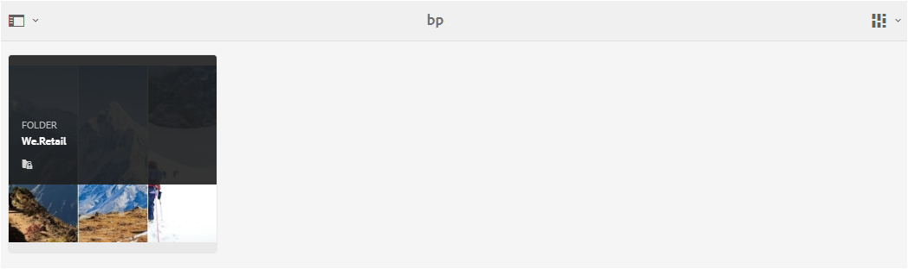
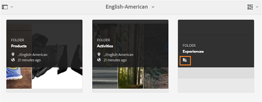
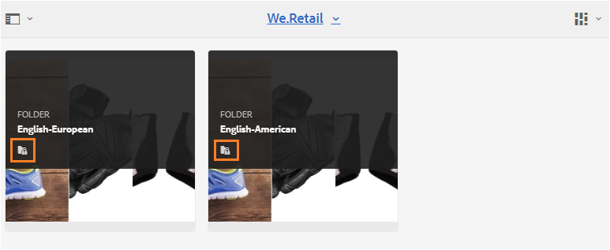
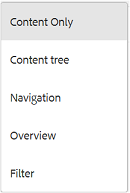
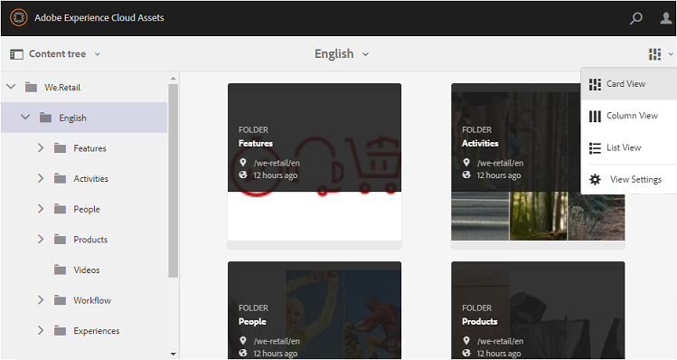
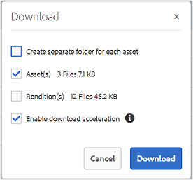
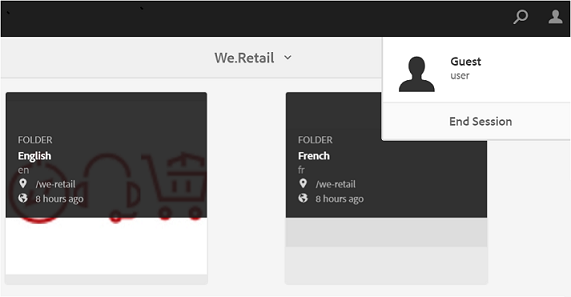

# Brand Portal へのゲストによるアクセス {#guest-access-to-brand-portal}

Experience Manager Assets Brand Portal では、ゲストによるポータルへのアクセスを許可します。 ゲストユーザーは資格情報がなくてもポータルに入ることができ、ポータルの公開アセット（およびコレクション）にアクセスできます。 ゲストセッション中のユーザーは Lightbox（非公開コレクション）にアセットを追加でき、セッションが終了するまで、またはゲストユーザーが[[!UICONTROL セッションの終了]](#exit-guest-session)を選択した場合を除いて、同様にダウンロードすることができます。 ゲストユーザーセッションは 15 分間アクティブのままになります。

ゲストアクセス機能により、組織はオンボーディングすることなく、承認済みアセットを[迅速に](../using/brand-portal-sharing-folders.md#how-to-share-folders)大規模に共有できます。 Brand Portal 6.4.2 以降には、複数の同時ゲストユーザー（組織あたりの合計ユーザークォータの 10%）に対応する機能が搭載されています。 ゲストによるアクセスを許可することで、Brand Portal の限られた機能を使用するユーザーのスコアの管理やオンボーディングにかかる時間を節約できます。\
組織は、管理ツールパネルの&#x200B;**[!UICONTROL アクセス]**&#x200B;設定から&#x200B;**[!UICONTROL ゲストアクセスを許可]** オプションを使用して、組織のBrand Portal アカウントでゲストアクセスを有効または無効にできます。

<!--
Comment Type: annotation
Last Modified By: mgulati
Last Modified Date: 2018-08-17T10:42:59.879-0400
Removed the first para: "AEM Assets Brand Portal allows public users to enter the portal anonymously and have restricted access to the allowed public resources as guests. Organization users with guest role need not seek access and authentication from administrators."
-->

## ゲストセッションの開始 {#begin-guest-session}

Brand Portalを匿名で入力するには、Brand Portalのウェルカム画面で&#x200B;**[!UICONTROL `Guest Access?`]**&#x200B;に対応する&#x200B;**[!UICONTROL ここをクリック]**&#x200B;を選択します。 CAPTCHA セキュリティチェックを入力して、Brand Portal へのアクセスを許可します。

## ゲストセッションの期間 {#guest-session-duration}

ゲストユーザーセッションは 15 分間アクティブのままになります。
このプロセスは、セッション開始時間から15分間、**[!UICONTROL ライトボックス]**&#x200B;の状態を保持します。 その後、現在のゲストセッションが再起動し、ライトボックスの状態が失われます。

例えば、ゲストユーザーは1500時間でBrand Portalにログインし、15:05時間でダウンロードできるように&#x200B;**[!UICONTROL Lightbox]**&#x200B;にアセットを追加します。 ユーザーが15:15時間前（ログイン後15分以内）に&#x200B;**[!UICONTROL Lightbox]** コレクション（またはそのアセット）をダウンロードしない場合、ユーザーはセッションを再起動する必要があります。 **[!UICONTROL ライトボックス]**&#x200B;が空です。つまり、セッションが失われた場合、アップロードされたアセットは使用できなくなります。

## 許可されている同時ゲストセッション {#concurrent-guest-sessions-allowed}

同時ゲストセッションの数は、組織あたりの合計ユーザークォータの 10% に制限されます。 つまり、ユーザークォータが200の組織の場合、最大20人のゲストユーザーが同時に作業できます。 21 番目のゲストユーザーはアクセスを拒否され、20 人のアクティブなゲストユーザーのいずれかがセッションを終了した場合にのみゲストとしてアクセスできるようになります。

>[!NOTE]
>
>ライセンスを取得したユーザーの数が契約値（クォータ）を超えても、Brand Portal は通知を送信しません。 また、ライセンスを取得したユーザーのアクティビティは制限されません。

## ゲストユーザーの Brand Portal の操作 {#guest-user-interaction-with-brand-portal}

### ゲスト UI ナビゲーション

ゲストとして Brand Portal に入ると、すべてのユーザーまたはゲストユーザーのみと[共有されているアセットおよびフォルダー](../using/brand-portal-sharing-folders.md#sharefolders)をすべて表示できます。 これはコンテンツのみの表示であり、アセットがカード、リストまたは列レイアウトで表示されます。

管理者が[Enable Folder Hierarchy](../using/brand-portal-general-configuration.md#main-pars-header-1621071021)を有効にしている場合、ゲストユーザーはBrand Portalにログインすると、ルートフォルダーと親フォルダー内の共有フォルダーからフォルダーツリーを表示します。

これらの親フォルダーは仮想フォルダーであり、アクションは実行できません。 これらの仮想フォルダーには、鍵のアイコンが付きます。

**[!UICONTROL カード表示]**&#x200B;でこれらをカーソルで指したり選択したりしても、共有フォルダーとは異なり、アクションタスクは表示されません。 **[!UICONTROL 概要]** ボタンは、**[!UICONTROL 列ビュー]**&#x200B;および&#x200B;**[!UICONTROL リストビュー]**&#x200B;で仮想フォルダーを選択する際に表示されます。

>[!NOTE]
>
>最初の共有フォルダーのサムネール画像が仮想フォルダーのデフォルトのサムネールになります。

   

**[!UICONTROL 設定を表示]** オプションを使用すると、ゲストユーザーは&#x200B;**[!UICONTROL カードビュー]**&#x200B;でカードサイズを調整したり、**[!UICONTROL リストビュー]**&#x200B;で表示する列を調整したりできます。

**[!UICONTROL コンテンツツリー]**&#x200B;を使用すると、アセット階層を移動できます。

Brand Portalには、ゲストユーザーが選択したアセット/フォルダーの&#x200B;**[!UICONTROL アセットプロパティ]**&#x200B;を表示するための&#x200B;**[!UICONTROL 概要]** オプションが用意されています。 「**[!UICONTROL 概要]**」オプションは、次の場所に表示されます。

* ツールバーの上部で、アセットまたはフォルダーを選択します。
* パネルセレクターを選択する際のドロップダウン。

アセットまたはフォルダーが選択されている間に&#x200B;**[!UICONTROL 概要]** オプションを選択すると、ユーザーはアセット作成のタイトル、パス、時間を確認できます。 一方、アセットの詳細ページでは、**[!UICONTROL 概要]** オプションを選択すると、ユーザーはアセットのメタデータを表示できます。

左側のパネルの&#x200B;**[!UICONTROL ナビゲーション]** オプションを使用すると、ファイルからコレクションに移動したり、ゲストセッションに戻ったりして、ユーザーがファイルまたはコレクション内のアセットを参照できるようにすることができます。

**[!UICONTROL フィルター]** オプションを使用すると、ゲストユーザーは、管理者が設定した検索述語を使用して、アセットファイルとフォルダーをフィルターできます。

### ゲストユーザーの機能

ゲストユーザーは Brand Portal の公開アセットにアクセスできますが、制約もいくつかあります（これについては後で説明します）。

**ゲストユーザーが実行できる操作**：

* すべての Brand Portal ユーザー向けのすべての公開フォルダーと公開コレクションにアクセスする。
* メンバー、詳細ページを参照し、すべての公開フォルダーとコレクションのメンバーの完全なアセットビューを持ちます。
* 公開フォルダーおよび公開コレクション全体でアセットを検索する。
* Lightbox コレクションにアセットを追加する。 コレクションに対するこれらの変更は、セッションの間保持されます。
* アセットを直接、または Lightbox コレクションからダウンロードする。

**ゲストユーザーが実行できない操作**：

* コレクションや保存済みの検索結果を作成、またはそれらを共有する。
* フォルダーやコレクションの設定にアクセスする。
* アセットをリンクとして共有する。

### ゲストセッションでのアセットのダウンロード

ゲストユーザーは、公開アセット、またはゲストユーザーのみと共有されたアセットを Brand Portal で直接ダウンロードできます。 また、ゲストユーザーは **[!UICONTROL Lightbox]**（公開コレクション）にアセットを追加したり、セッションが期限切れになる前に **[!UICONTROL Lightbox]** コレクションをダウンロードしたりできます。

アセットやコレクションをダウンロードするには、次の場所のダウンロードアイコンを使用します。

* アセットまたはコレクションにカーソルを合わせると表示されるクイックアクションサムネール
* アセットまたはコレクションを選択すると表示される上部のツールバー

[!UICONTROL  ダウンロード ] ダイアログボックスで「**[!UICONTROL ダウンロードアクセラレーションを有効にする]**」を選択すると、[ ダウンロードパフォーマンスを向上させることができます](../using/accelerated-download.md)。

## ゲストセッションの終了 {#exit-guest-session}

ゲストセッションを終了するには、ヘッダーにあるオプションから「**[!UICONTROL セッションを終了]**」を使用します。 ただし、ゲストセッションに使用されるブラウザータブが非アクティブになっている場合、アクティビティが行われなくなってから 2 時間が経過するとセッションは自動的に期限切れとなります。

## ゲストユーザーアクティビティの監視 {#monitoring-guest-user-activities}

管理者は、Brand Portal でのゲストユーザーの操作を監視できます。 Brand Portal で生成されたレポートは、ゲストユーザーアクティビティに関する重要なインサイトを提供できます。 例えば、**[!UICONTROL ダウンロード]** レポートは、ゲストユーザーがダウンロードしたアセットの数を追跡するために使用できます。 **[!UICONTROL ユーザーログイン]** レポートでは、ゲストユーザーがポータルに最後にログインした日時と、指定した期間のログイン頻度を通知できます。
