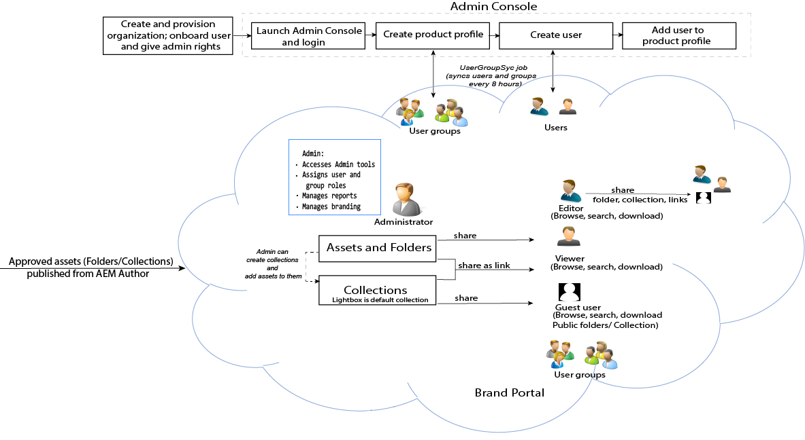

# Adobe Experience Manager Assets Brand Portal ガイド {#aem-brand-portal}

**Adobe Experience Manager Assets Brand Portal** は、組織が承認済みのブランドおよび製品アセットを外部の代理店、パートナー、内部チーム、販売店などにダウンロードで安全に配布してマーケティングニーズに応えるうえで役に立ちます。

安全なアセット共有ソリューションがないと、次のことが考えられます。

* メールまたはクラウドを通じた手動アセット共有
* ブランドのコンプライアンスの問題が発生する
* アセットの使用状況を制御できない
* キャンペーンの開始や製品の発売が遅れる
* 地域や組織をまたいでコンテンツが重複する
* リリース前のアセットが安全でない場所に保管される

Brand Portal は、マーケターがパートナーや社内ユーザーと共同作業してデザインガイドライン、ロゴ、キャンペーンアセットを作成、管理し、関係者に提供できるようにすることで、ブランドコンプライアンスを確保します。

Brand Portal は、クラウドベースの SaaS 製品です。 Adobe Experience Manager Assets 製品（オンプレミスまたはマネージドサービス）へのアドオンとして利用できます。 Brand Portal は、[!DNL Adobe Experience Manager Assets] as a [!DNL Cloud Service] で利用できます。 [設定済み](https://experienceleague.adobe.com/ja/docs/experience-manager-cloud-service/content/assets/brand-portal/configure-aem-assets-with-brand-portal)になると、承認済みアセットを [!DNL Adobe Experience Manager Assets] as a [!DNL Cloud Service] インスタンスから [!DNL Brand Portal] に公開し、Brand Portal ユーザーに配布できます。

Brand Portal ソリューションワークフローを次の画像に示します。

## Adobe Experience Manager Brand Portal ユーザーガイド

このユーザーガイドでは Brand Portal のサービスおよび主要ワークフローについて説明しています。 左側のレールを使用すると、各種機能をナビゲートでき、様々なペルソナがポータルとどのようにやり取りするかを理解することができます。

### 関連トピック

| ユーザーガイド | 説明 |
|--- |---|
| [新機能](whats-new.md) | Brand Portal で行われた変更。 |
| [リリースノート](brand-portal-release-notes.md) | 現在のリリースにおける機能強化、解決された重要な問題、既知の問題。 |
| [Experience Manager Assets と Brand Portal の連携の設定](../using/configure-aem-assets-with-brand-portal.md) | アセットを公開するための Brand Portal と Experience Manager Assets のレプリケート方法。 |
| [並列公開における問題のトラブルシューティング](troubleshoot-parallel-publishing.md) | Brand Portal と Experience Manager Assets 間のレプリケーションのトラブルシューティング。 |
| [サポートされているファイル形式](brand-portal-supported-formats.md) | Brand Portal でプレビューおよびダウンロード用にサポートされるファイル形式。 |
| [Brand Portal へのアセットの公開](brand-portal-sharing-folders.md) | フォルダー、コレクション、リンク、プリセット、スキーマ、ファセット、タグを Brand Portal に公開する方法。 |
| [Brand Portal でのアセットソーシング](brand-portal-asset-sourcing.md) | AEM Assets でアセットソーシングを設定し、Brand Portal にアセットをアップロードして、投稿フォルダーを AEM Assets に公開する方法。 |
| [Brand Portal の注目のビデオ](https://experienceleague.adobe.com/?lang=ja&tag=Brand+Portal#recommended/solutions/experience-manager) | ビデオチュートリアルを利用して、Experience Manager Assets Brand Portal の使用方法を学びます。 |

### 役立つリソース

* [AEM Assetsを利用したBrand Portalについて](https://experienceleague.adobe.com/ja/docs/experience-manager-brand-portal/using/home)
