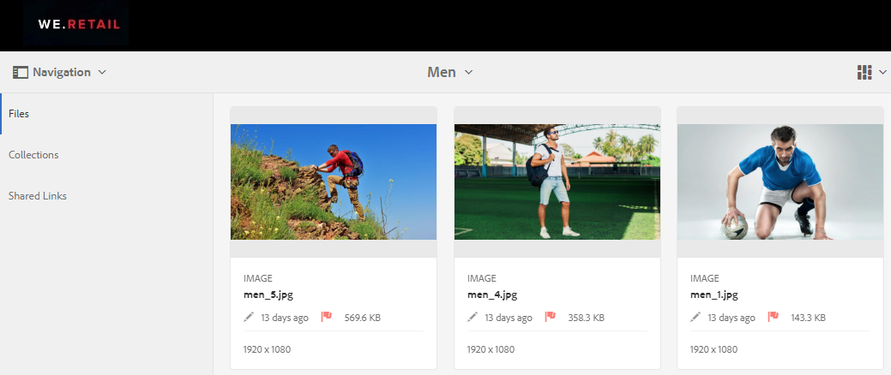
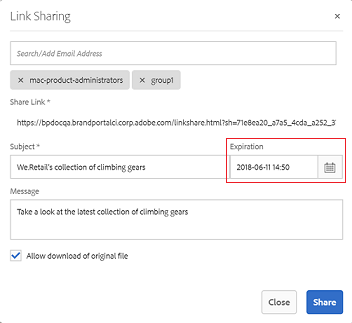
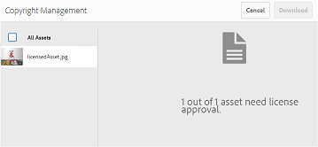
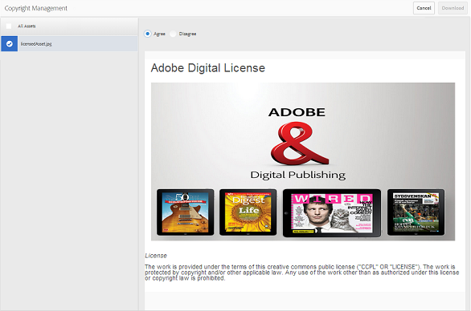
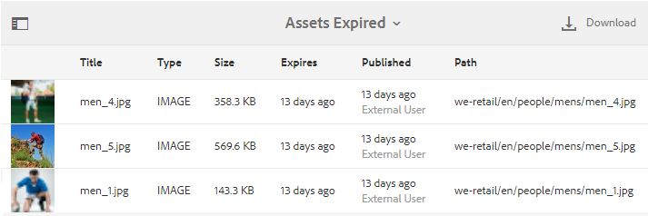

# アセットのデジタル著作権の管理 {#manage-digital-rights-of-assets}

ブランドを守るには、クリエイティブアセットやブランドマテリアルの配布および使用を適切に保護することが不可欠です。 このプロセスは、AEMからBrand Portalに公開された承認済みアセットに有効期限（および時間）を関連付けるか、条件付き使用のためにアセットにライセンスを付与することで実行できます。 また、Brand Portalでは、Brand Portalから共有されたアセットへのリンクの有効期限を指定できます。

この記事では、Brand Portalでアセットがどのように保護されているかを説明し、関連する使用権限について説明します。

## アセットの有効期限 {#asset-expiration}

アセットの有効期限は、Brand Portal 上の承認済みアセットの使用を組織全体にわたって制御する有効な方法です。 AEM Assets から Brand Portal に公開されるアセットには必ず有効期限日が設定されており、この設定によって、様々なユーザーの役割によるアセットの使用が制限されています。

### 期限切れアセットに関連する使用権限 {#usage-permissions-expired-assets}

Brand Portalでは、管理者は期限切れのアセットをコレクションに表示、ダウンロード、追加できます。 ただし、エディターとビューアーは、期限切れのアセットのみをコレクションに表示して追加できます。

管理者は期限切れアセットを AEM Assets から Brand Portal に公開できます。 ただし、期限切れのアセットは、Brand Portalのリンクを使用して共有することはできません。 期限切れアセットと期限切れでないアセットの両方を含むフォルダーから期限切れアセットを選択している場合は、「**[!UICONTROL リンクを共有]**」アクションは使用できません。 しかし、期限切れアセットと期限切れでないアセットを含んだフォルダーそのものを選択している場合は、「[!UICONTROL 共有]」アクションと「**[!UICONTROL リンクを共有]**」アクションを使用できます。

>[!NOTE]
>
>フォルダーは、その中に期限切れアセットが含まれている場合でも、リンクとして共有できます。 その場合、共有されたリンクは期限切れアセットをリストせず、期限切れでないアセットのみが共有されます。

以下の表には、期限切れアセットの使用権限が表示されています。

|   | **[!UICONTROL リンク共有]** | **[!UICONTROL ダウンロード]** | **[!UICONTROL プロパティ]** | **[!UICONTROL コレクションに追加]** | **[!UICONTROL 削除]** |
|---|---|---|---|---|---|
| **[!UICONTROL 管理者]** | 使用不可 | 使用可 | 使用可 | 使用可 | 使用可 |
| **[!UICONTROL 編集者]** | 使用不可 | 使用不可 | 使用可 | 使用可 | 使用不可 |
| **[!UICONTROL 閲覧者]** | 使用不可 | 使用不可 | 使用可 | 使用可 | 使用不可 |
| **[!UICONTROL ゲストユーザー]** | 使用不可 | 使用不可 | 使用可 | 使用可 | 使用不可 |

>[!NOTE]
>
>閲覧者およびエディターが期限切れアセットと期限切れでないアセットを含むフォルダーをダウンロードした場合は、期限切れでないアセットのみがダウンロードされます。 フォルダーに期限切れのアセットのみが含まれている場合は、空のフォルダーがダウンロードされます。

### アセットの有効期限ステータス {#expiration-status-of-assets}

アセットの有効期限ステータスは&#x200B;**[!UICONTROL カード表示]**&#x200B;で確認できます。 カード上の赤いフラグは、アセットの有効期限が切れていることを示します。

>[!NOTE]
>
>リストビューと列表示では、アセットの有効期限ステータスは表示されません。

## アセットリンクの有効期限 {#asset-link-expiration}

管理者およびエディターは、リンクを通じてアセットを共有する一方で、**[!UICONTROL リンク共有]**&#x200B;ダイアログボックスの「**[!UICONTROL 有効期限]**」フィールドを使用して有効期限の日時を設定できます。 リンクのデフォルトの有効期限は、リンクが共有された日付から7日間です。

これにより、リンクとして共有されたアセットは、Brand Portal管理者とエディターが設定した日時に期限切れになります。 また、アセットは有効期限を過ぎると表示およびダウンロードできなくなります。 承認済みアセットを外部ユーザーから保護するには、共有リンクに有効期限を設定し、指定された時間以降に未知のエンティティに公開されないようにします。

リンク共有について詳しくは、[アセットをリンクとして共有](../using/brand-portal-link-share.md)を参照してください。

## ライセンスで保護されたアセット {#licensed-assets}

ライセンスで保護されたアセットを Brand Portal からダウンロードするときは、事前に使用許諾契約への同意が求められます。 ライセンス済みアセットに関するこの契約書は、Brand Portalから直接ダウンロードするか、共有リンクを介してダウンロードする場合に適用されます。 有効期限が切れているかどうかにかかわらず、すべてのユーザーはライセンスで保護されたアセットを表示できます。 ただし、使用期限が切れたライセンス済みアセットのダウンロードと使用には制限があります。 使用期限が切れたライセンス済みアセットの動作と、ユーザーの役割に基づく許可されたアクティビティについては、[使用期限が切れたアセットの使用権限](../using/manage-digital-rights-of-assets.md#usage-permissions-expired-assets)を参照してください。

ライセンスで保護されたアセットには、[&#x200B; ライセンス契約](https://experienceleague.adobe.com/en/docs/experience-manager-65/content/assets/administer/drm)が添付されています。これは、[!DNL Experience Manager Assets]でアセットのメタデータプロパティを設定することによって行われます。

アセットに次のいずれかまたは両方のメタデータプロパティが含まれている場合、アセットは保護されていると見なされます。

* `xmpRights:WebStatement`：このプロパティが、そのアセットの使用許諾契約書を含むページのパスを指している。 `xmpRights:WebStatement` は、リポジトリ内の有効なパスである必要があります。
* `adobe_dam:restrictions`：このプロパティの値が、使用許諾契約書を指定する変換前の HTML である。

ライセンスで保護されたアセットをダウンロードすることを選択した場合、メタデータプロパティに応じて&#x200B;**[!UICONTROL 著作権管理]** ページにリダイレクトされます。

| `adobe_dam:restrictions` | `xmpRights:WebStatement` | 著作権管理 |
| --- | --- | --- |
| はい | - | このインターフェイスは、Assets と Brand Portal の両方に表示されます |
| - | はい（無効なパス） | インターフェイスなし |
| はい | はい（無効なパス） | インターフェイスなし |
| はい | はい（有効なパス） | インターフェイスは、AssetsまたはBrand Portal に表示されます。パスがAssetsとBrand Portalのどちらに対して有効か（またはその両方）に応じて異なります。 |

ここでダウンロードするアセットを選択し、関連付けられた使用許諾契約に同意する必要があります。 使用許諾契約に同意しない場合、「**[!UICONTROL ダウンロード]**」ボタンは無効になります。

選択した項目に保護されたアセットが複数含まれている場合、一度に 1 つずつアセットを選択し、使用許諾契約書に同意し、アセットのダウンロードに進みます。

## 期限切れのアセットに関するレポートを生成 {#generate-report-about-expired-assets}

管理者は、特定の期間内に期限切れになったすべてのアセットをリストするレポートを生成してダウンロードできます。 このレポートには、期限切れアセットについての詳細情報（サイズ、種類、アセット階層内のアセットの場所を示すパス、アセットが期限切れになった日時、アセットが公開された日時など）が含まれます。 このレポートの列はカスタマイズ可能であり、表示するデータを要件に応じて増やすことができます。

レポート機能について詳しくは、[&#x200B; レポートの操作](../using/brand-portal-reports.md#work-with-reports)を参照してください。
