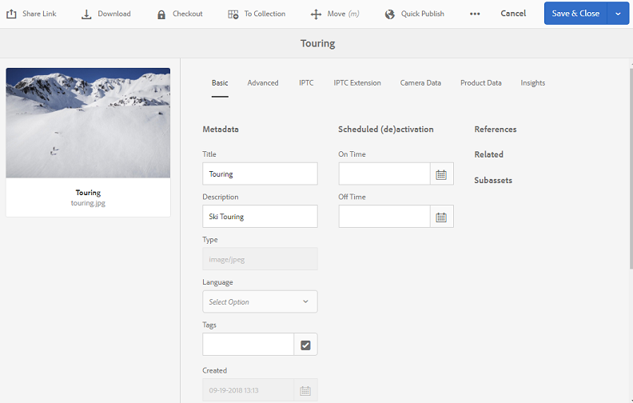

# Brand Portal へのプリセット、スキーマ、ファセットの公開 {#publish-presets-schema-and-facets-to-brand-portal}

この記事では、画像プリセット、メタデータスキーマおよびカスタム検索ファセットを AEM オーサーインスタンスから Brand Portal へ公開する方法について説明します。公開機能を使用すると、AEM オーサーインスタンスで作成または編集した画像プリセット、メタデータスキーマ、検索ファセットを再利用できます。 このアプローチは、重複の取り組みを減らします。

>[!NOTE]
>
>AEM オーサーインスタンスからBrand Portalに画像プリセット、メタデータスキーマおよび検索ファセットを公開する機能は、AEM 6.2 SP1-CFP7 およびAEM 6.3 SP 1-CFP 1 （6.3.1.1）以降で使用できます。

## Brand Portal への画像プリセットの公開 {#publish-image-presets-to-brand-portal}

画像プリセットとは、画像配信の際に画像に適用される一連のサイズ変更コマンドやフォーマットコマンドをまとめたものです。画像プリセットは Brand Portal で作成したり修正したりできます。または、AEM オーサーインスタンスがDynamic Media モードで動作している場合、ユーザーはAEM オーサーでプリセットを作成して、AEM Assets Brand Portalに公開することができます。 このアプローチにより、Brand Portalで同じプリセットが再作成されるのを防ぐことができます。
プリセットを作成すると、アセットの詳細レンディションパネルとダウンロードダイアログボックスに動的レンディションとして表示されます。

>[!NOTE]
>
>AEM オーサーインスタンスが **[!UICONTROL Dynamic Media モード]** で動作していない（お客様はDynamic Mediaを購入していない）場合、アセットの **[!UICONTROL ピラミッドTIFF]** レンディションはアップロード時に作成されません。 画像プリセットまたは動的レンディションは、アセットの **[!UICONTROL ピラミッドTIFF]** で機能します。 したがって、AEM オーサーインスタンスで **[!UICONTROL ピラミッドTIFF]** を使用できない場合は、Brand Portalでは使用できません。 その結果、アセットの詳細ページとダウンロードダイアログボックスのレンディションパネルに動的レンディションは表示されません。

画像プリセットを Brand Portal に公開するには、次のようにします。

1. AEM オーサーインスタンスで、AEM ロゴをクリックしてグローバルナビゲーションコンソールにアクセスし、ツールアイコンをクリックして、**[!UICONTROL Assets/画像プリセット]** に移動します。
1. 画像プリセットのリストから 1 つまたは複数の画像プリセットを選択し、**[!UICONTROL Brand PortalへのPublish]** をクリックします。

>[!NOTE]
>
>ユーザーが **[!UICONTROL PublishからBrand Portal]** をクリックすると、画像プリセットは公開用にキューに入れられます。 レプリケーションエージェントのログを監視して、公開が成功したかどうかを確認することを推奨します。

Brand Portal への画像プリセットの公開を取り消すには、次のようにします。

1. AEM オーサーインスタンスで、AEM ロゴをクリックしてグローバルナビゲーションコンソールにアクセスし、**[!UICONTROL ツール]** アイコンをクリックして、**[!UICONTROL Assets/画像プリセット]** に移動します。
1. 画像プリセットを選択し、上部にあるオプションから「**[!UICONTROL Brand Portal から削除]**」を選択します。

## Brand Portal へのメタデータスキーマの公開  {#publish-metadata-schema-to-brand-portal}

メタデータスキーマは、アセットまたはコレクションのプロパティページに表示されるレイアウトとプロパティを記述します。

 

ユーザーがAEM オーサーインスタンスでデフォルトのスキーマを編集し、Brand Portalのデフォルトのスキーマと同じスキーマを使用したい場合は、メタデータスキーマフォームをBrand Portalに公開します。 このようなシナリオでは、AEM オーサーインスタンスから公開されたデフォルトのスキーマがBrand Portalのデフォルトのスキーマを上書きします。

AEM オーサーインスタンス上でカスタムスキーマを作成していた場合は、同じカスタムスキーマを Brand Portal 上で作り直す代わりに、そのカスタムスキーマを Brand Portal に公開できます。公開されたカスタムスキーマは Brand Portal 内の任意のフォルダーまたはコレクションに適用できます。

>[!NOTE]
>
>AEM インスタンスでロックされている場合、デフォルトのスキーマはBrand Portalに公開できません。 つまり、編集はされません。

>[!NOTE]
>
>フォルダーのAEM オーサーインスタンスにスキーマが適用されている場合、Brand Portalにも同じスキーマが存在する必要があります。 これにより、AEM オーサーとBrand Portalのアセットプロパティページの一貫性を維持することができます。

メタデータスキーマを AEM オーサーインスタンスから Brand Portal へ公開するには、次のようにします。

1. AEM オーサーインスタンスで、AEM ロゴをクリックしてグローバルナビゲーションコンソールにアクセスし、ツールアイコンをクリックして、**[!UICONTROL Assets/メタデータスキーマ]** に移動します。
1. メタデータスキーマを選択し、上部にあるオプションから「**[!UICONTROL Brand Portal に公開]**」を選択します。

>[!NOTE]
>
>ユーザーが「**[!UICONTROL Brand Portal に公開]**」をクリックすると、メタデータスキーマが公開用のキューに入ります。レプリケーションエージェントのログを監視して、公開が成功したかどうかを確認することを推奨します。

Brand Portalからメタデータスキーマを非公開にするには：

1. AEM オーサーインスタンスで、AEM ロゴをクリックしてグローバルナビゲーションコンソールにアクセスし、ツールアイコンをクリックして、**[!UICONTROL Assets/メタデータスキーマ]** に移動します。
1. メタデータスキーマを選択し、上部にあるオプションから「**[!UICONTROL Brand Portal から削除]**」を選択します。

## Brand Portal への検索ファセットの公開 {#publish-search-facets-to-brand-portal}

検索フォームは、Brand Portal のユーザーに[ファセット検索](../using/brand-portal-search-facets.md)の機能を提供します。検索ファセットは Brand Portal 上での詳細検索を可能にします。検索フォームに[追加されている述語](https://experienceleague.adobe.com/en/docs/experience-manager-65/content/assets/administer/search-facets)はすべて、検索フィルター内の検索ファセットとしてユーザーに提供されます。

**[!UICONTROL Assets管理者の検索レールでカスタム検索フォームを使用するには]** AEM オーサーインスタンスから、再作成する代わりに、Brand Portalに直接公開します。

>[!NOTE]
>
>**[!UICONTROL Assets管理者の検索レール]** でロックされた検索フォームをAEM AssetsからBrand Portalに公開するには、まず編集する必要があります。 編集して公開すると、この検索フォームは、Brand Portal上の既存の検索フォームを上書きします。

編集された検索ファセットを AEM オーサーインスタンスから Brand Portal へ公開するには、次のようにします。

1. AEMのロゴをクリックし、**[!UICONTROL ツール/一般/Formsを検索]** に移動します。
1. 編集された検索フォームを選択し、「**[!UICONTROL Brand Portal に公開]**」を選択します。

   >[!NOTE]
   >
   >ユーザーが「**[!UICONTROL Brand Portal に公開]**」をクリックすると、検索ファセットが公開用のキューに入れられます。レプリケーションエージェントのログを監視して、公開が成功したかどうかを確認することを推奨します。

Brand Portalから検索フォームを非公開にするには、次の手順を実行します。

1. AEM オーサーインスタンスで、AEM ロゴをクリックしてグローバルナビゲーションコンソールにアクセスし、ツールアイコンをクリックして、**[!UICONTROL 一般/Formsを検索]** に移動します。
1. 検索フォームを選択し、上部にあるオプションから「**[!UICONTROL Brand Portal から削除]**」を選択します。

>[!NOTE]
>
>**[!UICONTROL Brand Portalから非公開]** アクションは、Brand Portal上のデフォルトの検索フォームのままとなり、公開前に使用した最後の検索フォームに復元されません。

### 制限事項 {#limitations}

1. 検索用述語の中には、Brand Portal 上の検索フィルターに適用できないものがあります。このような検索用述語が検索フォームの一部として AEM オーサーインスタンスから Brand Portal へ公開された場合は、適用できない検索用述語が削除されます。したがって、Brand Portal 側では、公開されたフォーム内の述語の数が少なくなります。詳しくは、[Brand Portal 上のフィルターに適用可能な検索用述語の一覧](../using/brand-portal-search-facets.md#list-of-search-predicates)を参照してください。

1. [!UICONTROL  オプションの述語 ] の場合、ユーザーがカスタムパスを使用してAEM オーサーインスタンスでオプションを読み取ると、Brand Portalで機能しません。 このような追加のパスやオプションは、検索フォームと一緒に Brand Portal へ公開されません。その場合は、ユーザーが&#x200B;**[!UICONTROL オプションの述語]**&#x200B;内の「**[!UICONTROL オプションを追加]**」で「**[!UICONTROL 手動]**」オプションを選択して、Brand Portal 側でこれらのオプションを手動で追加できます。

