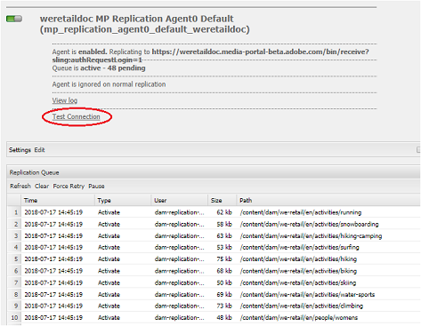

# Brand Portal への並列公開における問題のトラブルシューティング {#troubleshoot-issues-in-parallel-publishing-to-brand-portal}

Brand Portal と Experience Manager Assets の連携を設定すると、承認済みブランドアセットを Experience Manager Assets オーサーインスタンスからシームレスに取り込む（または公開する）ことができます。 [設定](../using/configure-aem-assets-with-brand-portal.md)が完了すると、Experience Manager オーサーはレプリケーションエージェントを使用して、選択した1つ以上のアセットをBrand Portal クラウドサービスにレプリケートし、Brand Portal ユーザーによる承認済みの使用に使用します。 複数のレプリケーションエージェントは、Experience Manager 6.2 SP1-CFP5、Experience Manager CFP 6.3.0.2以降で使用され、高速な並列公開が可能になります。

>[!NOTE]
>
>Experience Manager Assets Brand PortalとExperience Manager Assetsの連携を成功させるには、AdobeでExperience Manager 6.4.1.0にアップグレードすることをお勧めします。 Experience Manager 6.4 では、Experience Manager Assets と Brand Portal の連携を設定する際にエラーが発生し、レプリケーションが失敗します。

**[!UICONTROL /etc/cloudservice]**&#x200B;でBrand Portalのクラウドサービスを設定すると、必要なすべてのユーザーとトークンが自動生成され、リポジトリに保存されます。 クラウドサービスの設定が作成され、レプリケーションに必要なサービスユーザーと、コンテンツをレプリケートするためのレプリケーションエージェントも作成されます。 これによって 4 つのレプリケーションエージェントが作成されます。 したがって、多数のアセットを Experience Manager から Brand Portal に公開するときは、アセットがキューに入り、これらのレプリケーションエージェント間でラウンドロビンを通じて配分されます。

ただし、大きな Sling ジョブや、Experience Manager オーサーインスタンス上のネットワークおよび&#x200B;**[!UICONTROL ディスク I/O]** の増加や Experience Manager オーサーインスタンスのパフォーマンス低下などの理由で、公開が断続的に失敗することがあります。 Adobeでは、公開を開始する前に、1つ以上のレプリケーションエージェントとの接続をテストすることをお勧めします。

## 初めての公開で失敗した場合のトラブルシューティング：公開設定の検証 {#troubleshoot-failures-in-first-time-publishing-validating-your-publish-configuration}

パブリッシュ設定を検証するには：

1. エラーログの確認
1. レプリケーションエージェントが作成されているかどうかを確認します
1. 接続をテストします。

**Cloud Service 作成時のテールログ**

テールログを確認します。 レプリケーションエージェントが作成されているかどうかを確認します。 レプリケーションエージェントの作成が失敗した場合は、Cloud Serviceでマイナーな変更を行ってCloud Serviceを編集します。 検証を行い、レプリケーションエージェントが作成されているかをもう一度確認します。 作成されていない場合は、サービスを再編集します。

クラウドサービスを繰り返し編集する際に、適切に設定されていない場合は、Daycare チケットを報告します。

**レプリケーションエージェントとの接続をテスト**

レプリケーションログにエラーが見つかった場合は、ログを表示します。

1. カスタマーサポートに問い合わせてください。

1. [クリーンアップ](../using/troubleshoot-parallel-publishing.md#clean-up-existing-config)を再試行し、公開設定をもう一度作成します。

<!--
Comment Type: remark
Last Modified By: Mini Gulati (mgulati)
Last Modified Date: 2018-06-21T22:56:21.256-0400

?? check and compare public key. At times public key is different

?? another thing to check in /useradmin

-->

## 既存の Brand Portal 公開設定のクリーンアップ {#clean-up-existing-config}

ユーザー（例：`mac-<tenantid>-replication`）に最新の秘密鍵がなく、レプリケーションエージェントログに他のエラーが報告されないため、多くの場合、「401 unauthorized」エラーで公開が失敗します。 その場合は、トラブルシューティングを行うのではなく、設定を作成することをお勧めします。 新しい設定を正しく機能させるには、Experience Manager オーサーインスタンスのセットアップから以下をクリーンアップします。

1. `localhost:4502/crx/de/`に移動します（`localhost:4502:`でオーサーインスタンスを実行していることを考慮してください）
私は。 削除 `/etc/replication/agents.author/mp_replication`
ii. `/etc/cloudservices/mediaportal/<config_name>` の削除

1. localhost:4502/useradminに移動：\
   私は。 ユーザーを検索 `mac-<tenantid>replication`
ii. このユーザーを削除

これでシステムはすべてクリーンアップされました。 これで、クラウドサービス設定を作成しても、既存のJWT アプリケーションを使用できます。 アプリケーションを作成する必要はなく、新しく作成したクラウド設定から公開鍵を更新するだけです。

>[!NOTE]
>
>自動生成された設定は変更しないでください。

## Developer Connection の JWT アプリケーションテナントの可視性の問題 {#developer-connection-jwt-application-tenant-visibility-issue}

`https://legacy-oauth.cloud.adobe.io/`の場合、現在のユーザーがシステム管理者を保持しているすべての組織（テナント）が一覧表示されます。 ここに組織名が見つからない場合、または必要なテナントのアプリケーションをここで作成できない場合は、十分な（システム管理者）権限があるかどうかを確認してください。

このユーザーインターフェイスには、テナントの場合、上位10個のアプリケーションのみが表示される既知の問題が1つあります。 アプリケーションを作成したら、そのページにとどまり、URL をブックマークしてください。 アプリケーションのリストページに移動して、作成したアプリケーションを見つけないでください。 このブックマーク付きURLを直接ヒットし、必要に応じてアプリケーションを更新または削除できます。

作成した JWT アプリケーションが適切にリストされない場合があります。 したがって、JWT アプリケーションの作成時にURLをメモまたはブックマークすることをお勧めします。

## 機能していた設定が動作を停止した場合 {#running-configuration-stops-working}

<!--
Comment Type: draft

If the running configuration stops working, either of the following two possibilities
<g class="gr_ gr_15 gr-alert gr_gramm gr_inline_cards gr_run_anim Grammar multiReplace" data-gr-id="15" id="15" style="font-size: 12px;">
are
</g> there:

1.
<g class="gr_ gr_14 gr-alert gr_gramm gr_inline_cards gr_run_anim Grammar only-ins doubleReplace replaceWithoutSep" data-gr-id="14" id="14">
Connection
</g> has failed, or

2. Publish has failed with permission to dam-replication-service denied, while connection has passed 

If the connection has failed [1], the
<g class="gr_ gr_10 gr-alert gr_spell gr_inline_cards gr_run_anim ContextualSpelling ins-del multiReplace" data-gr-id="10" id="10">
fail safe
</g> way to fix it is to <a href="../using/troubleshoot-parallel-publishing.md#main-pars-header-1664955658">clean up</a> the existing Brand Portal publish configuration and recreate a publish configuration. 

However, if the
<g class="gr_ gr_18 gr-alert gr_spell gr_inline_cards gr_run_anim ContextualSpelling" data-gr-id="18" id="18">
publish
</g> has failed with
<g class="gr_ gr_16 gr-alert gr_gramm gr_inline_cards gr_run_anim Grammar only-ins doubleReplace replaceWithoutSep" data-gr-id="16" id="16">
permission
</g> denied to dam-replication-service, raise a support ticket.

-->

それまで問題なく Brand Portal への公開を行っていたレプリケーションエージェントが公開ジョブの処理を停止した場合は、レプリケーションログを確認してください。 Experience Manager にはビルトインの自動再試行機能があるので、特定のアセットの公開が失敗しても、自動的に再試行されます。 ネットワークエラーなどの断続的な問題がある場合は、再試行中に成功する可能性があります。

継続的な公開エラーが発生し、キューがブロックされている場合は、**[!UICONTROL 接続のテスト]**&#x200B;を確認してください。 報告されているエラーを解決してみてください。

エラーに基づいて、Brand Portal エンジニアリングチームが問題の解決を支援できるように、サポートチケットを記録することをお勧めします。

## Brand Portal IMS 設定トークンの期限が切れました {#token-expired}

Brand Portal 環境が突然停止した場合は、IMS 設定が正しく動作していない可能性があります。 システムは異常な IMS 設定を表示し、（以下のような）アクセストークンの有効期限が切れたというエラーメッセージを反映します。

`com.adobe.granite.auth.oauth.AccessTokenProvider failed to get access token from authorization server status: 400 response: Unknown macro: {"error"}`

この問題を解決するには、IMS設定を手動で保存して閉じ、ヘルスステータスをもう一度確認することをお勧めします。この問題を解決するには、AdobeでIMS設定を手動で保存して閉じます。 設定が機能しない場合は、既存の設定を削除し、新しい設定を作成します。

## 接続タイムアウトエラーを回避するためのレプリケーションエージェントの設定 {#connection-timeout}

ジョブの公開がタイムアウトエラーで失敗する場合は、通常、レプリケーションキューに保留中のリクエストが複数あります。 この問題を解決するには、タイムアウトを回避するようにレプリケーションエージェントを設定します。

レプリケーションエージェントを設定するには：

1. AEM Assets オーサーインスタンスにログインします。
1. **ツール**&#x200B;パネルで、**[!UICONTROL デプロイメント]**／**[!UICONTROL レプリケーション]**&#x200B;に移動します。
1. レプリケーションページで、「**[!UICONTROL `Agents on author`]**」をクリックします。 Brand Portal テナントの 4 つのレプリケーションエージェントを表示できます。
1. レプリケーションエージェントの URL をクリックし、「**[!UICONTROL 編集]**」をクリックします。
1. エージェントの設定で「**[!UICONTROL 拡張]**」タブをクリックします。
1. 「**[!UICONTROL 接続を閉じる]**」チェックボックスをオンにします。
1. 手順 4～7 を繰り返して、4 つのレプリケーションエージェントをすべて設定します。
1. サーバーを再起動します。
