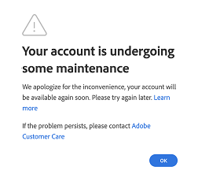
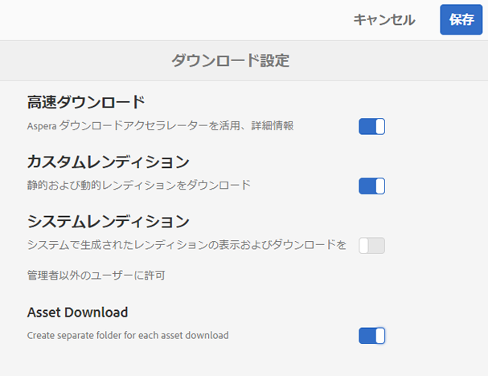
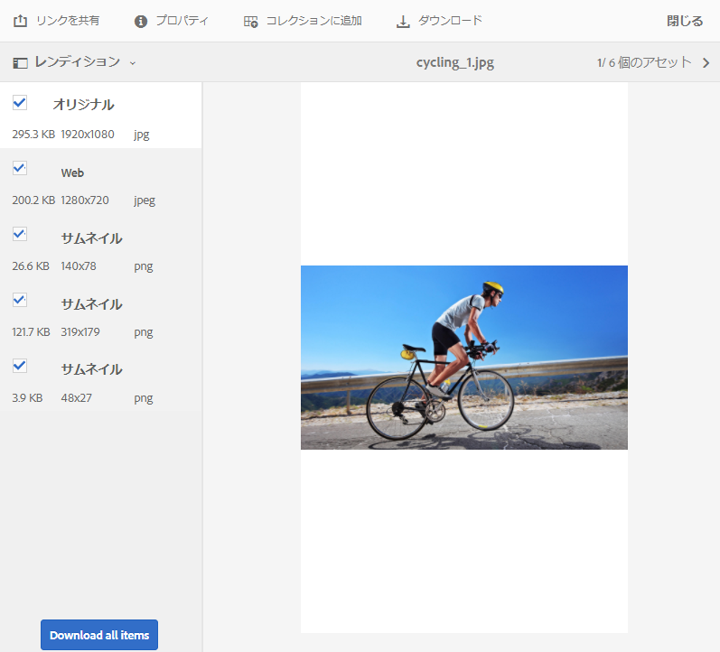
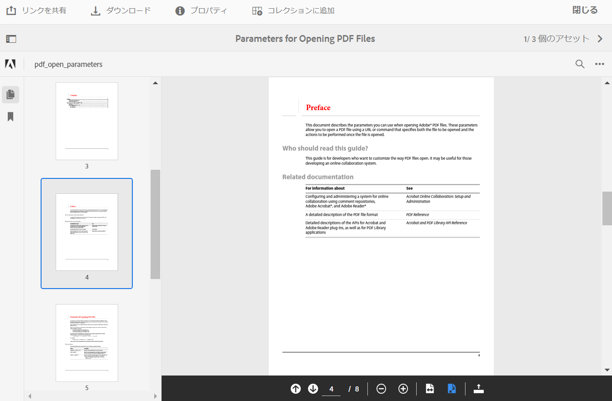
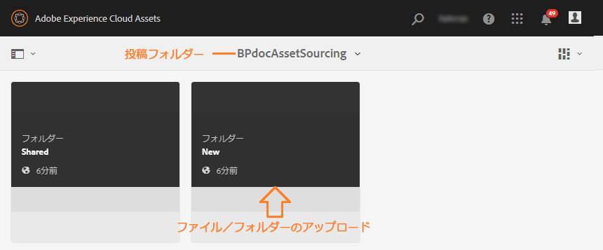
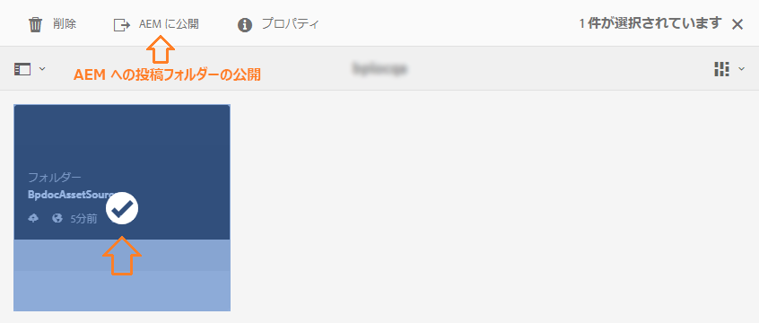
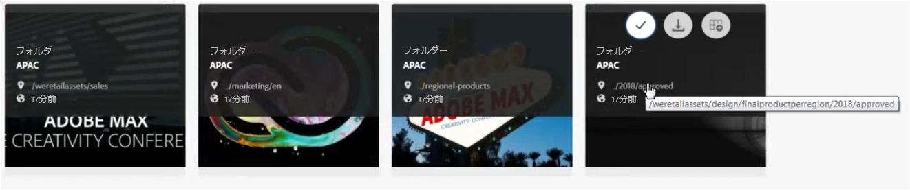
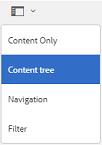
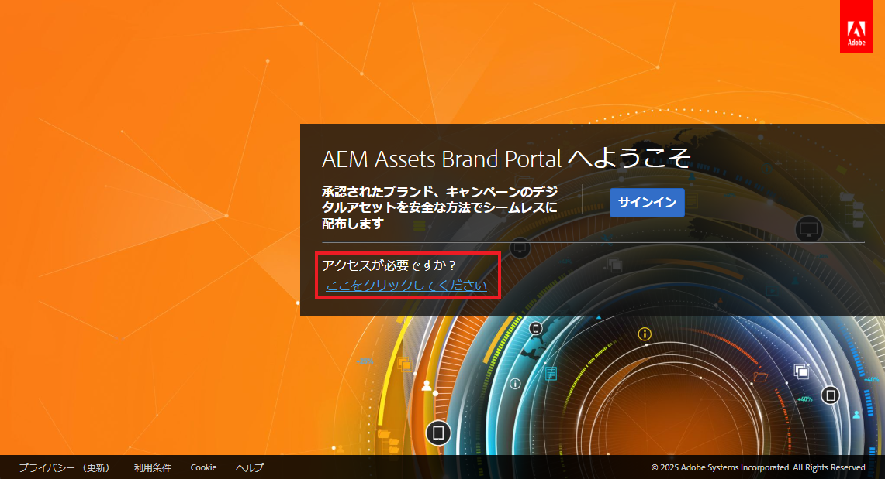

# Experience Manager Assets Brand Portal の新機能 {#what-s-new-in-aem-assets-brand-portal}

Adobe Experience Manager Assets Brand Portal では、承認されたクリエイティブアセットを容易に取得、制御し、それらのアセットを、デバイスの種類を問わず、外部の関係者や内部のビジネスユーザーに安全に配布できます。アセットの共有を効率化し、アセットの市場投入までの時間を短縮し、コンプライアンス違反や不正アクセスのリスクを低減できます。アドビは Brand Portal の全体的なエクスペリエンスの強化に取り組んでいます。以下に、最新機能と機能強化について簡単に紹介します。

## 2024.10.0 の変更点 {#what-changed-in-October-2024}

Brand Portal 2024.10.0 は内部リリースであり、重大な問題の修正が含まれています。詳しくは、最新の [Brand Portal リリースノート](brand-portal-release-notes.md)を参照してください。

## 2024.02.0 の変更点 {#what-changed-in-February-2024}

Brand Portal 2024.02.0 は内部リリースであり、重大な問題の修正が含まれています。詳しくは、最新の [Brand Portal リリースノート](brand-portal-release-notes.md)を参照してください。

## 2023.10.0 の変更点 {#what-changed-in-October-2023}

Brand Portal 2023.10.0 は内部リリースであり、重大な問題の修正が含まれています。詳しくは、最新の [Brand Portal リリースノート](brand-portal-release-notes.md)を参照してください。

## 2023.08.0 の変更点 {#what-changed-in-August-2023}

Brand Portal 2023.08.0 は内部リリースであり、重大な問題の修正が含まれています。詳しくは、最新の [Brand Portal リリースノート](brand-portal-release-notes.md)を参照してください。

## 2023.05.0 の変更点 {#what-changed-in-May-2023}

Brand Portal 2023.05.0 は内部リリースであり、重大な問題の修正が含まれています。詳しくは、最新の [Brand Portal リリースノート](brand-portal-release-notes.md)を参照してください。

## 2023.02.0 の変更点 {#what-changed-in-February-2023}

Brand Portal 2023.02.0 は内部リリースであり、重大な問題の修正が含まれています。詳しくは、最新の [Brand Portal リリースノート](brand-portal-release-notes.md)を参照してください。

## 2022.10.0 の変更点 {#what-changed-in-October-2022}

Brand Portal 2022.10.0 は内部リリースであり、重大な問題の修正が含まれています。詳しくは、最新の [Brand Portal リリースノート](brand-portal-release-notes.md)を参照してください。

## 2022.08.0 の変更点 {#what-changed-in-August-2022}

Brand Portal 2022.08.0 は内部リリースであり、重大な問題の修正が含まれています。詳しくは、最新の [Brand Portal リリースノート](brand-portal-release-notes.md)を参照してください。

## 2022.05.0 の変更点 {#what-changed-in-May-2022}

Brand Portal では、12 時間ごとに自動ジョブを実行して、AEM に公開されているすべての Brand Portal アセットを削除するようになりました。その結果、投稿フォルダー内のアセットを手動で削除して、フォルダーサイズをしきい値の制限以下に保つ必要がなくなりました。また、Brand Portal の&#x200B;**[!UICONTROL ツール]**／**[!UICONTROL アセット投稿ステータス]**／**[!UICONTROL 削除レポート]**&#x200B;オプションを使用して、自動的に実行された削除ジョブの状況を監視することもできます。ジョブのレポートには、次の詳細が表示されます。

* ジョブの開始時間
* ジョブの終了時間
* ジョブステータス
* ジョブに含まれる合計アセット数
* ジョブで正常に削除された合計アセット数
* ジョブの実行の結果として使用可能になった合計ストレージ

さらにドリルダウンして、削除ジョブに含まれる各アセットの詳細を表示することもできます。レポートには、アセットのタイトル、サイズ、作成者、削除ステータス、削除時間などの詳細が含まれます。

さらに、Brand Portal 2022.05.0 には、重要な問題に対する修正が含まれています。詳しくは、最新の [Brand Portal リリースノート](brand-portal-release-notes.md)を参照してください。

## 2022.02.0 の変更点 {#what-changed-in-Feb-2022}

Brand Portal 2022.02.0 は内部リリースであり、重大な問題の修正が含まれています。詳しくは、最新の [Brand Portal リリースノート](brand-portal-release-notes.md)を参照してください。

## 2021.10.0 の変更点 {#what-changed-in-october-2021}

Brand Portal 2021.10.0 は内部リリースであり、重要な問題の修正が含まれています。詳しくは、最新の [Brand Portal リリースノート](brand-portal-release-notes.md)を参照してください。

## 2021.08.0 の変更点 {#what-changed-in-august-2021}

Brand Portal 2021.08.0 は、エンタープライズユーザーやチームユーザーのビジネスプロファイルを導入して、組織がアセットをきめ細かく管理できるようにするための内部リリースです。ユーザーには、新規組織と移行後の組織に対する組織固有の権限が付与されるようになりました。移行時に、既存の Adobe ID アカウントはすべてビジネス ID に移行されます。

* すべての新規組織および移行後の既存組織にビジネス ID が割り当てられます。
* ビジネス ID には、ドメインの要求や SSO の設定などの、特定の設定は必要ありません。
* gmail.com や outlook.com などのパブリックメールドメインを含む、任意のメールアドレスでユーザーを追加できます。

**Brand Portal ユーザーへの影響**

移行は、既存のデータセット、アセット、ユーザーまたは設定には影響しません。移行時に発生する内部的な変更は、既存組織の権限がビジネスプロファイルに付与されることだけです。

>[!NOTE]
>
>ビジネスプロファイルは、現時点では、2021年8月16日以降に作成される新しい組織に適用されます。
>
>組織が移行されるまでは、引き続き Adobe ID、Enterprise ID、Federated ID のいずれかの ID を使用して組織にアクセスできます。

### 参考記事 {#reference-articles}

* [アドビプロファイルの概要](https://helpx.adobe.com/jp/enterprise/kb/introducing-adobe-profiles.html)

* [アドビプロファイルの管理](https://helpx.adobe.com/jp/enterprise/using/manage-adobe-profiles.html)

* [管理者のログインエクスペリエンスの更新](https://helpx.adobe.com/jp/enterprise/using/storage-for-business.html#new-admin-sign-in-exp)

* [アカウントは現在利用できません](https://helpx.adobe.com/jp/enterprise/kb/account-temporarily-unavailable.html)

* [Admin Console でユーザーを管理する方法](https://helpx.adobe.com/jp/enterprise/using/manage-users-individually.html)

* [製品カードを介した製品プロファイルへのユーザーの割り当て](https://helpx.adobe.com/jp/enterprise/using/manage-product-profiles.html#assign-users)

* [ディレクトリの信頼性](https://helpx.adobe.com/jp/enterprise/admin-guide.html/enterprise/using/set-up-identity.html#directory-trusting)

<!--   
### Add new users to T2E organization   {#add-users-to-T2E-org}

On adding a new user in Admin Console for a new or migrated T2E organization, the user will have to perform an additional step **Join Team** to get entitled to the T2E organization. 

The user is entitled only if the user chooses to **Join Team**, otherwise the user won't get access to the selected T2E organization in Brand Portal. 

>[!NOTE]
>
>The workflow is not applicable to the existing Brand Portal users.

### Additional screen while navigating to Admin Console   {#navigate-to-admin-console}

The administrators will have to perform an additional step of selecting the T2E organization while navigating from Brand Portal to Admin Console. The workflow applies on the new and migrated T2E organizations.   

Selection of the T2E organization is a one-time activity and is not required everytime the administrator navigates from Brand Portal to Admin Console.

1. Log in to a T2E organization in Brand Portal as administrator.
1. Go to **[!UICONTROL Tools]** > **[!UICONTROL Users]** > **[!UICONTROL Management]** and click on the link **[!UICONTROL Launch Admin Console]**. 

   Or, go to **[!UICONTROL Unified Shell]** > **[!UICONTROL Administration]** and click on the link **[!UICONTROL Launch Admin Console]**. 
1. Search the T2E organization to login to Admin Console.

   

### Restriction during migration of an organization   {#login-restriction}

When an organization is undergoing T2E migration, the users of that organization will not be able to login to Brand Portal. The following error message appears on the screen. However, the migration won't impact the active user session until the token expires. 

Once the migration is complete, the users can login to Brand Portal. The users will receive an email notification containing the entitlement changes. If the users are entitled to more than one organization, they will have to select the organization at the time of login. 
-->

<!--
For a new or migrated T2E orgnization, the users will have an organization specific entitlement. A user can have multiple entitlements with the same email id for different T2E organizations. 
-->

## 2021.06.0 の変更点 {#what-changed-in-june-2021}

Brand Portal 2021.06.0 は内部リリースであり、重要な問題の修正が含まれています。詳しくは、最新の [Brand Portal リリースノート](brand-portal-release-notes.md)を参照してください。

## 2021.02.0 の変更点 {#what-changed-in-feb-2021}

Brand Portal 2021.02.0 では、アクティベーションワークフローとアセットソーシング機能により、AEM Assets as a Cloud Service が強化されています。また、アセットのダウンロードエクスペリエンスも向上し、重要な修正が含まれています。また、管理者が、アセットフォルダー、アセットコレクション、複数アセットのデフォルトのダウンロード動作をテナントレベルで設定できます。また、Brand Portal の&#x200B;**[!UICONTROL 使用状況レポート]**&#x200B;も変更され、アクティブな Brand Portal ユーザーを反映するようになりました。

>[!IMPORTANT]
>
> * Brand Portal はメンテナンスモードです。すべての新しい製品イノベーションは[コンテンツハブ](https://experienceleague.adobe.com/ja/docs/experience-manager-cloud-service/content/assets/content-hub/product-overview)で使用できます。
> * Brand Portal を引き続きアクティベートする必要がある場合、ユースケースやその他の特定の要件について詳しくは、アドビ担当者にお問い合わせください。
> * Brand Portal は、[Assets Prime](https://experienceleague.adobe.com/ja/docs/experience-manager-cloud-service/content/assets/assets-prime) または [Assets Ultimate](https://experienceleague.adobe.com/ja/docs/experience-manager-cloud-service/content/assets/assets-ultimate-overview) では使用できません。ただし、既に Brand Portal へのアクセス権を持つ既存の Assets as a Cloud Service のお客様は、Assets Ultimate に移行しても Brand Portal を引き続き使用できます。

<!--

### Activate Brand Portal on AEM Assets as a Cloud Service {#bp-automation-on-cloud-service}

AEM Assets as a Cloud Service is now entitled to have a pre-configured Brand Portal instance. The Cloud Manager user can activate Brand Portal on the AEM Assets as a Cloud Service instance.

Earlier, AEM Assets as a Cloud Service was manually configured with Brand Portal using Adobe Developer Console.

The Cloud Manager user triggers the activation workflow that creates the required configurations at the backend and activates Brand Portal on the same IMS org as of the AEM Assets as a Cloud Service instance. 

To activate Brand Portal on your AEM Assets as a Cloud Service instance:

1. Log in to Adobe Cloud Manager and navigate to **[!UICONTROL Environments]**.
1. Select the environments (one by one) from the list. Once you find the environment associated with Brand Portal, click on the **[!UICONTROL Activate Brand Portal]** button to begin the activation workflow. 
1. Once the Brand Portal tenant is activated, the status changes to Activated.

See [activate Brand Portal on AEM Assets as a Cloud Service](https://experienceleague.adobe.com/ja/docs/experience-manager-cloud-service/content/assets/brand-portal/configure-aem-assets-with-brand-portal).

### Asset Sourcing on AEM Assets as a Cloud Service {#asset-sourcing-on-cloud-service}

The Asset Sourcing feature is now available on AEM Assets as a Cloud Service. The feature is by default enabled for all the cloud service users. The permitted Brand Portal users can contribute to Asset Sourcing by uploading new assets to the contribution folders and publish the contribution folder from Brand Portal to AEM Assets as a Cloud Service instance. Administrators can review and approve contributions from Brand Portal users before distributing them to other users.     

Earlier, Asset Sourcing was only available on AEM Assets (on premise and managed service). 

See [Asset Sourcing in Brand Portal](https://experienceleague.adobe.com/ja/docs/experience-manager-brand-portal/using/asset-sourcing-in-brand-portal/brand-portal-asset-sourcing).
-->

### アセットのダウンロード {#asset-download-setting}

既存の&#x200B;**[!UICONTROL ダウンロード設定]**&#x200B;に加えて、Brand Portal 管理者は、「**[!UICONTROL アセットのダウンロード]**」設定を指定できるようになりました。この設定を使用すると、管理者は、アセットフォルダー、アセットコレクション、（20 個を超える）複数アセットのデフォルトのダウンロード動作をテナントレベルで管理できます。

<!--
Earlier, all the asset renditions were directly downloaded in a zip folder in case of folder, collection, and bulk download of assets. As the **[!UICONTROL Download]** dialog box is skipped for folders or collections, there was no mechanism to control the downloading behaviour of the assets. Due to this, the users were finding it difficut to search for a particular asset rendition from a folder containing huge bunch of downloaded renditions. 
-->

これまでは、すべてのアセットレンディションが zip フォルダーに直接ダウンロードされていました。フォルダーとコレクションの&#x200B;**[!UICONTROL ダウンロード]**&#x200B;ダイアログボックスはスキップされました。また、アセットのダウンロード動作を制御する方法がなかったので、多数のダウンロードから特定のレンディションを検索することが困難でした。

アセットフォルダー、アセットコレクション、複数アセットのいずれかをダウンロードする際にアセットごとに別個のフォルダーを作成するオプションが、「**[!UICONTROL アセットのダウンロード]**」設定に用意されるようになりました。

「**[!UICONTROL アセットのダウンロード]**」設定が無効になっている場合、共有リンクを使用してアセットをダウンロードする場合を除き、フォルダーまたはコレクションは、同じフォルダー下にすべてのアセットレンディションを含む zip フォルダーとしてダウンロードされます。

Brand Portal テナントに管理者としてログインし、**[!UICONTROL ツール]**／**[!UICONTROL ダウンロード]**&#x200B;に移動します。管理者は、**[!UICONTROL アセットのダウンロード]**&#x200B;設定を有効にして、フォルダー、コレクション、アセットの一括ダウンロードをダウンロードする際に、アセットごとに個別のフォルダーを作成できます。

詳しくは、[Brand Portal からのアセットのダウンロード](https://experienceleague.adobe.com/ja/docs/experience-manager-brand-portal/using/download/brand-portal-download-assets)を参照してください。
<!--
### Download using Share link {#download-using-share-link}

The default behavior of downloading the assets using share link is now independent of the **[!UICONTROL Download Settings]**. A separate folder is created for each asset while downloading the assets using share link. 
-->

### 使用状況レポート {#usage-report}

Brand Portal の&#x200B;**[!UICONTROL 使用状況レポート]**&#x200B;が変更され、アクティブな Brand Portal ユーザーのみを反映するようになりました。Admin Console でどの製品プロファイルにも割り当てられていない Brand Portal ユーザーは、非アクティブユーザーと見なされ、**[!UICONTROL 使用状況レポート]**&#x200B;には反映されません。

これまでは、アクティブユーザーと非アクティブユーザーの両方が使用状況レポートに表示されていました。

## 2020.10.0 の変更点 {#what-changed-in-oct-2020}

Brand Portal 2020.10.0 は、アセットのダウンロードエクスペリエンスの簡素化に焦点を当てた機能強化リリースで、重要な修正が含まれています。この機能強化により、**[!UICONTROL レンディション]**&#x200B;パネルからレンディションと直接ダウンロードを除外するオプションを備えた、アセットのダウンロード用の新しく改善されたワークフローが導入されます。また、特定のユーザーグループのアクセス権とダウンロード権を設定でき、すべての Brand Portal ページからファイル、コレクション、共有リンクへの簡単なナビゲーションが可能になります。詳しくは、[Brand Portal リリースノート](brand-portal-release-notes.md)を参照してください。

### ダウンロード操作の簡素化 {#download-dialog}

以前は、**[!UICONTROL ダウンロード]**&#x200B;ダイアログボックスには、アセットごとに個別のフォルダーを作成したり、アセットをメールで送信したり、元のアセットを選択したりするなど、複数のオプションが用意されていました。これらのオプションは、特に複数のアセットやフォルダーをダウンロードする場合、技術者以外のユーザーや新規ユーザーにとって混乱を招くものでした。また、すべてのアセットレンディションを表示したり、特定のカスタムレンディションや動的レンディションを除外したりすることはできません。

新しい&#x200B;**[!UICONTROL ダウンロード]**&#x200B;ダイアログボックスでは、アセットの選択とフィルタリング処理が一般化され、Brand Portal ユーザーがアセットレンディションをダウンロードする際に効果的な決定を行いやすくなります。「[**[!UICONTROL ダウンロード]**](brand-portal-download-assets.md)」の構成および「**[!UICONTROL ダウンロード]**」設定に応じて、選択したすべてのアセットとそのレンディションがリストされます。

>[!NOTE]
>
>すべてのユーザーに対して&#x200B;**[!UICONTROL 高速ダウンロード]**&#x200B;がデフォルトで有効になり、Brand Portal からアセットをダウンロードする前に、ブラウザーの拡張機能に IBM® [Aspera Connect 3.9.9](https://www.ibm.com/support/fixcentral/swg/selectFixes?parent=ibm~Other%20software&product=ibm/Other+software/IBM+Aspera+Connect&release=3.9.9&platform=All&function=all) をインストールする必要があります。

<!--
If any of the **[!UICONTROL Custom Rendition]** or **[!UICONTROL System Rendition]** is enabled in the [**[!UICONTROL Download]**](brand-portal-download-assets.md) configuration and **[!UICONTROL Download]** settings are enabled for the group users, the new **[!UICONTROL Download]** dialog box appears with all the renditions of the selected assets or folders containing assets in a List View. 
-->

**[!UICONTROL ダウンロード]**&#x200B;ダイアログボックスで、ユーザーは次の操作を実行できます。

* ダウンロードリストで任意のアセットの使用可能なすべてのレンディションを表示する。
* ダウンロードに必要でないアセットのレンディションを除外する。
* 1 回のクリックで、同じレンディションセットをすべての類似アセットタイプに適用する。
* アセットタイプごとに異なるレンディションセットを適用する。
* アセットごとに別個のフォルダーを作成する。
* 選択したアセットとレンディションをダウンロードする。

ダウンロードワークフローは、スタンドアロンのアセット、複数のアセット、アセットを含むフォルダー、ライセンス済みアセットまたはライセンスなしのアセット、共有リンクを介してアセットをダウンロードする場合に一貫性があります。詳しくは、[Brand Portal からアセットをダウンロードする手順](https://experienceleague.adobe.com/ja/docs/experience-manager-brand-portal/using/download/brand-portal-download-assets)を参照してください。

### クイックナビゲーション {#quick-navigation}

以前は、「**[!UICONTROL ファイル]**」、「**[!UICONTROL コレクション]**」、および「**[!UICONTROL リンクを共有]**」を表示する各オプションは非表示になっており、ユーザーが別のビューに切り替えるにはその都度複数回クリックする必要がありました。

Brand Portal 2020.10.0 では、ユーザーはクイックナビゲーションリンクを使用して、すべての Brand Portal ページからワンクリックで「**[!UICONTROL ファイル]**」、「**[!UICONTROL コレクション]**」、「**[!UICONTROL リンクを共有]**」に移動できます。

### レンディションパネルの強化 {#rendition-panel}

以前は、**[!UICONTROL ダウンロード]**&#x200B;設定の「**[!UICONTROL カスタムレンディション]**」または「**[!UICONTROL システムレンディション]**」のいずれか有効になっている場合、ユーザーは&#x200B;**[!UICONTROL レンディション]**&#x200B;パネルで元のアセットとそのレンディションのみを表示できました。また、必要でない特定のカスタムレンディションや動的レンディションを除外するフィルターがなかったので、ユーザーはすべてのアセットレンディションをダウンロードする必要がありました。

<!--
Earlier, if any of the custom or system renditions was enabled in the **[!UICONTROL Download]** settings, an additional **[!UICONTROL Download]** dialog box appeared on clicking the **[!UICONTROL Download]** button wherein the user had to manually select the set of renditions (original asset, custom renditions, dynamic renditions) to download.
There was no filter to exclude specific custom or dynamic renditions which were not required for download.
-->

Brand Portal 2020.10.0 では、ユーザーは、特定のレンディションを除外し、**[!UICONTROL ダウンロード]**&#x200B;ダイアログボックスを開かなくても、アセットの詳細ページの[レンディションパネルから選択したレンディションを直接ダウンロード](brand-portal-download-assets.md#download-assets-from-asset-details-page)できます。

<!-- 
In Brand Portal 2020.10.0, direct download and exclude renditions features are introduced in the **[!UICONTROL Renditions]** panel on the asset details page. All the renditions (original asset, custom renditions, dynamic renditions) under the rendition panel are now associated with a check box and are enabled by default. 

The user can clear the check boxes to exclude the renditions which are not required for download. And can click on the **[!UICONTROL Download]** button in the **[!UICONTROL Renditions]** panel to directly download the selected set of renditions in a zip folder without having to open the **[!UICONTROL Download]** dialog box.
-->

### ダウンロード設定の指定 {#download-permissions}

Brand Portal 管理者は、既存の&#x200B;**[!UICONTROL ダウンロード]**&#x200B;設定に加えて、アセットの詳細ページからユーザーグループが元のアセットとレンディション、またはその両方を表示またはダウンロードする設定を指定できるようになりました。

Brand Portal テナントに管理者としてログインし、**[!UICONTROL ツール]**／**[!UICONTROL ユーザー]**&#x200B;に移動します。

**[!UICONTROL ユーザーの役割]**&#x200B;ページで、「**[!UICONTROL グループ]**」タブに移動して、ユーザーグループの表示および（または）ダウンロード設定を指定します。

以前は、この設定は、グループユーザーによる元のアセットのダウンロードを制限する目的でのみ使用できました。

管理者は、**[!UICONTROL ユーザーの役割]**&#x200B;ページの「**[!UICONTROL グループ]**」タブで、表示とダウンロードの設定を行うことができます。

* 「**[!UICONTROL オリジナルをダウンロード]**」と「**[!UICONTROL レンディションをダウンロード]**」の両方の設定がオンになっている場合、選択したグループのユーザーは、オリジナルのアセットとそのレンディションを表示およびダウンロードできます。
* 両方の設定をオフにした場合、ユーザーは元のアセットのみを表示できます。アセットの詳細ページでは、ユーザーにはアセットのレンディションは表示されません。
* 「**[!UICONTROL オリジナルをダウンロード]**」設定のみがオンになっている場合、ユーザーはアセットの詳細ページからオリジナルのアセットのみを表示およびダウンロードできます。
* 「**[!UICONTROL レンディションをダウンロード]**」設定のみが有効になっている場合、ユーザーは元のアセットを表示できますが、ダウンロードすることはできません。ただし、ユーザーはアセットのレンディションを表示およびダウンロードできます。

詳しくは、[アセットのダウンロード設定](https://experienceleague.adobe.com/ja/docs/experience-manager-brand-portal/using/download/brand-portal-download-assets#configure-download-permissions)を参照してください。

>[!NOTE]
>
>ユーザーが複数のグループに追加され、これらのグループの 1 つに制限がある場合、この制限がユーザーに適用されます。

<!--
>Restrictions to access the original asset and their renditions do not apply to administrators even if they are members of restricted groups.
 >
 >The users can always download assets and their renditions from the repository using a `curl` request even if the download configurations are turned-off.
 >
-->

## 6.4.7 の変更点 {#what-changed-in-647}

Brand Portal 6.4.7 リリースでは、ドキュメントビューアが導入され、アセットのダウンロードエクスペリエンスが向上し、重要な修正が行われました。詳しくは、最新の [Brand Portal リリースノート](brand-portal-release-notes.md)を参照してください。

<!--
Brand Portal 6.4.7 release brings in the Document Viewer, leverages the Brand Portal administrators to configure asset download, and centers top customer requests. See latest [Brand Portal Release Notes](brand-portal-release-notes.md).
-->

### ドキュメントビューア {#doc-viewer}

ドキュメントビューアを使用すると、PDF の表示操作が向上します。これにより、Adobe Document Cloud が Brand Portal で PDF ファイルを表示する場合と同様の操作を行えます。

以前は、PDF ファイルの表示には、制限付きのオプションが使用できました。

Brand Portal ユーザーは、ドキュメントビューアを使用して、ページやブックマークの表示、テキストの検索、ズームインとズームアウト、ページの移動を行うことができます。特定のページに切り替えたり、ウィンドウや画面に合わせたり、ツールバーの表示を切り替えたりすることができます。

>[!NOTE]
>
>その他のドキュメント形式の表示方法は変わりません。

### ダウンロードエクスペリエンス {#download-configurations}

アセットのダウンロード処理が改良され、[Brand Portal からアセットをダウンロード](brand-portal-download-assets.md)する際のユーザー操作がシンプルになりました。

Brand Portal からアセットをダウンロードする既存のワークフローでは、複数のダウンロードオプションから選択できる&#x200B;**[!UICONTROL ダウンロード]**&#x200B;ダイアログボックスが必然的に表示されます。

Brand Portal 6.4.7 では、Brand Portal 管理者がアセットの&#x200B;**[!UICONTROL ダウンロード]**&#x200B;設定を指定できます。利用可能な設定は以下のとおりです。

* **[!UICONTROL 高速ダウンロード]**
* **[!UICONTROL カスタムレンディション]**
* **[!UICONTROL システムレンディション]**

Brand Portal 管理者は、任意の組み合わせを有効にして、アセットのダウンロードを設定できます。

<!--In Brand Portal 6.4.7, fast download, custom renditions, and system renditions are the three configurations available.-->

* **[!UICONTROL カスタムレンディション]**&#x200B;と&#x200B;**[!UICONTROL システムレンディション]**&#x200B;の両方の設定がオフになっている場合は、追加のダイアログボックスが表示されずにアセットの元のレンディションがダウンロードされるので、Brand Portal ユーザーのダウンロードエクスペリエンスが簡素化されます。

* **[!UICONTROL カスタムレンディション]**&#x200B;または&#x200B;**[!UICONTROL システムレンディション]**&#x200B;のいずれかが有効になっている場合は、**[!UICONTROL ダウンロード]**&#x200B;ダイアログボックスが表示され、元のアセットとアセットレンディションがダウンロードされます。**[!UICONTROL 高速ダウンロード]**&#x200B;設定を有効にすると、ダウンロード処理が高速化されます。

設定に基づいて、スタンドアロンのアセット、複数のアセット、アセットを含むフォルダーのダウンロードワークフローは一定のままになります。また、ライセンス済みアセットまたはライセンスなしのアセット、共有リンクを使用したアセットのダウンロードも含まれます。

## 6.4.6 の変更点 {#what-changed-in-646}

Brand Portal 6.4.6 では、AEM Assets と Brand Portal の間の認証チャネルが変更されます。Brand Portal が AEM Assets as a Cloud Service、AEM Assets 6.3 以降でサポートされるようになりました。AEM Assets 6.3 以降では、Brand Portal は最初、レガシー OAuth Gateway を使用してクラシック UI で設定されていました。このゲートウェイでは、JWT トークン交換を使用して、認証用の IMS アクセストークンを取得します。AEM Assets と Brand Portal の連携が、Brand Portal テナントの認証用の IMS トークンを取得する Adobe Developer Console を通じて設定されるようになりました。

<!-- The steps to configure integration are different depending on your AEM version, and whether you are configuring for the first-time, or upgrading the existing integration:
-->

<!--
  
   | **AEM Version** |**New Integration** |**Upgrade Integration** |
|---|---|---|
| **AEM 6.5** |[Create new integration](../using/brand-portal-configure-integration-65.md) |[Upgrade existing integration](../using/brand-portal-configure-integration-65.md#upgrade-integration-65) | 
| **AEM 6.4** |[Create new integration](../using/brand-portal-configure-integration-64.md) |[Upgrade existing integration](../using/brand-portal-configure-integration-64.md#upgrade-integration-64) | 
| **AEM 6.3** |[Create new integration](../using/brand-portal-configure-integration-63.md) |[Upgrade existing integration](../using/brand-portal-configure-integration-63.md#upgrade-integration-63) | 
| **AEM 6.2** | | 

   -->

AEM Assets と Brand Portal の連携を設定する手順は、AEM のバージョンと、初めて設定するか既存の設定をアップグレードするかによって異なります。

<!--| **AEM Version** |**New Configuration** |**Upgrade Configuration** |
|---|---|---|
| **AEM 6.5 (6.5.4.0 and above)** |[Create configuration](../using/brand-portal-configure-integration-65.md) |[Upgrade configuration](../using/brand-portal-configure-integration-65.md#upgrade-integration-65) | 
| **AEM 6.4 (6.4.8.0 and above)** |[Create configuration](../using/brand-portal-configure-integration-64.md) |[Upgrade configuration](../using/brand-portal-configure-integration-64.md#upgrade-integration-64) | 
| **AEM 6.3 (6.3.3.8 and above)** |[Create configuration](../using/brand-portal-configure-integration-63.md) |[Upgrade configuration](../using/brand-portal-configure-integration-63.md#upgrade-integration-63) | 

-->

<!-- AEM Assets configuration with Brand Portal on Adobe I/O is supported on:
* AEM 6.5.4.0 and above
* AEM 6.4.8.0 and above
* AEM 6.3.3.8 and above -->

| **AEM のバージョン** | **新しい設定** | **設定のアップグレード** |
|---|---|---|
| **AEM Assets as a Cloud Service** | [設定の作成](https://experienceleague.adobe.com/ja/docs/experience-manager-cloud-service/content/assets/brand-portal/configure-aem-assets-with-brand-portal) | - |
| **AEM 6.5（6.5.4.0 以降）** | [設定の作成](https://experienceleague.adobe.com/ja/docs/experience-manager-65/content/assets/brandportal/configure-aem-assets-with-brand-portal) | [設定のアップグレード](https://experienceleague.adobe.com/ja/docs/experience-manager-65/content/assets/brandportal/configure-aem-assets-with-brand-portal#upgrade-integration-65) |

>[!NOTE]
>
>アドビでは、AEM インスタンスを更新して、最新のサービスパックを使用することをお勧めします。

詳しくは、[Brand Portal リリースノート](brand-portal-release-notes.md)を参照してください。

[Brand Portal FAQ](brand-portal-faqs.md) を参照してください。

## 6.4.5 の変更点 {#what-changed-in-645}

Brand Portal 6.4.5 を使用すると、外部の代理店やチームは、オーサー環境にアクセスする必要なく、コンテンツを Brand Portal にアップロードし、AEM Assets に公開できます。この機能は **[Brand Portal でのアセットソーシング](brand-portal-asset-sourcing.md)**&#x200B;と呼ばれます。世界中に分散している他の Brand Portal ユーザーに対して、アセットの投稿と共有を実現する双方向メカニズムを提供することで、カスタマーエクスペリエンスを向上させます。

### Brand Portal でのアセットソーシング {#asset-sourcing-in-bp}

アセットソーシングを使用すると、追加の&#x200B;**アセット投稿**&#x200B;プロパティを持つフォルダーを AEM ユーザー（管理者／管理者以外のユーザー）が作成できるので、この新規作成フォルダーを Brand Portal ユーザーによるアセット送信に利用することができます。これにより、新しく作成された&#x200B;**投稿**&#x200B;フォルダー内に NEW および SHARED という 2 つのサブフォルダーを追加作成するワークフローが自動的にトリガーされます。

AEM ユーザーが、概要とベースラインのアセットを **SHARED** フォルダーにアップロードします。投稿フォルダーに必要なアセットのタイプを定義して、Brand Portal ユーザーが必要な参照情報を得られるようにします。その後、管理者は、アクティブな Brand Portal ユーザーに投稿フォルダーへのアクセスを許可してから、新しく作成した&#x200B;**投稿**&#x200B;フォルダーを Brand Portal に公開できます。

ユーザーが **NEW** フォルダーへのコンテンツの追加を完了したら、投稿フォルダーを AEM オーサー環境に公開できます。読み込みが完了し、新しく公開したコンテンツが AEM Assets 内に反映されるまでに数分かかる場合があります。

また、既存の機能はすべてそのままで変わりません。Brand Portal ユーザーは、投稿フォルダーおよび許可された他のフォルダーからアセットを表示、検索およびダウンロードできます。さらに、管理者は投稿フォルダーの共有、プロパティの変更、コレクションへのアセットの追加を行うことができます。

>[!NOTE]
>
>Brand Portal のアセットソーシングは、AEM 6.5.2.0 以降でサポートされています。
>
>この機能は、以前のバージョンの AEM 6.3 および AEM 6.4 ではサポートされていません。

### 投稿フォルダーへのアセットのアップロード {#upload-assets-in-bp}

適切な権限を持つ Brand Portal ユーザーは、個別のアセット、または複数のアセットを含むフォルダー（.zip ファイル）を投稿フォルダーにアップロードできます。ユーザーは、複数のアセットをアセット投稿フォルダーにアップロードできます。ただし、一度に作成できるフォルダーは 1 つだけです。

Brand Portal ユーザーは **NEW** サブフォルダーにのみアセットをアップロードできます。**SHARED** フォルダーは、要件とベースラインアセットを配布するためのものです。

### AEM Assets への投稿フォルダーの公開 {#publish-assets-to-aem}

**NEW** フォルダーへのアップロードが完了したら、Brand Portal ユーザーは投稿フォルダーを AEM に公開できます。公開したコンテンツ／アセットが AEM Assets に読み込まれて反映されるまでに数分かかる場合があります。[AEM Assets への投稿フォルダーの公開](brand-portal-publish-contribution-folder-to-aem-assets.md)を参照してください。

## 6.4.4 の変更点 {#what-changed-in-644}

Brand Portal 6.4.4 リリースでは、テキスト検索の機能強化と、お客様らのご要望への対応に重点を置いています。詳しくは、最新の [Brand Portal リリースノート](brand-portal-release-notes.md)を参照してください。

### 検索の機能強化

Brand Portal 6.4.4 以降では、フィルタリングウィンドウのプロパティの述語で部分テキスト検索がサポートされます。部分テキスト検索を可能にするには、検索フォームの「プロパティの述語」で「**部分検索**」を有効にします。

部分テキスト検索およびワイルドカード検索について詳しくは、以下の説明を参照してください。

#### 部分フレーズ検索 {#partial-phrase-search}

フィルタリングウィンドウで、検索対象フレーズの一部分（1 つか 2 つの単語）のみを指定してアセットを検索できます。

**ユースケース**
部分フレーズ検索は、検索対象フレーズに出現する正確な単語の組み合わせが不明な場合に役立ちます。

例えば、Brand Portal の検索フォームで、「プロパティの述語」を使用してアセットのタイトルの部分検索を行う場合、「**camp**」という単語を指定すると、タイトルフレーズで「camp」という単語を使用しているアセットがすべて返されます。

#### ワイルドカード検索 {#wildcard-search}

Brand Portal では、検索クエリで単語の一部にアスタリスク（&#42;）を使用できます。

検索対象フレーズに出現する正確な単語が不明な場合は、ワイルドカード検索を使用して検索クエリを補完できます。

例えば、Brand Portal の検索フォームで、「プロパティの述語」を使用してアセットのタイトルの部分検索を行う場合に、「**climb&#42;**」と指定すると、「**climb**」で始まる単語がタイトルフレーズで使用されているアセットがすべて返されます。

さらに、以下のような指定ができます。

* 「**&#42;climb**」と指定すると、「**climb**」で終わる単語がタイトルフレーズで使用されているアセットがすべて返されます。

* 「**&#42;climb&#42;**」と指定すると、「**climb**」という部分文字列を含んだ単語がタイトルフレーズで使用されているアセットがすべて返されます。

>[!NOTE]
>
>「**部分検索**」チェックボックスを選択すると、デフォルトで「**大文字と小文字を区別しない**」がオンになります。

## 6.4.3 の変更点 {#what-changed-in}

Brand Portal 6.4.3 では、アクセス URL の代替エイリアス、新しいフォルダー階層、ビデオサポートの強化が導入されています。また、AEM オーサーから Brand Portal へのスケジュールされた公開、運用の改善が導入され、お客様のリクエストに対応しています。

### 管理者以外のユーザーに表示するフォルダー階層のナビゲーション

管理者以外のユーザー（編集者、閲覧者、ゲストユーザー）がログインしたときにフォルダーをどのように表示するかを管理者が設定できるようになりました。管理ツールパネルの&#x200B;**一般設定**&#x200B;に「[フォルダー階層を有効化](../using/brand-portal-general-configuration.md)」設定が追加されています。この設定は次のように動作します。

* **有効**&#x200B;にした場合は、ルートフォルダーから始まるフォルダーツリーが管理者以外のユーザーに表示されます。これにより、管理者と同じようなナビゲーション体験を提供できます。
* **無効**&#x200B;にした場合は、共有フォルダーのみランディングページに表示されます。

「[フォルダー階層を有効化](../using/brand-portal-general-configuration.md)」の機能は（有効にした場合）、別の階層から共有されている同名のフォルダーを区別するために役立ちます。管理者以外のユーザーがログインすると、共有フォルダーの仮想親フォルダー（とその上位層）が表示されます。

共有フォルダーは、仮想フォルダー内のそれぞれのディレクトリ内で整理されます。仮想フォルダーには鍵のアイコンが付きます。

最初の共有フォルダーのサムネール画像が仮想フォルダーのデフォルトのサムネールになります。

### 特定のフォルダー階層またはパス内での検索

検索フォームに&#x200B;**パスブラウザー**&#x200B;の述語が導入され、特定のディレクトリ内でアセットを検索できるようになりました。パスブラウザーの検索用述語のデフォルトの検索パスは `/content/dam/mac/<tenant-id>/` です。これはデフォルトの検索フォームを編集することで設定できます。

* 管理者は、パスブラウザーを使用して、Brand Portal 上の任意のフォルダーディレクトリへ移動できます。
* 管理者以外のユーザーは、パスブラウザーを使用して、自身に共有されているフォルダーへのみ移動できます（さらに、その親フォルダーへと階層をさかのぼることができます）。

  例えば、`/content/dam/mac/<tenant-id>/folderA/folderB/folderC` が管理者以外のユーザーと共有されているとします。このユーザーは、パスブラウザーを使用して、folderC 内のアセットを検索できます。このユーザーは、folderB や folderA に移動することもできます（ユーザーと共有されている folderC の上位層だからです）。

ルートフォルダーから始まる階層ではなく、参照した特定のフォルダー内でのみアセットを検索することができます。

これらのフォルダーで検索を行うと、ユーザーと共有されているアセットで検索した結果のみが返されます。

### Dynamic Media ビデオレンディションのサポート

Dynamic Media ハイブリッドモードの AEM オーサーインスタンスを使用しているユーザーは、オリジナルのビデオファイルに加えて、Dynamic Media レンディションをプレビューしたりダウンロードしたりできます。

特定のテナントアカウントで Dynamic Media レンディションのプレビューおよびダウンロードを有効にするには、管理者が **Dynamic Media 設定**&#x200B;を指定します。この手順では、管理ツールパネルの&#x200B;**ビデオ**&#x200B;設定にビデオサービスの URL と登録 ID を含めます。

Dynamic Media ビデオは以下の場所でプレビューできます。

* アセットの詳細ページ
* アセットのカード表示
* リンク共有のプレビューページ

Dynamic Media ビデオのエンコードは、次の場所からダウンロードできます。

* Brand Portal
* 共有リンク

### Brand Portal への公開のスケジュール設定

アセット（およびフォルダー）を AEM 6.4.2.0 オーサーインスタンスから Brand Portal へ公開するワークフローのスケジュールに未来の日時を指定できるようになりました。

同様に、「Brand Portal で非公開」ワークフローのスケジュールを設定することで、公開されているアセットを後でポータルから取り下げることができます。

### URL 中の設定可能なテナントエイリアス

組織のポータル URL に代替接頭辞を含めて、カスタマイズされたポータル URL を取得できます。既存のポータル URL のテナント名のエイリアスを取得するには、各組織からカスタマーサポートへ依頼する必要があります。

カスタマイズできるのは Brand Portal URL の接頭辞のみであり、URL 全体ではありません。\
例えば、**geomettrix.brand-portal.adobe.com** という既存ドメインを持つ組織は、アドビに依頼することで **geomettrixinc.brand-portal.adobe.com** という URL を作成できます。

ただし、AEM オーサーインスタンスを[設定](https://experienceleague.adobe.com/ja/docs/experience-manager-65/content/assets/brandportal/configure-aem-assets-with-brand-portal)する際にはテナント ID URL のみを使用できます。テナントエイリアス（代替）URL は使用できません。

アドビから提供された URL をそのまま使用するのではなく、カスタマイズされたポータル URL を取得して、ブランドのニーズを満たすことができます。

### ダウンロードエクスペリエンスの強化

このリリースでは、以下の状況におけるクリックや警告の数を低減し、シンプルなダウンロードエクスペリエンスを実現しています。

* レンディションのみをダウンロードする（オリジナルのアセットはダウンロードしない）ことの選択
* オリジナルのレンディションへのアクセスが制限されている場合はアセットをダウンロード

## 6.4.2 の変更点 {#what-changed-in-1}

Brand Portal 6.4.2 では、ゲストによるアクセスと高速ダウンロードを介したグローバルなリーチを可能にし、組織のアセット配布ニーズを満たす機能が導入されています。また、新しい管理者設定や追加のレポートによる制御の強化と、お客様のリクエストにも対処しています。

### ゲストによるアクセス

AEM Brand Portal は、ゲストによるポータルへのアクセスを許可します。ゲストユーザーは資格情報がなくてもポータルに入ることができます。また、すべての公開フォルダーおよび公開コレクションにアクセスしたり、それらをダウンロードしたりすることができます。ゲストユーザーは Lightbox（非公開コレクション）にアセットを追加したり、Lightbox からアセットをダウンロードしたりすることができます。また、管理者によって定められたスマートタグ検索や検索用述語を表示することもできます。ゲストセッションでは、ユーザーはコレクションや保存済みの検索を作成または共有したり、フォルダーやコレクションの設定にアクセスしたり、アセットをリンクとして共有したりすることはできません。

組織では、複数の同時ゲストセッションが許可されます（同時ゲストセッションの数は、組織あたりの合計ユーザークォータの 10％に制限されます）。

ゲストセッションは 2 時間アクティブのままになります。そのため、Lightbox の状態も、セッション開始時刻から 2 時間保持されます。2 時間後、ゲストセッションは再起動する必要があるので、Lightbox の状態も失われます。

### ダウンロードの高速化

Brand Portal ユーザーは、最大 25 倍の速度を実現できる IBM® Aspera Connect の高速ダウンロードを適用して、世界中のどこにいてもシームレスにダウンロードを行うことができます。Brand Portal または共有リンクからアセットを高速にダウンロードするには、ダウンロードダイアログボックスで「**ダウンロードの高速化を有効化**」オプションを選択する必要があります。ただし、その組織でダウンロードの高速化が可能になっている必要があります。

その組織で IBM® Aspera による高速ダウンロードを有効にするには、管理者が、管理ツールパネルの[一般設定](brand-portal-general-configuration.md#allow-download-acceleration)から「**ダウンロードの高速化を有効化**」オプション（デフォルトでは無効になっています）を有効にします。

Brand Portal および共有リンクからのアセットファイルのダウンロードを高速化する前提条件とトラブルシューティング手順について詳しくは、[Brand Portal からのダウンロードを高速化するためのガイド](../using/accelerated-download.md#main-pars-header)を参照してください。

### ユーザーログインレポート

ユーザーのログインを追跡する新しいレポートが導入されました。**ユーザーログイン**&#x200B;レポートは、組織が Brand Portal の委任管理者やその他のユーザーを監査および監視するのに便利です。

レポートログには、Brand Portal 6.4.2 を導入してからレポート生成時までの各ユーザーの名前、メール ID、ペルソナ（管理者、閲覧者、エディター、ゲスト）、グループ、最後のログイン、アクティビティのステータスおよびログイン回数が表示されます。管理者は、レポートを .csv 形式で書き出すことができます。ユーザーログインレポートを他のレポートと併用すれば、組織はユーザーによる承認済みのブランドリソースの操作を厳しく監視できるので、企業コンプライアンスオフィスとの準拠を確保できます。

### オリジナルのレンディションへのアクセス

管理者は、オリジナルの画像ファイルへのアクセスを制限したり、Brand Portal または共有リンクからのダウンロードに対する低解像度レンディションへのアクセス権を提供したりすることができます。このアクセス権は、ユーザーの役割ページの「グループ」タブからユーザーグループレベルで制御できます。

* デフォルトでは、「オリジナルへのアクセス」がすべてに対して有効になっているので、すべてのユーザーがオリジナルのレンディションをダウンロードできます。
* ユーザーのグループがオリジナルのレンディションにアクセスできないようにするには、管理者は各チェックボックスを選択解除する必要があります。
* ユーザーが複数のグループのメンバーであり、グループの 1 つのみに制約がある場合、制約はそのユーザーに適用されます。
* 制約は管理者には適用されません（管理者が制約されたメンバーである場合を含む）。
* リンクとしてアセットを共有するユーザーの権限は、共有リンクを使用してアセットをダウンロードするユーザーに適用されます。

### カード表示およびリスト表示のフォルダー階層パス

カード表示のときに、フォルダーのカードが、管理者以外のユーザー（編集者、閲覧者、ゲストユーザー）向けにフォルダー階層情報を表示するようになりました。この機能は、親階層について、アクセスしようとしているフォルダーの場所をユーザーに知らせます。

フォルダー階層情報は、特に他のフォルダーと区別する際に便利です。似たような名前のフォルダーを、別のフォルダー階層から共有された他のフォルダーと区別する場合などです。管理者以外のユーザーが、自分たちに共有されているアセットのフォルダー構造を把握していない場合、似たような名前のアセット／フォルダーは紛らわしくなります。

* それぞれのカードに表示されるパスは、カードのサイズに合わせて切り詰めて表示されます。ただし、ユーザーが切り詰められたパスにポインタを合わせると、完全なパスをツールヒントとして表示することができます。

リスト表示では、Brand Portal のすべてのユーザーに対し、列内のアセットのフォルダーパスを示します。

### アセットのプロパティを表示する「概要」オプション

Brand Portal には、選択したアセットやフォルダーのアセットプロパティを管理者以外のユーザー（エディター、閲覧者、ゲストユーザー）が表示できる「概要」オプションがあります。「概要」オプションは、次の場所に表示されます。

1. アセット／フォルダーを選択する際、上部に表示されるツールバー。
2. パネルセレクターを選択する際のドロップダウン。

アセットやフォルダーを選択した状態で「概要」オプションを選択すると、タイトル、パス、アセット作成時間を確認できます。一方、アセットの詳細ページで「概要」オプションを選択すると、アセットのメタデータを確認できます。

## 新しい設定

管理者が特定のテナントで次の機能を有効化または無効化できるよう、6 つの新しい設定が追加されました。

* ゲストによるアクセスを許可
* ユーザーによる Brand Portal へのアクセス要求を許可
* 管理者が Brand Portal からアセットを削除することを許可
* 公開コレクションの作成を許可
* 公開スマートコレクションの作成を許可
* ダウンロードの高速化を許可

上記の設定は、管理ツールパネルのアクセスおよび一般設定にあります。

### OAuth 統合を設定する `Adobe I/O` UI

Brand Portal 6.4.2 以降では、レガシー OAuth（`https://legacy-oauth.cloud.adobe.io/`）インターフェイスを使用して作成した JWT アプリケーションを使用すると、OAuth 統合を設定することにより、AEM Assets と Brand Portal を統合できるようになります。OAuth 統合を設定するための UI は、以前、`https://marketing.adobe.com/developer/` / でホストされていました。Brand Portal にアセットとコレクションを公開するための、AEM Assets と Brand Portal の統合について詳しくは、[AEM Assets と Brand Portal の統合の設定](https://experienceleague.adobe.com/ja/docs/experience-manager-65/content/assets/brandportal/configure-aem-assets-with-brand-portal)を参照してください。

## 検索の機能強化

プロパティの述語で大文字と小文字を区別しないように設定できます。そのためには、更新されたプロパティの述語にある「大文字と小文字を区別しない」をオンにします。このオプションは、プロパティの述語と複数値プロパティの述語で使用できます。\
ただし、大文字と小文字を区別しない検索では、プロパティの述語のデフォルト検索よりも時間がかかります。検索フィルターに大文字と小文字を区別しない述語が多数ある場合は、検索に時間がかかることがあります。アドビでは、大文字と小文字を区別しない検索は、賢く使用することをお勧めします。

## 6.4.1 の変更点 {#what-changed-in-2}

Brand Portal 6.4.1 は、プラットフォームのアップグレードリリースです。いくつかの新機能と、閲覧、検索、パフォーマンスの強化などの重要な機能強化を導入しています。

### 閲覧の機能強化

* 新しいコンテンツツリーパネルでアセット階層内をすばやく移動できます。

* キーボードショートカットが新しくなりました。例えば、プロパティページへの移動には _P_ キー、編集には _E_ キー、コピー操作には _Ctrl+C_ キーを使用します。
* 多数のアセットの閲覧に対応するように、カード表示およびリスト表示でのスクロールが改善され、遅延読み込みが行われるようになりました。
* カード表示の機能が強化され、表示設定に基づいて様々なサイズのカードがサポートされるようになりました。

* カード表示で日付ラベルにポインタを合わせると、日時が表示されるようになりました。

* アセットのスナップショットの下に「**詳細情報**」が追加され、アセットの詳細ページに移動できるようになりました。

* リスト表示では、デフォルトで最初の列にアセットのファイル名が表示されるようになりました。また、ロケール、アセットタイプ、寸法、サイズ、評価および公開情報も表示されます。新しい「**設定を表示**」を使用して、リスト表示に表示する詳細情報を設定できるようになりました。

* アセットの詳細が強化され、新しいナビゲーションボタンを使用してアセット間を行き来し、アセット数を表示できるようになりました。

* AEM からアップロードされたオーディオファイルをアセットの詳細ページでプレビューできるようになりました。
* アセットのプロパティに新しい関連アセット機能が追加されました。AEM から Brand Portal に公開された関連アセットの関係が維持され、これらの関連アセットへのリンクがプロパティページに表示されるようになりました。
* 管理者以外のユーザーによる公開コレクションの作成を制限する新しい設定が追加されました。各組織はカスタマーサポートチームと連携して、この機能を特定のアカウントに設定できます。

### 検索の機能強化

* 検索項目に移動した後に、検索クエリを再度実行しなくても検索結果内の同じ位置に戻れる機能が追加されました。
* 検索結果数が表示されるようになりました。
* 改善されたファイルタイプ検索フィルターでは、画像、ドキュメント、マルチメディアなどの幅広いカテゴリだけでなく、.jpg、.png、.psd などの特定の MIME タイプで検索結果をフィルタリングできるようになりました。
* コレクションの検索フィルターが強化され、以前の時間スライダー機能ではなく、正確なタイムスタンプで処理できるようになりました。
* 新しいアクセスタイプフィルターが追加され、公開または非公開コレクションを検索できるようになりました。

### ダウンロードの最適化

* サイズが大きい単一のファイルを、zip ファイルを作成しなくても直接ダウンロードできるようになり、処理速度とスループットが向上しました。
* リンク共有機能のファイルサイズごとのダウンロード上限は **1** GB です。

* アセットを Brand Portal から、または共有リンク機能を利用してダウンロードする際に、カスタムファイルと元のファイルのみをダウンロードするように選択して、標準レンディションのダウンロードを避けることができるようになりました。

### パフォーマンスの強化

* アセットのダウンロード速度が最大 100％向上しました。
* アセットの検索応答が最大 40％向上しました。
* 閲覧パフォーマンスが最大 40％向上しました。

**メモ**：ここに記した向上率は、ラボテスト実施時点でのものです。

### レポート機能の強化

**リンク共有レポートの追加**
共有リンクの情報を提供する新しいレポートが追加されました。リンク共有レポートには、内部および外部のユーザーと共有されるすべてのアセットへの URL が示されます。指定した期間内に組織全体にわたってユーザーについて報告します。さらに、リンクがいつ共有されたか、誰と共有されたか、いつ期限が切れるかという情報も示されます。

**使用状況レポートへのアクセスエントリポイントの変更**
使用状況レポートは他のレポートと統合され、アセットレポートコンソールから表示できるようになりました。アセットレポートコンソールにアクセスするには、管理ツールパネルから「**レポートを作成 / 管理**」を選択します。

**レポート作成のユーザーエクスペリエンスの向上**
Brand Portal のレポートインターフェイスが、より直観的に使用できるようになり、きめ細かな制御が可能になりました。レポートは Brand Portal に保存されるので、管理者は、各種レポートを作成できる以外にも、生成済みレポートに再アクセスし、それらをダウンロードまたは削除できます。

デフォルトの列を追加または削除することで、各レポートを作成中にカスタマイズできるようになりました。また、ダウンロード、有効期限および公開レポートにカスタム列を追加して、精度を制御することもできます。

### 管理ツールの強化

メタデータ、検索およびレポートの管理ツールに用意されているプロパティピッカーが強化され、オートコンプリート機能や閲覧機能により管理操作が簡単になりました。

### その他の機能強化

* AEM 6.3.2.1 および 6.4 から Brand Portal に公開されたアセットは、AEM Assets Brand Portal レプリケーションダイアログボックスの「公開フォルダーの公開」ボックスをオンにすることで、一般公開できるようになりました。

* Brand Portal へのアクセス権が申請されると、Brand Portal の通知領域に通知が届くほか、アクセス権の申請があったことを知らせるメールが管理者に送信されます。

## 6.3.2 の変更点 {#what-changed-in-3}

Brand Portal 6.3.2 は、顧客からの強い要望に応える新機能や拡張機能と、全般的なパフォーマンス向上を提供します。

### Brand Portal へのアクセス権の申請 {#request-access-to-brand-portal}

ユーザーは、Brand Portal のログイン画面に「**アクセスが必要ですか？**」と表示される新機能を使用して、Brand Portal へのアクセスを申請できるようになりました。

ユーザーは、Adobe ID を持っていかどうか、および Adobe ID を作成するかどうかに応じて、適切なワークフローに従って申請を送信できます。Brand Portal の製品管理者は、ユーザーからの申請が通知領域に届いたら、Adobe Admin Console からアクセスを付与します。

詳しくは、[Brand Portal へのアクセス権の申請](../using/brand-portal.md#requestaccesstobrandportal)を参照してください。

### ダウンロードされたアセットのレポートの機能強化 {#enhancement-in-the-assets-downloaded-report}

ダウンロードされたアセットのレポートに、指定期間中のユーザー別のアセットダウンロード回数が含まれるようになりました。このレポートを .csv 形式でダウンロードすると、ライセンス済みアセットの合計ダウンロード数などのデータを集計できます。

詳しくは、[追加レポートの作成と管理](../using/brand-portal-reports.md#createandmanageadditionalreports)の手順 3 および 6 を参照してください。

### Brand Portal のメンテナンス通知 {#brand-portal-maintenance-notification}

次回のメンテナンス作業の 2～3 日前に通知バナーが表示されるようになりました。以下に通知の例を示します。

詳しくは、[Brand Portal のメンテナンス通知](https://experienceleague.adobe.com/ja/docs/experience-manager-brand-portal/using/introduction/brand-portal)を参照してください。

### リンク共有機能で共有される要ライセンスアセットの機能強化 {#enhancement-for-licensed-assets-shared-using-the-link-share-feature}

ライセンスが必要なアセットをリンク共有機能でダウンロードするときに、そのアセットの使用許諾契約書への同意が求められるようになりました。

詳しくは、[アセットをリンクとして共有](../using/brand-portal-link-share.md#shareassetsasalink)の手順 12 を参照してください。

### ユーザーピッカーの機能強化 {#user-picker-enhancement}

ユーザーピッカーのパフォーマンスが向上し、ユーザーを膨大に抱える顧客のニーズに対応できるようになりました。

### Experience Cloud ブランディングの変更 {#experience-cloud-branding-changes}

Brand Portal は、新しい Adobe Experience Cloud ブランディングに準拠するようになりました。

## 6.3.1 の変更点 {#what-changed-in-4}

Brand Portal 6.3.1 は、Brand Portal と AEM の統合に向けた新機能と拡張機能を含みます。

### ユーザーインターフェイスのアップグレード {#upgraded-user-interface}

現在、Brand Portal のユーザーエクスペリエンスを AEM と統合することを目的に、Coral 3 ユーザーインターフェイスへの移行を進めています。この変更により、ナビゲーションや外観を含む全体的な操作性が向上します。

#### ナビゲーションの強化 {#enhanced-navigational-experience}

* 以下に示す新しいアドビロゴから、管理ツールにすばやくアクセスできます。

* オーバーレイから製品のナビゲーションができます。

* 親フォルダーにすばやく移動できます。

* 必要なコンテンツとツールをすばやく検索して移動できます。

### 閲覧の強化 {#enhanced-browsing-experience}

* 新しい列表示で、ネストされたフォルダーを参照できます。

 

* アップロードされた最新のアセットは、フォルダー内のアセットの一覧の一番上に表示されます。

### 検索の強化 {#enhanced-search-experience}

* 新しいオムニサーチ機能により、検索キーワードを入力すると自動的に検索候補が表示されるので、その中から関連するコンテンツや機能、タグにすばやくアクセスできます。オムニサーチは、すべての検索機能で使用できます。

* オムニサーチに検索フィルターを追加すれば、検索結果をより細かく絞り込んで、検索を効率化できます。

* 新しい評価ベースのアセット検索を使用すると、アセットを評価に基づいて検索できます（AEM Assets から公開されている場合）。
* 新しい複数値検索では、AND 演算子で複数のキーワードを指定して、アセットをすばやく検出できます。
* 新しい検索ブースト機能を使用すると、検索関連性を向上させて、特定のアセットを検索結果の一番上に表示できます。
* 新しいパスベースの検索機能を使用すると、アセットを検索できるネストされたフォルダーへのパスが見つかります。

#### 新しいスマートタグベースの検索 {#new-smart-tags-based-search}

スマートタグ付きの画像が AEM Assets から Brand Portal に公開されている場合は、Brand Portal 内で、スマートタグの名前を検索キーワードとして使用して、これらの画像を検索できます。この機能は、ファイルに対してのみ使用できます。

### ダウンロードの強化 {#enhanced-downloading-experience}

ネストされたフォルダーをダウンロードした後も、元のフォルダー階層を保持できます。ネストされたフォルダー内のアセットを、それぞれのフォルダーではなく、単一のフォルダーにダウンロードすることも可能です。

### パフォーマンスの向上 {#improved-performance}

参照、検索およびダウンロード機能が強化され、Brand Portal のパフォーマンスが大幅に向上しています。

### アセットの新しい Digital Rights Management {#new-digital-rights-management-for-assets}

管理者は、アセットを共有する前に、そのアセットの有効期限（日時）を設定できます。有効期限が切れたアセットは、閲覧者と編集者が見ることはできますが、ダウンロードはできません。アセットの有効期限が切れると、管理者に通知されます。

### アセットの並べ替えの強化 {#enhanced-asset-sorting}

リスト表示でのフォルダー内アセットの並べ替えを、最初のページに表示されるアセットの数に関係なく実行できるようになりました。フォルダー内のすべてのアセットが最初のページに表示されるかどうかに関係なく、すべてのアセットが並べ替えられます。

### レポートの強化 {#reporting-capabilities}

管理者は、アセットのダウンロード、期限切れ、公開に関する 3 種類のレポートを作成および管理できます。レポート内に列を設定したり、レポートを CSV 形式で書き出したりすることも可能です。

### 追加のメタデータ {#additional-metadata}

Brand Portal 6.3.1 には、AEM Assets 6.3 と同じメタデータが追加されています。スキーマエディターフォームを使用して、アセットのプロパティページに表示するメタデータを制御できます。アセットメタデータは、外部のリンク共有ユーザーには表示されません。これらのユーザーは、リンク共有 URL を使用して、アセットのプレビューとダウンロードのみ行えます。

### 管理者用機能の追加 {#additional-capabilities-for-administrators}

* 管理者は、ログイン画面の壁紙のカスタマイズを最終決定する前に、変更内容をプレビューできます。

* 管理者が追加する新しいユーザーは、Brand Portal に自動的に含まれるので、招待に同意する必要はありません。

### AEM Assets 6.3 の新しい公開機能 {#new-publishing-capabilities-in-aem-assets}

* AEM 管理者は、2017年第 4 四半期に提供される AEM 6.3 SP 1-CFP 1（6.3.1.1）を使用して、AEM Assets から Brand Portal にメタデータスキーマを公開できます。

* AEM 管理者は、AEM 6.2 SP1-CFP7 と AEM 6.3 SP 1-CFP 1（6.3.1.1）を使用して、AEM Assets から Brand Portal にすべてのタグを公開できます。

* AEM Assets から、タグ（スマートタグを含む）を持つアセットとコレクションを公開できます。その後、Brand Portal 内でこれらのタグを検索キーワードとして使用して、アセットやコレクションを検索できます。
